# Promenade

[](https://golang.org)
[](https://www.postgresql.org)
[](LICENSE)

Production-ready REST API built with **Clean Architecture**, featuring PostgreSQL with UUID v7, comprehensive testing infrastructure, JWT authentication, and API versioning.

## Key Features

- **Clean Architecture** - Clear separation of concerns (Domain, Use Case, Adapter, Infrastructure)
- **UUID v7 Primary Keys** - Time-ordered UUIDs for optimal database performance (2x faster inserts than v4)
- **Event-Driven Architecture** - Async event bus with dual adapters:
  - **Memory Adapter** - In-memory Pub/Sub for development/testing (fast, zero dependencies)
  - **Redis Adapter** - Distributed Pub/Sub for production (persistent, scalable)
  - Factory pattern with graceful fallback and health checks
- **RBAC System** - Role-Based Access Control with wildcard permissions and 5 system roles
- **Structured Logging** - slog with JSON/text format, context fields (request_id, user_id)
- **Automated Purge System** - Configurable data retention with cron scheduler for soft-deleted records
- **Comprehensive Testing** - 120+ tests total across all layers - 100% passing (< 1 minute)
  - Unit: Domain entities, business logic, password validation
  - Integration: 109 DB tests + 7 event bus tests (memory + Redis)
  - Smoke: End-to-end critical authentication flows
- **JWT Authentication** - Secure token-based auth with refresh tokens
- **API Versioning** - v1 and v2 with isolated handlers, DTOs, and routers
- **PostgreSQL + sqlx** - No ORM, raw SQL with transaction support and BaseRepository pattern
- **Swagger Documentation** - Auto-generated API docs for both versions
- **Docker Ready** - Full Docker Compose setup for development, testing, and production
- **Database Migrations** - golang-migrate for version control
- **High Performance** - Gin framework with graceful shutdown and production-ready timeouts

## Quick Start

### Prerequisites

- **Go 1.21+**
- **Docker & Docker Compose**
- **Make**
- **PostgreSQL 16** (via Docker or local)
- **Redis 7** (optional, for distributed event bus)
- **golang-migrate** (optional, installed via `make install`)

### Installation

```bash
# Clone the repository
git clone https://github.com/basilex/promenade.git
cd promenade

# Install dependencies and tools
make install

# Start PostgreSQL via Docker
make docker-up

# Run database migrations
make migrate-up

# Start development server
make dev
```

Server will start on http://localhost:8081

### Default Login Credentials

The system includes pre-configured users with different RBAC roles for development and testing:

```bash
# System Administrator (superadmin role - bootstrap user)
Email:    system@promenade.com
Password: passw0rd
Role:     Full system access (*)

# Super Administrator (superadmin role - testing)
Email:    superadmin@promenade.com
Password: passw0rd
Role:     Full system access (*)

# Administrator (admin role)
Email:    admin@promenade.com
Password: passw0rd
Role:     User/content management

# Moderator (moderator role)
Email:    moderator@promenade.com
Password: passw0rd
Role:     Content moderation

# Regular User (user role)
Email:    alexander.vasilenko@gmail.com
Password: 03041965
Role:     Basic user operations
```

**[!] Important:** Change these passwords before deploying to production!

-> **Full credentials reference:** See [docs/CREDENTIALS.md](docs/CREDENTIALS.md) for complete list with API examples.

### Docker Setup (Alternative)

Run everything in Docker containers:

```bash
# Build and run all services (PostgreSQL, Redis, Migrations, API)
make docker-run

# Or step by step:
make docker-build VERSION=0.1.0 ENV=dev
make docker-up

# Check health
curl http://localhost:8080/api/v1/health
```

**Database Auto-Creation:** PostgreSQL container automatically creates three databases on first startup:

- `promenade_prod` - Production database (with migrations applied via migrate service)
- `promenade_dev` - Development database (requires manual `make migrate-up` for local dev)
- `promenade_test` - Test database (used by integration tests)

**Redis Setup:** Redis container runs on:

- Port `6379` - Development/Production
- Port `6380` - Testing (isolated from dev/prod)

**Event Bus Configuration:** Set `BUS_ADAPTER=redis` in `.env` files to use Redis Pub/Sub (defaults to in-memory for development).

**Clean Slate:** Use `make docker-clean` to remove all containers and volumes, then `make docker-up` to recreate with fresh databases.

-> **Docker details**: See [docker/README.md](docker/README.md) for comprehensive Docker documentation.

### Quick Test

```bash
# Run all tests (unit + integration)
make test

# Or run integration tests only
make test-integration

# Test authentication with default user (local dev)
curl -X POST http://localhost:8081/api/v1/auth/login \
  -H "Content-Type: application/json" \
  -d '{"email":"system@promenade.com","password":"passw0rd"}'

# Test authentication (Docker)
curl -X POST http://localhost:8080/api/v1/auth/login \
  -H "Content-Type: application/json" \
  -d '{"email":"system@promenade.com","password":"passw0rd"}'
```

## -> API Access

### API Endpoints

- **GET /api** - API information with all available versions

  ```bash
  curl http://localhost:8081/api
  # Returns: service info, available versions (v1, v2), links to documentation
  ```

- **GET /api/v1** - API v1 information

  ```bash
  curl http://localhost:8081/api/v1
  # Returns: version info, base path, documentation, health check links
  ```

- **GET /api/v2** - API v2 information
  ```bash
  curl http://localhost:8081/api/v2
  # Returns: version info, base path, documentation, health check links
  ```

### Quick Links

**Local Development** (port 8081):

- **API Root**: http://localhost:8081/api
- **API v1 Base**: http://localhost:8081/api/v1
- **API v2 Base**: http://localhost:8081/api/v2
- **Swagger v1**: http://localhost:8081/api/v1/docs/swagger/index.html
- **Swagger v2**: http://localhost:8081/api/v2/docs/swagger/index.html
- **Health Check**: http://localhost:8081/api/v1/health

**Docker** (port 8080):

- **API Root**: http://localhost:8080/api
- **Swagger v1**: http://localhost:8080/api/v1/docs/swagger/index.html
- **Health Check**: http://localhost:8080/api/v1/health

### Swagger UI Authentication

**How to authenticate in Swagger UI (browser):**

1. **Login** via `/api/v1/auth/login` endpoint:

   ```json
   {
     "email": "system@promenade.com",
     "password": "passw0rd"
   }
   ```

2. **Copy the `access_token`** from response (e.g., `eyJhbGciOiJIUzI1NiIs...`)

3. **Click the "Authorize" button** (lock icon at the top right)

4. **In the "Value" field, enter**:

   ```
   Bearer eyJhbGciOiJIUzI1NiIs...
   ```

   **[!] IMPORTANT:** You must type the word `Bearer`, then a space, then your token

5. **Click "Authorize"** and close the dialog

6. **All protected endpoints** (with lock icon) will now work automatically

**Common mistake:** Entering just the token without `Bearer` prefix results in `401 Unauthorized`.

**cURL equivalent** (for comparison):

```bash
# Get token
TOKEN=$(curl -s -X POST http://localhost:8081/api/v1/auth/login \
  -H "Content-Type: application/json" \
  -d '{"email":"system@promenade.com","password":"passw0rd"}' | jq -r '.data.access_token')

# Use token (notice "Bearer " prefix)
curl http://localhost:8081/api/v1/roles \
  -H "Authorization: Bearer $TOKEN"
```

### Error Handling

All errors return structured JSON responses via `ErrorHandler` in shared layer:

- **404 Not Found** - Route doesn't exist:

  ```json
  {
    "success": false,
    "message": "route not found",
    "error": "The requested endpoint does not exist",
    "timestamp": 1766125580
  }
  ```

- **405 Method Not Allowed** - HTTP method not supported:
  ```json
  {
    "success": false,
    "message": "method not allowed",
    "error": "The HTTP method is not supported for this endpoint",
    "timestamp": 1766125580
  }
  ```

**Server Timestamp:** All responses include `timestamp` field (Unix seconds) for:

- Client-server time synchronization
- Latency measurement (client_time - server_timestamp)
- Debugging and log correlation across timezones
- Cache freshness detection

**Implementation:** See `internal/adapter/http/shared/handler/error_handler.go` - centralized HTTP error handling with unit test coverage.

## -> Documentation

### Technical Documentation

**Core Architecture:**

- **[Event Bus Architecture](pkg/bus/README.md)** - Dual adapter event bus (memory + Redis), factory pattern, retry logic
- **[Authorization & RBAC](docs/AUTHORIZATION.md)** - Role-based access control, permissions, wildcards, middleware
- **[Logging](docs/LOGGING.md)** - Structured logging with slog (JSON/text format, context fields)
- **[Validation](docs/VALIDATION.md)** - Multi-layer validation strategy (DTOs, entities, custom validators)

**Database & Storage:**

- **[Soft Delete](docs/SOFT_DELETE.md)** - Soft delete implementation for posts and comments
- **[UUID v7 Guide](docs/UUID_V7_GUIDE.md)** - Time-ordered UUIDs for optimal database performance
- **[Auth Schema](docs/AUTH_SCHEMA.md)** - Complete authentication system database schema

**Testing:**

- **[Testing Guide](docs/TESTING_GUIDE.md)** - Comprehensive testing setup and best practices
- **[Testing Infrastructure](docs/TESTING_INFRASTRUCTURE.md)** - Test infrastructure, fixtures, helpers
- **[Redis Bus Testing](docs/REDIS_BUS_TESTING.md)** - Integration testing Redis Pub/Sub adapter

**Development:**

- **[Makefile Architecture](docs/MAKEFILE_ARCHITECTURE.md)** - Modular build system organization
- **[Credentials](docs/CREDENTIALS.md)** - Default users, roles, and API examples

**Language Policy:** All documentation and code comments are in English.

### Database Schema

Complete database schema with relationships and key constraints:

```mermaid
erDiagram
    users ||--o{ user_sessions : "has many"
    users ||--o| user_profiles : "has one"
    users ||--o{ user_contacts : "has many"
    users ||--o{ user_posts : "creates"
    users ||--o{ post_comments : "writes"
    users ||--o{ comment_likes : "likes"
    users ||--o{ password_reset_tokens : "requests"
    users ||--o{ email_verification_tokens : "receives"
    users ||--o{ login_attempts : "attempts"
    users ||--o{ user_roles : "has roles"
    users ||--o{ user_roles : "assigns roles (assigned_by)"

    roles ||--o{ user_roles : "assigned to users"
    roles ||--o{ role_permissions : "has permissions"
    permissions ||--o{ role_permissions : "granted to roles"

    user_profiles }o--|| countries : "located in"

    user_posts ||--o{ post_comments : "has comments"
    post_comments ||--o{ post_comments : "has replies"
    post_comments ||--o{ comment_likes : "receives likes"

    countries ||--o{ country_currencies : "uses"
    currencies ||--o{ country_currencies : "used by"

    users {
        uuid id PK "UUID v7"
        varchar email UK "unique email"
        varchar name
        varchar password "bcrypt hash"
        user_status status "enum"
        timestamptz email_verified_at
        text suspended_reason
        timestamptz suspended_until
        timestamptz last_login_at
        timestamptz created_at
        timestamptz updated_at
    }

    user_sessions {
        uuid id PK "UUID v7"
        uuid user_id FK
        varchar refresh_token UK "hashed JWT"
        text user_agent
        inet ip_address
        timestamptz expires_at
        timestamptz created_at
    }

    user_profiles {
        uuid id PK "UUID v7"
        uuid user_id FK,UK "one-to-one"
        varchar first_name
        varchar last_name
        varchar nickname UK "@username"
        text bio
        date date_of_birth
        varchar gender
        uuid country_id FK
        varchar city
        varchar timezone "IANA format"
        jsonb social_links
        varchar avatar_url
        boolean is_public
        boolean is_verified
        integer profile_views_count
        integer followers_count
        timestamptz last_seen_at
        timestamptz created_at
        timestamptz updated_at
    }

    user_contacts {
        uuid id PK "UUID v7"
        uuid user_id FK
        varchar contact_type "email|phone|telegram..."
        varchar contact_value
        varchar label "Work|Personal|Emergency"
        boolean is_verified
        boolean is_primary
        boolean is_public
        time available_from
        time available_to
        varchar[] available_days
        timestamptz created_at
        timestamptz updated_at
    }

    user_posts {
        uuid id PK "UUID v7"
        uuid user_id FK
        varchar title
        varchar slug UK "per user"
        text excerpt
        text content
        jsonb featured_image
        post_status status "draft|published|archived|scheduled"
        boolean is_public
        boolean is_featured
        timestamptz published_at
        timestamptz scheduled_at
        jsonb tags
        integer view_count
        integer like_count
        integer comment_count
        integer reading_time_minutes
        timestamptz deleted_at "soft delete"
        timestamptz created_at
        timestamptz updated_at
    }

    post_comments {
        uuid id PK "UUID v7"
        uuid post_id FK
        uuid user_id FK
        uuid parent_id FK "self-reference for replies"
        text content "1-5000 chars"
        boolean is_edited
        timestamptz edited_at
        integer like_count
        integer reply_count
        timestamptz deleted_at "soft delete"
        timestamptz created_at
        timestamptz updated_at
    }

    comment_likes {
        uuid comment_id PK,FK
        uuid user_id PK,FK
        timestamptz created_at
    }

    countries {
        uuid id PK "UUID v7"
        varchar name
        varchar code
        char iso2 UK "2-letter code"
        char iso3 UK "3-letter code"
        country_region region "enum"
        timestamptz created_at
        timestamptz updated_at
    }

    currencies {
        uuid id PK "UUID v7"
        varchar name
        varchar code UK "USD|EUR|GBP..."
        varchar symbol "$|€|£..."
        timestamptz created_at
        timestamptz updated_at
    }

    country_currencies {
        uuid country_id PK,FK
        uuid currency_id PK,FK
        boolean is_primary
        timestamptz created_at
    }

    password_reset_tokens {
        uuid id PK "UUID v7"
        uuid user_id FK
        varchar token UK
        boolean used
        timestamptz used_at
        timestamptz expires_at
        timestamptz created_at
    }

    email_verification_tokens {
        uuid id PK "UUID v7"
        uuid user_id FK
        varchar token UK
        boolean used
        timestamptz used_at
        timestamptz expires_at
        timestamptz created_at
    }

    permissions {
        uuid id PK "UUID v7"
        varchar resource "posts|users|comments..."
        varchar action "create|read|update|delete|*"
        text description
        timestamptz created_at
    }

    roles {
        uuid id PK "UUID v7"
        varchar name UK "superadmin|admin|moderator..."
        varchar display_name "Human-readable name"
        text description
        boolean is_system "Cannot be deleted"
        timestamptz created_at
        timestamptz updated_at
    }

    role_permissions {
        uuid role_id PK,FK
        uuid permission_id PK,FK
    }

    user_roles {
        uuid user_id PK,FK
        uuid role_id PK,FK
        timestamptz assigned_at
        uuid assigned_by FK "User who assigned"
        timestamptz expires_at "Optional expiration"
    }

    login_attempts {
        uuid id PK "UUID v7"
        uuid user_id FK
        inet ip_address
        text user_agent
        boolean successful
        text failure_reason
        timestamptz attempted_at
    }
```



**Key Features:**

- **UUID v7** for all primary keys (time-ordered, better performance than UUID v4)
- **RBAC (Role-Based Access Control)** - Flexible permission system with wildcard support (`*:*`, `posts:*`)
  - 5 system roles: superadmin, admin, moderator, user, guest
  - Granular permissions: 33 predefined permissions (users:create, posts:delete, etc.)
  - Optional role expiration for temporary access grants
- **Soft deletes** on user posts and comments (`deleted_at`)
- **Nested comments** via self-referencing `parent_id` in `post_comments`
- **JSONB** for flexible data (social links, preferences, tags, featured images)
- **Enums** for type safety (`user_status`, `post_status`, `country_region`)
- **Composite primary keys** for junction tables (`comment_likes`, `country_currencies`, `role_permissions`, `user_roles`)
- **Cascading deletes** to maintain referential integrity
- **Unique constraints** to prevent duplicates (email, nickname, slug per user, permission resource:action)

## Development Commands

**Modular Makefile System** - Commands organized by context (see [MAKEFILE_ARCHITECTURE.md](docs/MAKEFILE_ARCHITECTURE.md))

### Quick Reference

```bash
make help              # Show all available commands (grouped by module)
make dev               # Start development server (most common workflow)
make test              # Run all tests (unit + integration + smoke)
make docker-run        # Build and run in Docker
```

### Development Workflow (Makefile.dev.mk)

```bash
make install               # Install tools (swag, migrate, golangci-lint)
make dev                   # Start server (postgres + migrations + app)
make build                 # Build binary to bin/promenade
make build-demos           # Build all demo applications to bin/
make run-event-bus-demo    # Run memory event bus demo
make run-redis-bus-demo    # Run Redis event bus demo (requires Redis)
make run                   # Run compiled binary
make lint                  # Run golangci-lint
make fmt                   # Format code (go fmt + gofmt -s)
make generate              # Generate entity boilerplate
make config-show           # Show current configuration
```

### Testing (Makefile.test.mk)

```bash
make test                   # Run all tests (unit + integration-all + smoke)
make test-unit              # Unit tests only (~5s)
make test-integration       # Integration DB tests (~38s, auto-starts DB)
make test-integration-bus   # Event bus tests (memory + redis ~5s)
make test-integration-all   # All integration tests (DB + bus ~43s)
make test-smoke             # Smoke tests (~4.5s, critical flows)
make test-coverage          # Generate HTML coverage report
make test-db-start          # Start test DB + Redis (ports 5433, 6380)
make test-db-stop           # Stop test DB + Redis
```

### Production/DevOps (Makefile.prod.mk)

```bash
# Docker
make docker-build      # Build image (VERSION=0.1.0 ENV=dev)
make docker-run        # Build + start containers
make docker-up         # Start services
make docker-down       # Stop services
make docker-logs       # View logs
make docker-clean      # Remove containers + volumes

# Migrations
make migrate-up        # Apply migrations
make migrate-down      # Rollback last migration
make migrate-create    # Create migration (NAME=xxx)

# Documentation
make swagger-all       # Generate v1 + v2 Swagger docs

# Cleanup
make clean             # Remove build artifacts (bin/, tmp/*, coverage.*)
make clean-docker      # Remove Docker containers and volumes
```

## Architecture

This project strictly follows **Clean Architecture** principles with four distinct layers:

```
┌─────────────────────────────────────────────────────────────┐
│                    HTTP Handlers (Gin)                      │ ← Adapter Layer
│                    DTOs, Mappers, Routes                     │
├─────────────────────────────────────────────────────────────┤
│                      Use Cases                              │ ← Use Case Layer
│              Business Logic Orchestration                    │
├─────────────────────────────────────────────────────────────┤
│                    Domain Entities                          │ ← Domain Layer
│              Repository Interfaces (Ports)                   │
├─────────────────────────────────────────────────────────────┤
│             Repository Implementations                       │ ← Infrastructure
│              PostgreSQL, Config, JWT                         │
└─────────────────────────────────────────────────────────────┘
```

### Layers Explained

| Layer              | Responsibility                            | Dependencies       |
| ------------------ | ----------------------------------------- | ------------------ |
| **Domain**         | Business entities & repository interfaces | None (independent) |
| **Use Case**       | Application business rules                | Domain only        |
| **Adapter**        | HTTP handlers, DTOs, mappers              | Use Case, Domain   |
| **Infrastructure** | Database, config, external services       | Domain interfaces  |

**Dependency Rule**: Inner layers never depend on outer layers. Dependencies point inward.

### Project Structure

```
promenade/
├── cmd/
│   └── api/
│       └── main.go                    # Application entry point, DI, server setup
├── internal/
│   ├── domain/
│   │   ├── entity/                    # Business entities (User, Permission, Role, UserProfile, UserContact, UserPost, PostComment, Country, Currency, Session)
│   │   ├── event/                     # Domain events (UserRegisteredEvent, UserSuspendedEvent, etc.)
│   │   └── repository/                # Repository interfaces (ports)
│   ├── usecase/                       # Business logic orchestration
│   │   ├── auth_usecase.go           # Login, register, refresh, logout
│   │   ├── permission_usecase.go     # RBAC permissions management
│   │   ├── role_usecase.go           # RBAC roles management
│   │   ├── user_contact_usecase.go   # User contacts management
│   │   ├── user_profile_usecase.go   # User profiles, privacy, moderation
│   │   ├── user_post_usecase.go      # Blog posts, publishing, engagement
│   │   ├── post_comment_usecase.go   # Comments management
│   │   ├── country_usecase.go        # Countries CRUD
│   │   ├── currency_usecase.go       # Currencies CRUD
│   │   └── purge_usecase.go          # Soft delete cleanup
│   ├── adapter/
│   │   ├── http/
│   │   │   ├── shared/
│   │   │   │   ├── middleware/       # Auth, RBAC, CORS, logging, recovery, request ID
│   │   │   │   ├── handler/          # Info, error handlers
│   │   │   │   └── response/         # Response helpers
│   │   │   ├── v1/                   # API v1
│   │   │   │   ├── handler/          # v1 HTTP handlers
│   │   │   │   ├── dto/              # v1 request/response DTOs
│   │   │   │   └── router/           # v1 route definitions, module initialization
│   │   │   └── v2/                   # API v2 (future)
│   │   │       ├── handler/
│   │   │       ├── dto/
│   │   │       ├── mapper/
│   │   │       └── router/
│   │   └── repository/
│   │       └── postgres/              # PostgreSQL implementations (sqlx)
│   └── infrastructure/
│       ├── config/                    # Environment configuration loader
│       ├── database/                  # PostgreSQL connection, transactions
│       ├── logger/                    # Structured logging setup
│       ├── notification/              # Email service (async via event bus)
│       └── scheduler/                 # Cron scheduler for purge system
├── pkg/
│   ├── bus/                          # Event bus system
│   │   ├── memory/                   # In-memory bus adapter
│   │   ├── redis/                    # Redis Pub/Sub adapter
│   │   ├── bus.go                    # Bus interface
│   │   ├── event.go                  # Event interface
│   │   ├── factory.go                # Factory with fallback
│   │   ├── topics.go                 # Topic constants
│   │   └── README.md                 # Event bus documentation
│   ├── jwt/                          # JWT token manager
│   ├── logger/                       # Logger initialization
│   ├── pagination/                   # Pagination helpers
│   ├── ref/                          # Reference helpers for nullable fields
│   ├── uuidv7/                       # UUID v7 generator (time-ordered)
│   ├── validator/                    # Custom request validators
│   └── version/                      # Application version info
├── test/
│   ├── helpers/                      # Test utilities
│   │   ├── database.go              # Test DB setup & cleanup
│   │   └── fixtures.go              # Test data generators
│   ├── integration/                  # Integration tests
│   │   ├── event_bus_test.go        # Memory bus tests
│   │   └── redis_bus_test.go        # Redis bus tests
│   ├── smoke/                        # End-to-end smoke tests (114 tests)
│   │   ├── auth_smoke_test.go
│   │   ├── country_currency_smoke_test.go
│   │   ├── user_contact_smoke_test.go
│   │   ├── user_profile_smoke_test.go
│   │   ├── user_post_smoke_test.go
│   │   ├── post_comment_smoke_test.go
│   │   ├── comment_likes_smoke_test.go
│   │   ├── rbac_smoke_test.go
│   │   └── rbac_integration_smoke_test.go
│   ├── mocks/                       # Mock implementations for testing
│   │   ├── *_repository_mock.go
│   │   └── auth_usecase_mock.go
│   ├── e2e/                         # End-to-end tests (future)
│   └── README.md                    # Testing guide
├── examples/                         # Demo applications
│   ├── event_bus_demo/              # Memory bus demo
│   │   └── main.go
│   └── redis_bus_demo/              # Redis bus demo
│       └── main.go
├── migrations/                       # Database migrations (golang-migrate)
│   ├── 000001_init_schema_deps.up.sql
│   ├── 000002_create_auth_schema.up.sql
│   ├── 000003_create_countries_currencies.up.sql
│   ├── 000004_create_user_contacts.up.sql
│   ├── 000005_create_user_profiles.up.sql
│   ├── 000006_create_user_posts.up.sql
│   ├── 000007_create_post_comments.up.sql
│   ├── 000008_create_comment_likes_table.up.sql
│   ├── 000009_create_rbac_tables.up.sql
│   └── *.down.sql                   # Rollback migrations
├── docker/
│   ├── docker-compose.yml           # Dev: Postgres (5432), Redis (6379)
│   ├── docker-compose.test.yml      # Test: Postgres (5433), Redis (6380)
│   ├── Dockerfile                   # Production image
│   ├── init-db.sh                   # Auto-create databases
│   └── README.md                    # Docker documentation
├── docs/                            # Technical documentation
│   ├── v1/                          # Swagger v1 (auto-generated)
│   ├── v2/                          # Swagger v2 (auto-generated)
│   ├── AUTH_SCHEMA.md               # Authentication schema
│   ├── AUTHORIZATION.md             # RBAC system
│   ├── CREDENTIALS.md               # Default credentials
│   ├── LOGGING.md                   # Logging conventions
│   ├── MAKEFILE_ARCHITECTURE.md     # Makefile system
│   ├── REDIS_BUS_TESTING.md         # Redis adapter testing
│   ├── SOFT_DELETE.md               # Soft delete implementation
│   ├── TESTING_GUIDE.md             # Testing patterns
│   ├── TESTING_INFRASTRUCTURE.md    # Test setup
│   ├── UUID_V7_GUIDE.md             # UUID v7 usage
│   └── VALIDATION.md                # Validation rules
├── scripts/                         # Helper scripts & generators
│   ├── templates/                   # Code generation templates
│   │   ├── entity.tmpl
│   │   ├── usecase.tmpl
│   │   ├── handler_v1.tmpl
│   │   ├── dto_v1.tmpl
│   │   ├── repository_*.tmpl
│   │   └── migration_*.tmpl
│   ├── lib/
│   │   └── helpers.sh               # Shared shell functions
│   ├── generate.sh                  # Entity generator
│   ├── generate-interactive.sh      # Interactive generator
│   ├── add-routes.sh                # Route helper
│   ├── run-tests.sh                 # Test runner
│   └── *.sh                         # Other utilities
├── templates/
│   └── email/                       # Email templates
│       ├── welcome.html
│       ├── email_verified.html
│       ├── password_changed.html
│       ├── account_suspended.html
│       └── account_banned.html
├── .github/
│   └── copilot-instructions.md      # AI agent guidelines
├── Makefile                         # Main makefile (imports modules)
├── Makefile.dev.mk                  # Development targets
├── Makefile.test.mk                 # Testing targets
├── Makefile.prod.mk                 # Production/Docker targets
├── go.mod                           # Go dependencies
├── go.sum                           # Dependency checksums
├── LICENSE                          # MIT License
└── README.md                        # This file
```

### \* Working with Nullable Fields (`pkg/ref`)

When working with database entities that have nullable fields (mapped to SQL `NULL`), Go requires using pointer types (`*string`, `*time.Time`, etc.). The `pkg/ref` package provides convenient helpers to avoid verbose manual pointer creation and prevent common mistakes.

#### Why Reference Helpers?

```go
// [X] Manual approach - verbose and error-prone
reason := "Violation of terms"
user.SuspendedReason = &reason  // Easy to forget "*" after 8 hours at computer

until := time.Now().Add(7 * 24 * time.Hour)
user.SuspendedUntil = &until

// [+] Using ref package - clean and safe
user.SuspendedReason = ref.String("Violation of terms")
user.SuspendedUntil = ref.Time(time.Now().Add(7 * 24 * time.Hour))
```

#### Available Helpers

**Constructor functions** (value → pointer):

```go
ref.String(s string) *string                     // "hello" → *"hello"
ref.Time(t time.Time) *time.Time                // time.Now() → *time.Now()
ref.UUID(u uuidv7.UUID) *uuidv7.UUID            // uuid → *uuid
ref.Int(i int) *int                             // 42 → *42
ref.Bool(b bool) *bool                          // true → *true
```

**Safe getters** (pointer → value with defaults):

```go
ref.StringValue(s *string) string               // nil → "", *"hello" → "hello"
ref.TimeValue(t *time.Time) time.Time          // nil → time.Time{}, *now → now
ref.UUIDValue(u *uuidv7.UUID) uuidv7.UUID      // nil → uuid.UUID{}, *id → id
ref.IntValue(i *int) int                       // nil → 0, *42 → 42
ref.BoolValue(b *bool) bool                    // nil → false, *true → true
```

**Getters with custom defaults**:

```go
ref.StringOr(s *string, default string) string
ref.TimeOr(t *time.Time, default time.Time) time.Time
ref.IntOr(i *int, default int) int
ref.BoolOr(b *bool, default bool) bool
```

**Utility functions**:

```go
ref.IsNil[T any](p *T) bool                    // Check if pointer is nil
ref.IsSet(s *string) bool                      // Check if string pointer is not nil AND not empty
```

#### Real-World Examples

**Creating entities with nullable fields**:

```go
// User suspension
user.Suspend(reason, ref.Time(time.Now().Add(7*24*time.Hour)))

// User profile with optional fields
profile := &entity.UserProfile{
    UserID:      userID,
    Nickname:    "john_doe",
    Bio:         ref.String("Software engineer"),
    DateOfBirth: ref.Time(time.Date(1990, 1, 1, 0, 0, 0, 0, time.UTC)),
    CountryID:   ref.UUID(countryUUID),
    Timezone:    "America/New_York",
}
```

**Test assertions**:

```go
// [X] Old way - manual dereferencing
assert.Equal(t, "Violation of terms", *user.SuspendedReason)
assert.Equal(t, expectedTime, *user.SuspendedUntil)

// [+] New way - safe getters
assert.Equal(t, "Violation of terms", ref.StringValue(user.SuspendedReason))
assert.Equal(t, expectedTime, ref.TimeValue(user.SuspendedUntil))
```

**Conditional logic**:

```go
// Check if bio is set and not empty
if ref.IsSet(profile.Bio) {
    // Display bio
    fmt.Println("Bio:", ref.StringValue(profile.Bio))
} else {
    // Show default message
    fmt.Println("Bio: Not provided")
}

// Get value with fallback
displayName := ref.StringOr(profile.DisplayName, profile.Nickname)
```

#### Benefits

- **Type-safe** - Compiler catches mismatches
- -> **Less verbose** - No temporary variables needed
- - **Intention-clear** - `ref.String("value")` explicitly shows nullable intent
- [!] **Fewer bugs** - Eliminates "forgot to add `*`" mistakes after long coding sessions
- - **Test-friendly** - Safe dereferencing in assertions without panic risk

#### Nullable Fields Philosophy

```go
// Use regular types for required fields (NOT NULL in database)
Email    string       // Always has value, minimum ""
Name     string       // Required
CreatedAt time.Time   // NOT NULL DEFAULT NOW()

// Use pointers for optional fields (NULL in database)
MiddleName     *string     // nil = not set, &"" = empty, &"John" = value
LastLoginAt    *time.Time  // nil = never logged in, &time = last login time
SuspendedUntil *time.Time  // nil = not suspended, &time = suspended until
```

This approach allows distinguishing between three states:

1. **Not set** (nil) - field was never provided
2. **Empty** (&"") - field was explicitly cleared
3. **Value** (&"text") - field has actual data

## Event Bus System

The project implements a **transport-agnostic event bus** for asynchronous communication between components. This enables scalable, loosely-coupled architecture within the monolith, with a clear path to microservices when needed.

### Architecture Overview

```
┌─────────────────────────────────────────────────────────────────┐
│                      Application Layer                          │
│  ┌──────────────┐         ┌──────────────┐                     │
│  │ AuthUseCase  │────────>│  Event Bus   │<────────┐           │
│  └──────────────┘ Publish └──────────────┘ Subscribe           │
│       User                       │                  │           │
│    Registered                    │             ┌────▼────────┐  │
│                                  │             │   Email     │  │
│                                  │             │  Service    │  │
│                                  │             └─────────────┘  │
│                             ┌────▼────────┐                     │
│                             │  Analytics  │                     │
│                             │  Service    │                     │
│                             └─────────────┘                     │
└─────────────────────────────────────────────────────────────────┘

Flow:
1. User registers → AuthUseCase publishes UserRegisteredEvent
2. Event Bus dispatches to all subscribers (non-blocking)
3. Email Service sends welcome email in background
4. Analytics Service tracks registration metrics
5. Main request returns immediately (user doesn't wait)
```

### Key Benefits

| Benefit              | Description                                                        |
| -------------------- | ------------------------------------------------------------------ |
| **Non-blocking**     | Publish() returns immediately - user doesn't wait for side effects |
| **Decoupling**       | Use cases don't know about email/analytics - just publish events   |
| **Scalability**      | Easy to add new subscribers without changing existing code         |
| **Evolution Path**   | Start with in-memory bus → Redis Pub/Sub → NATS → Kafka            |
| **Testing**          | Mock bus for tests, no actual email/analytics calls                |
| **Async Processing** | Worker pool handles events concurrently in goroutines              |

### Available Implementations

#### 1. In-Memory Bus (Default - Development)

**Use case**: Development, testing, and single-instance deployments

```go
// Production code (cmd/api/main.go) - via factory
busConfig := config.BusConfig{
    Adapter:         "memory",           // BUS_ADAPTER=memory
    WorkerPoolSize:  cfg.Bus.WorkerPoolSize,
    BufferSize:      cfg.Bus.BufferSize,
    RetryAttempts:   cfg.Bus.RetryAttempts,
    RetryDelay:      cfg.Bus.RetryDelay,
    RetryMaxDelay:   cfg.Bus.RetryMaxDelay,
    RetryMultiplier: cfg.Bus.RetryMultiplier,
}
eventBus, err := bus.NewBus(busConfig) // Factory pattern
defer eventBus.Close(ctx)
```

**Features**:

- [+] Zero external dependencies
- [+] Configurable worker pool (4 workers default)
- [+] Buffered message queue (100 messages default)
- [+] Graceful shutdown with proper cleanup
- [+] Built-in health checks and metrics
- [+] Thread-safe with mutex protection
- [!] No persistence - events lost on restart
- [!] Single-process only - not suitable for horizontal scaling

#### 2. Redis Pub/Sub (Production-Ready)

**Use case**: Multi-instance deployments, distributed systems, microservices

```go
// Production code (cmd/api/main.go) - via factory
busConfig := config.BusConfig{
    Adapter:         "redis",            // BUS_ADAPTER=redis
    WorkerPoolSize:  cfg.Bus.WorkerPoolSize,
    BufferSize:      cfg.Bus.BufferSize,
    RetryAttempts:   cfg.Bus.RetryAttempts,
    RetryDelay:      cfg.Bus.RetryDelay,
    RetryMaxDelay:   cfg.Bus.RetryMaxDelay,
    RetryMultiplier: cfg.Bus.RetryMultiplier,
    Redis: config.RedisConfig{
        Host:     "localhost",           // REDIS_HOST
        Port:     6379,                  // REDIS_PORT
        Password: "",                    // REDIS_PASSWORD
        DB:       0,                     // REDIS_DB
        PoolSize: 10,                    // REDIS_POOL_SIZE
    },
}
eventBus, err := bus.NewBus(busConfig) // Factory with fallback to memory
defer eventBus.Close(ctx)
```

**Features**:

- [+] Multi-process support (horizontal scaling)
- [+] Distributed Pub/Sub for real-time delivery
- [+] Production-ready timeouts (5s dial, 3s read/write)
- [+] Health checks (ping with 10s timeout)
- [+] Automatic fallback to memory adapter on connection failure
- [+] JSON serialization for cross-service compatibility
- [+] Graceful shutdown with worker cleanup
- [!] No guaranteed delivery - subscribers must be online
- [!] At-most-once semantics - no persistence after delivery

#### 3. NATS/Kafka (Future)

**Use case**: Microservices with guaranteed delivery

```go
// Future implementation
eventBus := nats.NewNATSBus(busConfig, natsConn)
// or
eventBus := kafka.NewKafkaBus(busConfig, kafkaProducer)
```

**Features**:

- [+] Persistent message storage
- [+] At-least-once delivery guarantees
- [+] Message replay capability
- [+] Dead letter queues for failures
- [!] More complex infrastructure

### Configuration

Event bus is configured via environment variables in `.env` files:

```bash
# .env.development / .env.production

# Bus Adapter Selection
BUS_ADAPTER=memory                # memory|redis (default: memory)

# Worker Configuration (both adapters)
BUS_WORKER_POOL_SIZE=4           # Concurrent workers processing events
BUS_BUFFER_SIZE=100              # Internal message queue size

# Retry & Backoff (both adapters)
BUS_RETRY_ATTEMPTS=3             # Max retry attempts on handler failure
BUS_RETRY_DELAY=1s               # Initial delay between retries
BUS_RETRY_MAX_DELAY=30s          # Maximum delay between retries
BUS_RETRY_MULTIPLIER=2.0         # Backoff multiplier (exponential)

# Redis Configuration (only when BUS_ADAPTER=redis)
BUS_REDIS_HOST=localhost         # Redis server hostname
BUS_REDIS_PORT=6379              # Redis server port (6379=prod, 6380=test)
BUS_REDIS_PASSWORD=              # Redis password (empty for no auth)
BUS_REDIS_DB=0                   # Redis database number (0-15)
BUS_REDIS_POOL_SIZE=10           # Connection pool size
```

**Config struct** (`internal/infrastructure/config/config.go`):

```go
type BusConfig struct {
    Adapter         string        // "memory" or "redis"
    WorkerPoolSize  int           // Number of concurrent workers
    BufferSize      int           // Message buffer capacity
    RetryAttempts   int           // Max retry attempts on failure
    RetryDelay      time.Duration // Initial delay between retries
    RetryMaxDelay   time.Duration // Maximum delay between retries
    RetryMultiplier float64       // Exponential backoff multiplier
    Redis           RedisConfig   // Redis-specific configuration
}

type RedisConfig struct {
    Host     string // Redis hostname
    Port     int    // Redis port
    Password string // Redis password (optional)
    DB       int    // Redis database number
    PoolSize int    // Connection pool size
}
```

**Factory Pattern with Fallback:**

The `bus.NewBus()` factory automatically handles adapter selection and graceful degradation:

```go
// 1. Try Redis if BUS_ADAPTER=redis
eventBus, err := bus.NewBus(busConfig)
if err != nil {
    // Redis failed - automatically falls back to memory adapter
    logger.Warn("Failed to initialize Redis, using memory adapter")
}

// 2. Health check
if err := eventBus.Health(ctx); err != nil {
    logger.Error("Event bus health check failed", err)
}
```

### Handler Retry Logic & Backoff

The event bus includes built-in retry logic for all event handlers. If a handler returns an error, the bus will automatically retry processing the event up to the configured number of attempts (`BUS_RETRY_ATTEMPTS`).

- **Exponential Backoff:** Each retry is delayed using exponential backoff, starting from `BUS_RETRY_DELAY` (initial delay) and multiplying by `BUS_RETRY_MULTIPLIER` for each subsequent attempt, capped at `BUS_RETRY_MAX_DELAY`.
- **Configurable:** All retry parameters are set via environment variables and config struct.
- **Structured Logging:** All handler errors, retry attempts, and final failures are logged with structured context (topic, message ID, attempt, error).
- **Non-blocking:** Event publishing is always non-blocking; main business logic is never interrupted by handler failures.

Example retry sequence (with BUS_RETRY_ATTEMPTS=3, BUS_RETRY_DELAY=1s, BUS_RETRY_MULTIPLIER=2.0, BUS_RETRY_MAX_DELAY=5s):

- 1st attempt: immediate
- 2nd attempt: after 1s (1s \* 2^0)
- 3rd attempt: after 2s (1s \* 2^1)
- 4th attempt: after 4s (1s \* 2^2)

If all attempts fail, the error is logged and the event is dropped (in-memory bus).

### Publishing Events

**Step 1: Define domain event** (`internal/domain/event/user_events.go`):

```go
type UserRegisteredEvent struct {
    *bus.BaseEvent
    UserID uuidv7.UUID `json:"user_id"`
    Email  string      `json:"email"`
    Name   string      `json:"name"`
}

func NewUserRegisteredEvent(userID uuidv7.UUID, email, name string) *UserRegisteredEvent {
    return &UserRegisteredEvent{
        BaseEvent: bus.NewBaseEvent(bus.TopicUserRegistered, userID),
        UserID:    userID,
        Email:     email,
        Name:      name,
    }
}
```

**Step 2: Publish from use case** (`internal/usecase/auth_usecase.go`):

```go
func (uc *authUseCase) Register(ctx context.Context, email, name, password string) (*entity.User, error) {
    // 1. Create user in database
    user, err := uc.userRepo.Create(ctx, newUser)
    if err != nil {
        return nil, err
    }

    // 2. Publish event (non-blocking)
    userEvent := event.NewUserRegisteredEvent(user.ID, user.Email, user.Name)
    if err := uc.eventBus.Publish(ctx, userEvent.Type(), userEvent); err != nil {
        logger.Error("Failed to publish user registered event",
            slog.Any("error", err),
            slog.String("user_id", user.ID.String()))
        // Don't fail registration if event publishing fails
    }

    // 3. Return immediately - email is sent in background
    return user, nil
}
```

**Key principle**: Event publishing errors are **logged but not propagated**. The main operation (user registration) should succeed even if events fail.

### Subscribing to Events

**Email notification service** (`internal/infrastructure/notification/email_service.go`):

```go
type EmailService struct {
    bus           bus.Bus
    sender        EmailSender
    templates     *template.Template
}

// Start subscribes to events
func (s *EmailService) Start(ctx context.Context) error {
    // Subscribe to multiple topics
    s.bus.Subscribe(bus.TopicUserRegistered, s.handleUserRegistered)
    s.bus.Subscribe(bus.TopicUserEmailVerified, s.handleUserEmailVerified)
    s.bus.Subscribe(bus.TopicUserPasswordChanged, s.handleUserPasswordChanged)
    s.bus.Subscribe(bus.TopicUserSuspended, s.handleUserSuspended)
    s.bus.Subscribe(bus.TopicUserBanned, s.handleUserBanned)
    return nil
}

// Handle user registration event
func (s *EmailService) handleUserRegistered(ctx context.Context, e bus.Event) error {
    evt, ok := e.(*event.UserRegisteredEvent)
    if !ok {
        return fmt.Errorf("unexpected event type: %T", e)
    }

    // Render HTML template
    data := map[string]interface{}{
        "Name":     evt.Name,
        "Email":    evt.Email,
        "UserID":   evt.UserID.String(),
        "LoginURL": s.appURL + "/api/v1/auth/login",  // From config (APP_URL)
        "AppName":  s.appName,                        // From config (APP_NAME)
        "Year":     time.Now().Year(),
    }

    html, err := s.renderTemplate("welcome.html", data)
    if err != nil {
        return fmt.Errorf("failed to render template: %w", err)
    }

    // Send email (happens in background goroutine)
    email := Email{
        To:      evt.Email,
        Subject: "Welcome to Promenade!",
        HTML:    html,
    }

    return s.sender.Send(ctx, email)
}
```

**Production initialization** (`cmd/api/main.go`):

```go
// Initialize Event Bus
busConfig := bus.NewBusConfig(
    cfg.Bus.WorkerPoolSize,  // From .env: BUS_WORKER_POOL_SIZE=10
    cfg.Bus.BufferSize,      // From .env: BUS_BUFFER_SIZE=1000
    cfg.Bus.RetryAttempts,   // From .env: BUS_RETRY_ATTEMPTS=3
    cfg.Bus.RetryDelay,      // From .env: BUS_RETRY_DELAY=1s
    cfg.Bus.RetryMaxDelay,   // From .env: BUS_RETRY_MAX_DELAY=5s
    cfg.Bus.RetryMultiplier, // From .env: BUS_RETRY_MULTIPLIER=2.0
)
eventBus := memory.NewMemoryBus(busConfig)
defer eventBus.Close(context.Background())

// Initialize Email Service with config
emailSender := notification.NewMockEmailSender() // TODO: replace with real SMTP in production
emailService, err := notification.NewEmailService(
    eventBus,
    emailSender,
    "templates/email",          // Template directory
    cfg.Email.FromAddress,      // From .env: EMAIL_FROM_ADDRESS
    cfg.Email.FromName,         // From .env: EMAIL_FROM_NAME
    cfg.Email.AppURL,           // From .env: APP_URL
    cfg.Email.AppName,          // From .env: APP_NAME
)
if err != nil {
    logger.Fatal("Failed to create email service", slog.Any("error", err))
}

// Start service (subscribes to events)
if err := emailService.Start(context.Background()); err != nil {
    logger.Fatal("Failed to start email service", slog.Any("error", err))
}

logger.Info("Email notification service started (async via event bus)",
    slog.String("templates_path", "templates/email"),
    slog.String("from_address", cfg.Email.FromAddress),
    slog.String("app_url", cfg.Email.AppURL))
```

**Environment configuration** (`.env.development`):

```bash
# Email Configuration
EMAIL_FROM_ADDRESS=noreply@promenade.com
EMAIL_FROM_NAME=Promenade Team

# Application
APP_NAME=Promenade
APP_URL=http://localhost:8081
```

### Email Templates

Templates are externalized in `templates/email/` directory:

```
templates/email/
├── welcome.html              # New user registration
├── email_verified.html       # Email verification success
├── password_changed.html     # Security alert
├── account_suspended.html    # Temporary suspension
├── account_banned.html       # Permanent ban
└── README.md                 # Template documentation
```

**Benefits of external templates**:

- [+] Change email design without redeploying service
- [+] Professional HTML emails with CSS styling
- [+] A/B testing different email variants
- [+] Designer-friendly (no Go code required)
- [+] Version control for email content

**Example template** (`templates/email/welcome.html`):

```html
<!DOCTYPE html>
<html lang="en">
  <head>
    <style>
      body {
        font-family: Arial, sans-serif;
      }
      .header {
        background: linear-gradient(135deg, #667eea 0%, #764ba2 100%);
      }
      .button {
        padding: 12px 30px;
        background: #667eea;
        color: white;
      }
    </style>
  </head>
  <body>
    <div class="header">
      <h1>Welcome to Promenade!</h1>
    </div>
    <div class="content">
      <p>Hi <strong>{{.Name}}</strong>,</p>
      <p>Your account has been successfully created.</p>
      <a href="{{.LoginURL}}" class="button">Start Exploring →</a>
    </div>
    <div class="footer">
      <p>© {{.Year}} Promenade. All rights reserved.</p>
    </div>
  </body>
</html>
```

### Standard Topics

Predefined topic constants in `pkg/bus/topics.go`:

```go
const (
    // User Management
    TopicUserRegistered      = "user.registered"
    TopicUserActivated       = "user.activated"
    TopicUserSuspended       = "user.suspended"
    TopicUserBanned          = "user.banned"
    TopicUserEmailVerified   = "user.email.verified"
    TopicUserPasswordChanged = "user.password.changed"

    // Content Management
    TopicPostPublished       = "post.published"
    TopicPostUnpublished     = "post.unpublished"
    TopicCommentAdded        = "comment.added"
    TopicCommentRemoved      = "comment.removed"
)
```

**Naming convention**: `{domain}.{entity}.{action}` for clarity and consistency.

## 🗑️ Automated Purge System

Promenade includes a **production-ready automated purge system** for permanently deleting soft-deleted records after configurable retention periods. This ensures compliance with data retention policies and maintains database performance.

### Overview

The purge system automatically removes soft-deleted records (`deleted_at IS NOT NULL`) that exceed their retention period:

- **User Posts** - Default 90 days retention
- **Post Comments** - Default 30 days retention

**Architecture**: Event-driven design with cron scheduler, configurable retention policies, dry-run mode, batch processing, and admin HTTP API.

### Configuration

Configure via environment variables in `.env` files:

```bash
# Enable/disable automated purge
PURGE_ENABLED=true

# Cron schedule (default: 2 AM daily)
PURGE_SCHEDULE="0 2 * * *"

# Dry-run mode (log what would be deleted without actual deletion)
PURGE_DRY_RUN=false

# Batch size for deletion operations (prevents long-running transactions)
PURGE_BATCH_SIZE=1000

# Retention periods (days)
PURGE_RETENTION_USER_POSTS=90      # 90 days for soft-deleted posts
PURGE_RETENTION_POST_COMMENTS=30   # 30 days for soft-deleted comments
```

**Cron Schedule Examples**:

- `"0 2 * * *"` - Daily at 2:00 AM (default)
- `"0 3 * * 0"` - Weekly on Sunday at 3:00 AM
- `"0 4 1 * *"` - Monthly on 1st day at 4:00 AM
- `"0 */6 * * *"` - Every 6 hours

### Admin API Endpoints

All endpoints require `admin:purge` permission:

```bash
# 1. Trigger manual purge (bypasses schedule)
curl -X POST http://localhost:8081/api/v1/admin/purge/trigger \
  -H "Authorization: Bearer <admin_token>" \
  -H "Content-Type: application/json" \
  -d '{"entity":"user_posts","dry_run":false}'
# Response: {"deleted": 42, "entity": "user_posts", "dry_run": false}

# 2. Get retention policies
curl http://localhost:8081/api/v1/admin/purge/policies \
  -H "Authorization: Bearer <admin_token>"
# Response: [{"entity":"user_posts","retention_days":90}, ...]

# 3. Preview purge (count deletable records)
curl http://localhost:8081/api/v1/admin/purge/preview \
  -H "Authorization: Bearer <admin_token>"
# Response: [{"entity":"user_posts","count":127}, ...]

# 4. Get purge status
curl http://localhost:8081/api/v1/admin/purge/status \
  -H "Authorization: Bearer <admin_token>"
# Response: {"enabled":true,"schedule":"0 2 * * *","next_run":"2025-01-20T02:00:00Z"}
```

### Key Features

- **Automated Scheduling** - Runs on cron schedule (default 2 AM daily)
- **Retention Policies** - Configurable per entity (posts: 90d, comments: 30d)
- **Batch Processing** - Deletes 1000 records per batch with 100ms delays
- **Dry-Run Mode** - Test purge logic without actual deletion
- **Event Bus Integration** - Publishes `purge.completed` and `purge.failed` events
- **Admin API** - Manual trigger, preview, policy management
- **Graceful Shutdown** - Waits for in-progress purge operations
- **Performance Optimized** - Batch deletion prevents long-running transactions

### Example Workflow

```go
// 1. User soft-deletes a post
post.SoftDelete()  // Sets deleted_at = NOW()

// 2. Post remains soft-deleted for 90 days (retention period)
// During this time:
//   - Post is hidden from normal queries (WHERE deleted_at IS NULL)
//   - Post can be restored by admins/moderators
//   - Data is still in database for audit/recovery

// 3. After 90 days, purge system runs (scheduled or manual)
// Criteria: deleted_at < NOW() - INTERVAL '90 days'
purgeUseCase.PurgeEntity(ctx, "user_posts", false)

// 4. Post is PERMANENTLY deleted from database
// Event published: purge.completed
```

### Safety Features

- **Grace Period**: Only deletes records exceeding retention period
- **Batch Limits**: Prevents overwhelming database (default 1000 records/batch)
- **Transaction Safety**: Each batch is atomic (all or nothing)
- **Dry-Run Testing**: Verify purge logic before production execution
- **Event Logging**: All purge operations emit events for monitoring
- **Configurable Delays**: 100ms between batches to reduce DB load

### Monitoring & Events

Purge operations emit events for integration with monitoring systems:

```go
// Success event
type PurgeCompletedEvent struct {
    Entity      string    `json:"entity"`       // "user_posts"
    Deleted     int       `json:"deleted"`      // 127
    DryRun      bool      `json:"dry_run"`      // false
    CompletedAt time.Time `json:"completed_at"` // 2025-01-20T02:00:15Z
}

// Failure event
type PurgeFailedEvent struct {
    Entity string `json:"entity"` // "post_comments"
    Error  string `json:"error"`  // "database connection lost"
}
```

**Topics**: `purge.completed`, `purge.failed` (see `pkg/bus/topics.go`)

### Testing

The purge system includes **6 comprehensive integration tests**:

```bash
make test-integration

# Tests:
# ✓ TestPurgeRepository_PurgeUserPosts          - Delete posts exceeding retention
# ✓ TestPurgeRepository_PurgeUserPosts_DryRun   - Dry-run mode (no deletion)
# ✓ TestPurgeRepository_PurgePostComments       - Delete comments exceeding retention
# ✓ TestPurgeRepository_CountDeletableUserPosts - Count deletable posts
# ✓ TestPurgeRepository_CountDeletablePostComments - Count deletable comments
# ✓ TestPurgeRepository_BatchProcessing         - Batch deletion (25 records → 3 batches)
```

**Test Helpers**: `insertPostWithDeletedAt`, `insertCommentWithDeletedAt` create soft-deleted test data.

See [test/helpers/fixtures.go](test/helpers/fixtures.go) and [internal/adapter/repository/postgres/purge_repository_test.go](internal/adapter/repository/postgres/purge_repository_test.go).

### Testing

#### Unit Tests with Mock Bus

```go
func TestAuthUseCase_Register(t *testing.T) {
    mockBus := new(MockBus)
    authUC := NewAuthUseCase(userRepo, sessionRepo, jwtManager, mockBus)

    // Test registration logic
    user, err := authUC.Register(ctx, "test@example.com", "John", "password")
    require.NoError(t, err)

    // Verify event was published (but don't actually send email)
    mockBus.AssertCalled(t, "Publish", mock.Anything, "user.registered", mock.Anything)
}
```

#### Integration Tests with Real Bus

```go
func TestEventBusIntegration(t *testing.T) {
    // Use in-memory bus with empty template path (fallback templates)
    eventBus := memory.NewDefaultMemoryBus()
    defer eventBus.Close(context.Background())

    emailSender := notification.NewMockEmailSender()
    // Parameters: eventBus, sender, templatesPath, fromAddress, fromName, appURL, appName
    emailService, err := notification.NewEmailService(
        eventBus,
        emailSender,
        "",                          // empty = use fallback templates
        "noreply@promenade.com",     // from config: EMAIL_FROM_ADDRESS
        "Promenade Team",            // from config: EMAIL_FROM_NAME
        "http://localhost:8081",     // from config: APP_URL
        "Promenade",                 // from config: APP_NAME
    )
    require.NoError(t, err)
    require.NoError(t, emailService.Start(ctx))

    // Publish event
    userEvent := event.NewUserRegisteredEvent(uuidv7.New(), "test@example.com", "John")
    err = eventBus.Publish(ctx, userEvent.Type(), userEvent)
    require.NoError(t, err)

    // Wait for async processing
    time.Sleep(100 * time.Millisecond)

    // Verify email was "sent" to mock
    require.Equal(t, 1, len(emailSender.GetSentEmails()))
    assert.Equal(t, "test@example.com", emailSender.GetSentEmails()[0].To)
}
```

### Performance & Monitoring

#### Bus Statistics

```go
stats := eventBus.Stats()
fmt.Printf("Topics: %d\n", stats["total_topics"])
fmt.Printf("Subscribers: %d\n", stats["total_subscribers"])
fmt.Printf("Messages Published: %d\n", stats["messages_published"])
fmt.Printf("Messages Processed: %d\n", stats["messages_processed"])
```

#### Health Check

```go
if err := eventBus.Health(ctx); err != nil {
    logger.Error("Event bus is unhealthy", slog.Any("error", err))
}
```

#### Performance Characteristics

**In-Memory Bus**:

- **Latency**: < 1ms to publish (returns immediately)
- **Throughput**: 10,000+ events/sec with default config
- **Worker Pool**: Limits concurrent processing (prevents resource exhaustion)
- **Graceful Shutdown**: Waits for in-flight events to complete

**Tuning for production**:

```bash
# High-volume deployment
BUS_WORKER_POOL_SIZE=50      # More concurrent handlers
BUS_BUFFER_SIZE=10000        # Larger queue for spikes
BUS_RETRY_ATTEMPTS=5         # More aggressive retries
BUS_RETRY_DELAY=2s           # Longer backoff
```

### Migration Path: Monolith → Microservices

#### Phase 1: Monolith with Event Bus (Current)

```
┌─────────────────────────────────────────────────────────────────┐
│                      Application Layer                          │
│  ┌──────────────┐         ┌──────────────┐                     │
│  │ AuthUseCase  │────────>│  Event Bus   │<────────┐           │
│  └──────────────┘ Publish └──────────────┘ Subscribe           │
│       User                       │                  │           │
│    Registered                    │             ┌────▼────────┐  │
│                                  │             │   Email     │  │
│                                  │             │  Service    │  │
│                                  │             └─────────────┘  │
│                             ┌────▼────────┐                     │
│                             │  Analytics  │                     │
│                             │  Service    │                     │
│                             └─────────────┘                     │
└─────────────────────────────────────────────────────────────────┘
```

#### Phase 2: Multi-Instance with Redis

```
┌──────────────┐         ┌──────────────┐
│ Instance 1   │         │ Instance 2   │
│ ┌──────────┐ │         │ ┌──────────┐ │
│ │ Use Case │─┼───┐ ┐───┼─│ Email    │ │
│ └──────────┘ │   │ │   │ │ Service  │ │
└──────────────┘   │ │   │ └──────────┘ │
                   ▼ ▼   └──────────────┘
              ┌──────────┐
              │  Redis   │
              │ Pub/Sub  │
              └──────────┘
```

#### Phase 3: Microservices with NATS/Kafka

```
┌────────────┐    ┌─────────┐    ┌─────────────┐
│    API     │───>│  NATS/  │───>│   Email     │
│  Service   │    │  Kafka  │    │ Microservice│
└────────────┘    └─────────┘    └─────────────┘
                       │
                       └─────────>┌─────────────┐
                                  │ Analytics   │
                                  │ Microservice│
                                  └─────────────┘
```

**Key insight**: Same event publishing code works across all phases. Only the bus implementation changes:

```go
// Phase 1: In-memory
eventBus := memory.NewMemoryBus(config)

// Phase 2: Redis
eventBus := redis.NewRedisBus(config, redisClient)

// Phase 3: NATS
eventBus := nats.NewNATSBus(config, natsConn)
```

### Best Practices

1. **Events are immutable** - Never modify event after publishing
2. **Events are facts** - Past tense naming (`UserRegistered`, not `RegisterUser`)
3. **Idempotent handlers** - Handle duplicate events gracefully
4. **Don't fail operations on event errors** - Log and continue
5. **Keep events small** - Only essential data (use IDs, not full objects)
6. **Version events** - Add `EventVersion` field for schema evolution
7. **Monitor dead letters** - Track and retry failed events
8. **Use correlation IDs** - Trace events across services

### Demo

Run the event bus demo to see async email notifications in action:

```bash
cd /Users/basilex/Workspace/src/promenade
go run examples/event_bus_demo/main.go
```

**Output**:

```
* Event Bus Demo - Async Email Notifications
================================================

[+] Email service started and listening for events...

-> Simulating user registration: Demo User (demo@example.com)
[+] Event published to bus (returns immediately)
⏳ Email being sent in background goroutine...

-> Emails sent: 1
  1. To: demo@example.com
     Subject: Welcome to Promenade!

-> Event Bus Stats:
  Topics: 5
  Subscribers: 5
  Messages Published: 1
  Messages Processed: 1

* Key Takeaways:
   • Publish() returns immediately - non-blocking
   • Email sent asynchronously in worker pool
   • User doesn't wait for email delivery
```

### Further Reading

- **[Event Bus README](pkg/bus/README.md)** - Complete technical documentation with examples
- **[Integration Tests](test/integration/event_bus_test.go)** - Test suite with both adapters

## Configuration

### Environment Files

The project uses a hierarchical environment configuration:

| File               | Purpose              | Committed? | Priority   |
| ------------------ | -------------------- | ---------- | ---------- |
| `.env`             | Base defaults        | [+] Yes    | Lowest     |
| `.env.development` | Development settings | [+] Yes    | Medium     |
| `.env.local`       | Personal overrides   | [X] No     | Highest    |
| `.env.production`  | Production secrets   | [X] No     | Production |

### Key Configuration Variables

```bash
# ============================================================================
# Application Configuration
# ============================================================================
APP_NAME=Promenade                          # Application display name
APP_URL=http://localhost:8081               # Base URL for links and callbacks

# ============================================================================
# Server Configuration
# ============================================================================
SERVER_PORT=8081                            # HTTP server port
ENVIRONMENT=development                     # development, staging, production

# ============================================================================
# Database Configuration (PostgreSQL)
# ============================================================================
DB_HOST=localhost                           # Database hostname
DB_PORT=5432                                # PostgreSQL port
DB_USER=system                              # Database username
DB_PASSWORD=password                        # Database password
DB_NAME=promenade_dev                       # Database name
DB_SSLMODE=disable                          # SSL mode (disable, require, verify-ca, verify-full)
DB_MAX_OPEN_CONNS=25                        # Max open connections
DB_MAX_IDLE_CONNS=5                         # Max idle connections

# ============================================================================
# JWT Configuration
# ============================================================================
JWT_SECRET=your-secret-key-change-in-production   # Generate: openssl rand -base64 32
JWT_ACCESS_TTL_MINUTES=15                   # Access token lifetime (minutes)
JWT_REFRESH_TTL_HOURS=168                   # Refresh token lifetime (hours, 7 days)

# ============================================================================
# Swagger Configuration
# ============================================================================
SWAGGER_ENABLED=true                        # Enable Swagger UI (disable in production)
SWAGGER_HOST=localhost:8081                 # Swagger host address

# ============================================================================
# Rate Limiting
# ============================================================================
RATE_LIMIT_RPS=100                          # Requests per second per IP
RATE_LIMIT_BURST=200                        # Burst capacity

# ============================================================================
# Event Bus Configuration
# ============================================================================
BUS_ADAPTER=memory                          # Adapter: "memory" or "redis"
BUS_WORKER_POOL_SIZE=10                     # Concurrent workers
BUS_BUFFER_SIZE=1000                        # Event queue buffer size
BUS_RETRY_ATTEMPTS=3                        # Max retry attempts
BUS_RETRY_DELAY=1s                          # Initial retry delay
BUS_RETRY_MAX_DELAY=5s                      # Max retry delay (exponential backoff cap)
BUS_RETRY_MULTIPLIER=2.0                    # Exponential backoff multiplier

# ============================================================================
# Redis Configuration (when BUS_ADAPTER=redis)
# ============================================================================
REDIS_HOST=localhost                        # Redis hostname
REDIS_PORT=6379                             # Redis port
REDIS_PASSWORD=                             # Redis password (empty if no auth)
REDIS_DB=0                                  # Redis database number (0-15)
REDIS_POOL_SIZE=10                          # Connection pool size

# ============================================================================
# Email Configuration
# ============================================================================
EMAIL_FROM_NAME=Promenade Team              # Sender name in emails
EMAIL_FROM_ADDRESS=noreply@promenade.com    # Sender email address

# ============================================================================
# Purge Configuration (Soft Delete Cleanup)
# ============================================================================
PURGE_ENABLED=true                          # Enable automatic purge
PURGE_SCHEDULE=0 2 * * *                    # Cron: daily at 2 AM
PURGE_DRY_RUN=false                         # Dry run mode (logs only)
PURGE_BATCH_SIZE=1000                       # Records per batch
PURGE_RETENTION_USER_POSTS=90               # Days to retain deleted posts
PURGE_RETENTION_POST_COMMENTS=30            # Days to retain deleted comments
```

### Setup Local Environment

```bash
# Copy example file for local overrides
cp .env.example .env.local

# Edit with your local settings
vim .env.local

# Values in .env.local override all other env files
```

### Loading Priority

```
.env.local (highest priority)
    ↓
.env.development
    ↓
.env (base defaults)
```

## Testing

Promenade features a **comprehensive testing infrastructure** with isolated test database and helper utilities.

### Test Statistics

- **394 Total Tests** - 100% passing [+]
  - **183 Unit Tests** (entity validation, domain logic)
    - Country, Currency, Session, UserContact, UserPost, UserProfile, User entities
    - Permission, Role, RBAC system validation
    - Business logic, status transitions, timestamps
  - **97 Integration Tests** (with real PostgreSQL)
    - BaseRepository: 7 tests (transactions, executor pattern)
    - Auth: 10 tests (sessions, token management)
    - Countries & Currencies: 4 tests (CRUD operations)
    - User Management: 33 tests (users, profiles, contacts)
    - Content: 37 tests (posts, comments, likes, replies)
    - **Purge System: 6 tests** (batch deletion, dry-run, retention policies)
  - **114 Smoke Tests** (end-to-end critical flows)
    - Auth: 8 scenarios (registration → login → sessions → logout)
    - Country/Currency: 12 scenarios (complete CRUD operations)
    - User Management: 35 scenarios (profiles, contacts, posts)
    - Content: 31 scenarios (posts, comments, likes)
    - RBAC: 41 scenarios (permissions, roles, assignments, wildcards)
- **Test Database** - PostgreSQL 16 on port 5433 (isolated from dev DB)
- **Test Execution** - ~37 seconds for full suite (5s unit + 28s integration + 4s smoke)
- | **Coverage**         | Unit Tests | Integration Tests | Smoke Tests | Total   |
  | -------------------- | ---------- | ----------------- | ----------- | ------- |
  | **Country/Currency** | 18         | 4                 | 12          | 34      |
  | **Session/Auth**     | 9          | 10                | 8           | 27      |
  | **UserContact**      | 14         | 13                | 11          | 38      |
  | **UserPost**         | 42         | 30                | 12          | 84      |
  | **PostComment**      | 0          | 22                | 13          | 35      |
  | **UserProfile**      | 31         | 13                | 12          | 56      |
  | **User/RBAC**        | 64         | 9                 | 0           | 73      |
  | **Permission/Role**  | 31         | 16                | 41          | 88      |
  | **CommentLikes**     | 0          | 1                 | 5           | 6       |
  | **BaseRepository**   | 0          | 7                 | 0           | 7       |
  | **Purge System**     | 0          | **6**             | 0           | **6**   |
  | **Total**            | **183**    | **97**            | **114**     | **394** |

_Note: Smoke tests provide end-to-end verification of critical user flows with real database operations. Tests include table-driven tests with multiple scenarios per function._

### Running Tests

```bash
# Quick test - all tests with auto DB setup
make test                  # Run unit + integration tests (280 tests)

# Individual test suites
make test-unit            # Unit tests only (no database, 183 tests)
make test-integration     # Integration tests (real PostgreSQL, 97 tests)
make test-smoke           # Smoke tests (~4.5s, critical flows)
make test-coverage        # Generate HTML coverage report
make test-watch           # Watch mode (re-run on file changes)

# Test database management
make test-db-start        # Start test PostgreSQL (port 5433)
make test-db-stop         # Stop test database
```

### Test Infrastructure

The project includes production-grade test helpers:

```go
// test/helpers/database.go
testDB := helpers.SetupTestDB(t)        // Connect to test database
defer testDB.Close()
defer testDB.CleanupTables(t)           // Clean all tables after test

// test/helpers/fixtures.go
user := helpers.UserFixture()                    // Standard active user
customUser := helpers.UserFixture(func(u *entity.User) {
    u.Email = "custom@test.com"                 // Override fields
})
session := helpers.SessionFixture(user.ID)       // Active session
expiredSession := helpers.ExpiredSessionFixture(user.ID)
```

### Test Examples

**Repository Integration Test:**

```go
func TestUserRepository_Create(t *testing.T) {
    t.Run("creates user successfully", func(t *testing.T) {
        testDB := helpers.SetupTestDB(t)
        defer testDB.Close()
        defer testDB.CleanupTables(t)

        repo := postgres.NewUserRepository(testDB.DB)
        user := helpers.UserFixture()

        err := repo.Create(context.Background(), user)
        require.NoError(t, err)
        assert.NotEqual(t, uuid.Nil, user.ID)
    })
}
```

### \* Smoke Tests

Production-ready **end-to-end smoke tests** verify critical user flows with real database operations. These tests ensure core functionality works correctly in integration.

**Test Suite** (`test/smoke/`):

| Test File                        | Scenarios | Coverage                                                                          |
| -------------------------------- | --------- | --------------------------------------------------------------------------------- |
| `auth_smoke_test.go`             | 8         | Registration, login, GetMe, refresh, logout, sessions, duplicate validation       |
| `country_currency_smoke_test.go` | 12        | Country & Currency CRUD (create, read, update, delete, list, code lookup)         |
| `comment_likes_smoke_test.go`    | 5         | Like/unlike comments, pagination, deleted comments, performance (100 checks)      |
| `rbac_smoke_test.go`             | 28        | Permissions, roles, user assignments, wildcards, expiration, RBAC checks          |
| `rbac_integration_smoke_test.go` | 13        | Real-world RBAC: moderator ban, admin feature, creator restrictions, cross-checks |
| `post_comment_smoke_test.go`     | 13        | Comment CRUD, threading, replies, nested replies, pagination, soft delete, auth   |
| `user_profile_smoke_test.go`     | 12        | Profile CRUD, privacy, verification, ban/unban, views, last seen, list, search    |
| `user_post_smoke_test.go`        | 12        | Post CRUD, draft/publish, featured, schedule, views, soft delete, list, search    |
| `user_contact_smoke_test.go`     | 11        | Contact CRUD (email, phone, telegram), primary, verification, visibility, delete  |
| **Total**                        | **114**   | **All tests passing [+] (9 test files, production-grade coverage)**               |

**Running Smoke Tests:**

```bash
# Run all smoke tests (recommended - includes DB setup)
make test-smoke

# Or run manually with go test
go test -v -count=1 ./test/smoke

# Run specific smoke test
go test -v ./test/smoke -run TestCommentLikes_SmokeTest

# Skip in short mode
go test -short ./test/smoke  # Smoke tests are skipped
```

**Example Smoke Tests:**

```go
// RBAC Smoke Test - comprehensive permission and role management
func TestRBAC_SmokeTest(t *testing.T) {
    // Tests: permissions, roles, user assignments, wildcards, expiration
    t.Run("[+] Create_custom_permissions", func(t *testing.T) {
        perm, err := permUC.CreatePermission(ctx, "invoices", "read", "Can read invoices")
        require.NoError(t, err)
    })

    t.Run("[+] Assign_permissions_to_role", func(t *testing.T) {
        err := roleUC.SyncRolePermissions(ctx, roleID, permIDs)
        require.NoError(t, err)
    })

    t.Run("[+] Check_wildcard_permission", func(t *testing.T) {
        hasPerm, err := roleUC.HasPermission(ctx, userID, "reports:create")
        assert.True(t, hasPerm, "via wildcard reports:*")
    })
}

// Comment Likes Smoke Test - like/unlike flow with performance check
func TestCommentLikes_SmokeTest(t *testing.T) {
    t.Run("[+] Basic_like_flow", func(t *testing.T) {
        // Like comment → verify count → unlike → verify again
    })

    t.Run("* Performance", func(t *testing.T) {
        // Execute 100 HasUserLiked queries and measure performance
    })
}
```

**Key Features:**

- [+] Real database integration (PostgreSQL on port 5433)
- [+] Isolated test data with automatic cleanup
- [+] Critical path verification (create → retrieve → update → delete)
- [+] Performance benchmarks included (100 permission checks in <500ms)
- [+] Fast execution (~4 seconds for all 114 scenarios across 9 test files)
- [+] 100% passing rate with comprehensive coverage
- [+] Idempotent tests with cleanup at start and end (CleanupTables)

See [TESTING_GUIDE.md](docs/TESTING_GUIDE.md) for comprehensive testing documentation.

## API Endpoints & Manual Testing

### Endpoint Coverage

The API provides **79 REST endpoints** across 8 modules with comprehensive functionality.

| Module         | Endpoints | Tested | Status   | Description                                              |
| -------------- | --------- | ------ | -------- | -------------------------------------------------------- |
| **Auth**       | 11        | 6      | [+] 55%  | Registration, login, logout, refresh, session management |
| **Profiles**   | 13        | 4      | [+] 31%  | User profiles with privacy settings and moderation       |
| **Contacts**   | 9         | 3      | [+] 33%  | User contact management (email, phone, social)           |
| **Posts**      | 18        | 5      | [!] 28%  | Blog posts with publishing, scheduling, engagement       |
| **Comments**   | 9         | 7      | [+] 56%  | Threaded comments with likes and moderation              |
| **Countries**  | 9         | 4      | [+] 44%  | Country management with currency relationships           |
| **Currencies** | 9         | 7      | [+] 78%  | Currency management with country relationships           |
| **Health**     | 1         | 1      | [+] 100% | Service health check                                     |
| **TOTAL**      | **79**    | **37** | **47%**  | Core functionality fully operational                     |

### Authentication Example

```bash
# 1. Register
curl -X POST http://localhost:8081/api/v1/auth/register \
  -H "Content-Type: application/json" \
  -d '{"email":"user@example.com","name":"John Doe","password":"SecurePass123!"}'

# 2. Login (get tokens)
curl -X POST http://localhost:8081/api/v1/auth/login \
  -H "Content-Type: application/json" \
  -d '{"email":"user@example.com","password":"SecurePass123!"}'
# Response: {"access_token": "...", "refresh_token": "..."}

# 3. Use access token for protected endpoints
curl http://localhost:8081/api/v1/auth/me \
  -H "Authorization: Bearer <access_token>"

# 4. Refresh when access token expires
curl -X POST http://localhost:8081/api/v1/auth/refresh \
  -H "Content-Type: application/json" \
  -d '{"refresh_token":"<refresh_token>"}'

# 5. Logout (invalidate refresh token)
curl -X POST http://localhost:8081/api/v1/auth/logout \
  -H "Content-Type: application/json" \
  -d '{"refresh_token":"<refresh_token>"}'
```

### RBAC Example

```bash
# 1. List all permissions (requires permissions:read)
curl http://localhost:8081/api/v1/permissions \
  -H "Authorization: Bearer <admin_token>"

# 2. Create custom permission (requires permissions:create)
curl -X POST http://localhost:8081/api/v1/permissions \
  -H "Authorization: Bearer <admin_token>" \
  -H "Content-Type: application/json" \
  -d '{"resource":"articles","action":"publish","description":"Publish articles"}'

# 3. Create new role (requires roles:create)
curl -X POST http://localhost:8081/api/v1/roles \
  -H "Authorization: Bearer <admin_token>" \
  -H "Content-Type: application/json" \
  -d '{"name":"content_manager","display_name":"Content Manager","description":"Can manage all content"}'

# 4. Add permissions to role (requires roles:update)
curl -X POST http://localhost:8081/api/v1/roles/<role_id>/permissions \
  -H "Authorization: Bearer <admin_token>" \
  -H "Content-Type: application/json" \
  -d '{"permission_id":"<permission_id>"}'

# 5. Assign role to user (requires roles:assign)
curl -X POST http://localhost:8081/api/v1/roles/<role_id>/users/<user_id> \
  -H "Authorization: Bearer <admin_token>" \
  -H "Content-Type: application/json" \
  -d '{"expires_at":"2025-12-31T23:59:59Z"}' # Optional expiration

# 6. Check user's roles
curl http://localhost:8081/api/v1/users/<user_id>/roles \
  -H "Authorization: Bearer <token>"

# 7. Use wildcard permissions for superadmin
# System role "superadmin" has permission "*:*" which grants all access
```

### Swagger Documentation

Interactive API documentation available at:

- **v1**: http://localhost:8081/api/v1/docs/swagger/index.html
- **v2**: http://localhost:8081/api/v2/docs/swagger/index.html

## 🎮 Demo Applications

The project includes interactive demo applications showcasing event bus functionality with both adapters.

### Available Demos

#### 1. Event Bus Demo (Memory Adapter)

Demonstrates in-memory event bus with user registration flow.

```bash
# Build and run
make run-event-bus-demo

# Or manually
go run examples/event_bus_demo/main.go
```

**What it does:**

- Initializes memory bus with worker pool
- Simulates user registration
- Publishes `UserRegisteredEvent`
- Sends welcome email asynchronously
- Displays event processing logs
- Graceful shutdown with cleanup

#### 2. Redis Bus Demo (Redis Adapter)

Demonstrates Redis Pub/Sub with distributed event processing.

```bash
# Ensure Redis is running
docker run -d -p 6379:6379 redis:7-alpine

# Build and run
make run-redis-bus-demo

# Or manually
go run examples/redis_bus_demo/main.go
```

**What it does:**

- Connects to Redis on localhost:6379
- Creates multiple subscribers
- Publishes events across processes
- Demonstrates Pub/Sub pattern
- Shows JSON serialization
- Health checks and metrics

### Building All Demos

```bash
# Build all demos to bin/ directory
make build-demos

# Binaries created:
# - bin/event_bus_demo
# - bin/redis_bus_demo

# Run compiled binaries
./bin/event_bus_demo
./bin/redis_bus_demo
```

**Note:** Demo binaries are automatically excluded from git (`.gitignore` includes `*_demo` pattern).
