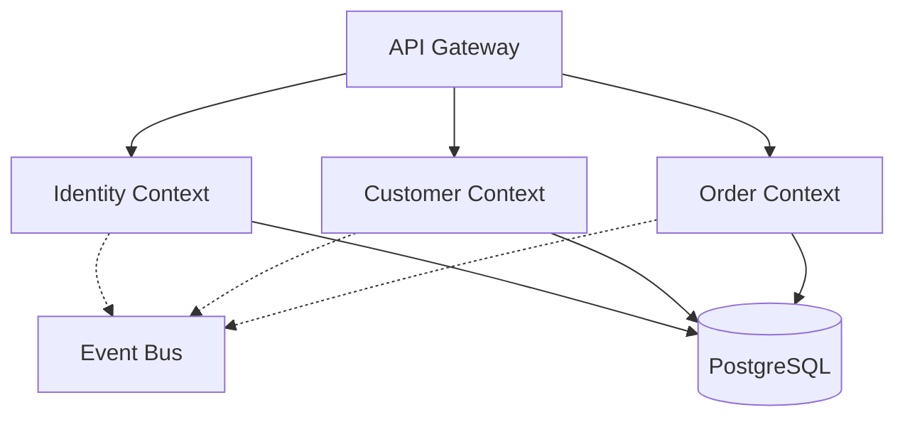
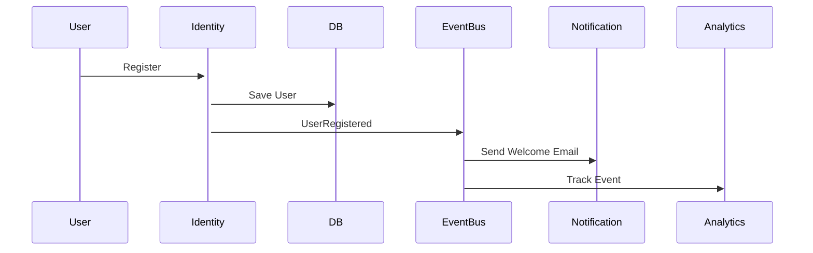
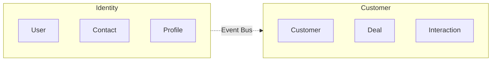

# Promenade Refactoring Roadmap

**Created**: December 29, 2025  
**Status**: Planning Phase  
**Goal**: Привести проект до production-ready стану без технічного боргу

---

## Поточний стан (Snapshot)

### ✅ Що працює
- [x] VitePress сайт на GitHub Pages (https://basilex.github.io/promenade/)
- [x] GitHub Actions CI/CD pipeline (тести + deploy)
- [x] 240+ тестів (unit + smoke + integration)
- [x] Документація в README.md та docs/
- [x] 5 bounded contexts (Identity, Customer, Shared готові)
- [x] Event Bus (Memory + Redis), JWT, Logger, UUID v7

### ⚠️ Проблеми
1. **Тести** - багато mock-based smoke tests без реальної цінності, костилі з `testing.Short()`
2. **Документація** - розрізнена (README vs сайт), багато не потрапило на сайт
3. **Docker** - старий docker-compose.yml замість сучасного compose.yaml
4. **Головна сторінка** - порожня, немає концептів і навігації
5. **CI костилі** - skip checks, hardcoded ports, test-db dependency

### 📊 Статистика
- **Tests**: 240+ (50% можна видалити)
- **Docs**: ~15,000 ліній документації (розкидані)
- **Docker files**: 3 застарілих файли
- **Website pages**: 2 (треба ~20+)

---

## План рефакторингу (4 фази)

---

## ФАЗА 1: Очистка тестів (Тиждень 1)

**Мета**: Зменшити кількість тестів до 50-80 критичних, які реально ловлять баги.

### Крок 1.1: Аудит тестів (День 1)

**Завдання**: Проаналізувати всі тести та визначити що залишити.

**Критерії для видалення:**
- [ ] Smoke tests (handler mocks) - не дають реальної цінності
- [ ] Дубльовані тести (entity + usecase тестують одне)
- [ ] Тести які просто викликають функцію без assertions
- [ ] Тести з одним test case (не table-driven)

**Критерії для збереження:**
- [ ] Unit tests для бізнес-логіки (entities, value objects, use cases)
- [ ] Integration tests для repositories (реальна БД)
- [ ] Package tests (bus, jwt, logger, uuidv7)

**Очікуваний результат:**
```
BEFORE                          AFTER
------                          -----
240+ tests total                50-80 tests total
test/smoke/ (60 tests)          → DELETE
test/integration/ (80 tests)    → KEEP (optimize)
internal/*_test.go (100 tests)  → KEEP (critical only)
pkg/*_test.go (100 tests)       → KEEP (all)
```

**Action Items:**
```bash
# 1. Видалити smoke tests повністю
rm -rf test/smoke/

# 2. Створити список integration tests для оптимізації
find test/integration -name "*_test.go" -exec wc -l {} \; | sort -rn > integration_audit.txt

# 3. Створити список unit tests для перегляду  
find internal -name "*_test.go" -exec wc -l {} \; | sort -rn > unit_audit.txt
```

### Крок 1.2: Видалення smoke tests (День 2)

**Обгрунтування:** Mock-based handler tests не ловлять реальні баги:
- Мокають use case → не тестують інтеграцію
- Тестують тільки HTTP коди → можна перевірити руками
- Не використовують реальну БД → не ловлять SQL помилки

**Plan:**
- [ ] Видалити `test/smoke/` повністю
- [ ] Оновити Makefile (видалити `test-smoke` target)
- [ ] Оновити CI (видалити smoke tests step)
- [ ] Оновити TEST_COVERAGE_REPORT.md

**Files to delete:**
```
test/smoke/contexts/
  customer-mgmt/customer/handler_test.go    (11 tests)
  identity/contact/handler_test.go          (7 tests)
  identity/permission/handler_test.go       (7 tests)
  identity/profile/handler_test.go          (8 tests)
  identity/role/handler_test.go             (7 tests)
  identity/user/handler_test.go             (12 tests)
  shared/country/handler_test.go            (5 tests)
  shared/currency/handler_test.go           (5 tests)
  shared/language/handler_test.go           (5 tests)
  shared/timezone/handler_test.go           (5 tests)
```

**Очікуваний результат:** -72 тести, залишається ~168

### Крок 1.3: Оптимізація integration tests (День 3)

**Проблема:** Зараз integration tests розкидані по файлах, кожен тест створює нову БД.

**Рішення:** Один файл на контекст з table-driven tests.

**Приклад структури:**
```go
// test/integration/contexts/identity/context_test.go
package identity_test

func TestIdentity_UserRepository(t *testing.T) {
    db := integration.SetupTestDB(t)
    repo := user.NewRepository(db)
    
    tests := []struct {
        name string
        test func(t *testing.T)
    }{
        {"Create", testUserCreate},
        {"GetByID", testUserGetByID},
        {"Authenticate", testUserAuthenticate},
    }
    
    for _, tt := range tests {
        t.Run(tt.name, func(t *testing.T) {
            tt.test(t)
        })
    }
}
```

**Action Items:**
- [ ] Об'єднати integration tests в один файл на контекст
- [ ] Використовувати table-driven підхід
- [ ] Видалити дублюючі setup/cleanup
- [ ] Зменшити ~80 тестів до ~30

### Крок 1.4: Очистка unit tests (День 4)

**Критерії видалення:**
- Тести які просто викликають конструктор без validation
- Тести з одним assert (can be inline comment)
- Getter/Setter tests (no logic)

**Приклад до/після:**

BEFORE:
```go
func TestUser_GetID(t *testing.T) {
    user := &User{ID: uuid.New()}
    assert.NotNil(t, user.GetID())
}

func TestUser_GetEmail(t *testing.T) {
    user := &User{Email: "test@test.com"}
    assert.Equal(t, "test@test.com", user.GetEmail())
}
```

AFTER:
```go
func TestUser_Creation(t *testing.T) {
    tests := []struct {
        name    string
        email   string
        wantErr bool
    }{
        {"valid", "test@test.com", false},
        {"invalid", "not-email", true},
        {"empty", "", true},
    }
    
    for _, tt := range tests {
        t.Run(tt.name, func(t *testing.T) {
            user, err := NewUser(tt.email, "password")
            if tt.wantErr {
                assert.Error(t, err)
                return
            }
            assert.NoError(t, err)
            assert.Equal(t, tt.email, user.Email.Value())
        })
    }
}
```

### Крок 1.5: Видалити CI костилі (День 5)

**Проблема:** Зараз є skip checks, hardcoded ports, test-db dependency.

**Рішення:**
1. Видалити всі `testing.Short()` skip checks
2. Розділити tests чітко:
   - `make test-unit` - unit tests (БЕЗ реальної БД)
   - `make test-integration` - integration tests (З реальною БД)
3. CI: unit tests завжди, integration опціонально

**Changes:**
```yaml
# .github/workflows/ci.yml
jobs:
  unit-tests:
    runs-on: ubuntu-latest
    steps:
      - run: make test-unit  # No database needed
      
  integration-tests:
    runs-on: ubuntu-latest
    services:
      postgres: ...  # PostgreSQL service
    steps:
      - run: make test-integration
```

**Action Items:**
- [ ] Видалити всі `if testing.Short()` з integration tests
- [ ] Перенести unit tests з test/integration/contexts/ в internal/contexts/
- [ ] Оновити Makefile.test.mk
- [ ] Оновити .github/workflows/ci.yml

### Результат Фази 1

**Метрики:**
- Tests: 240 → ~50-80
- Test coverage: 90% → 95%+ (на критичному коді)
- CI time: ~40s → ~15s (unit only)
- Maintainability: 🔴 → 🟢

**Deliverables:**
- [ ] Видалено test/smoke/
- [ ] Оптимізовано test/integration/
- [ ] Очищено internal/*_test.go
- [ ] Оновлено CI/CD
- [ ] Оновлено TEST_COVERAGE_REPORT.md

---

## ФАЗА 2: Modernize Docker (Тиждень 2)

**Мета**: Перейти на сучасний Docker Compose V2 (compose.yaml).

### Крок 2.1: Створити нові compose files (День 1)

**Структура:**
```
docker/
  compose.yaml              # Development (PostgreSQL + Redis)
  compose.test.yaml         # Test database (port 5433)
  compose.prod.yaml         # Production stack
  .env.example              # Environment variables template
  init-db.sh                # Database initialization script
  README.md                 # Docker setup guide
```

**compose.yaml (development):**
```yaml
name: promenade-dev

services:
  postgres:
    image: postgres:16-alpine
    container_name: promenade_postgres
    environment:
      POSTGRES_USER: system
      POSTGRES_PASSWORD: passw0rd
      POSTGRES_DB: promenade_dev
    ports:
      - "5432:5432"
    volumes:
      - postgres_data:/var/lib/postgresql/data
      - ./init-db.sh:/docker-entrypoint-initdb.d/init-db.sh
    healthcheck:
      test: ["CMD-SHELL", "pg_isready -U system"]
      interval: 10s
      timeout: 5s
      retries: 5

  redis:
    image: redis:7-alpine
    container_name: promenade_redis
    ports:
      - "6379:6379"
    volumes:
      - redis_data:/data
    healthcheck:
      test: ["CMD", "redis-cli", "ping"]
      interval: 10s
      timeout: 5s
      retries: 5

volumes:
  postgres_data:
  redis_data:
```

**compose.test.yaml:**
```yaml
name: promenade-test

services:
  postgres:
    image: postgres:16-alpine
    container_name: promenade_test_postgres
    environment:
      POSTGRES_USER: system
      POSTGRES_PASSWORD: passw0rd
      POSTGRES_DB: promenade_test
    ports:
      - "5433:5432"  # Different port for test DB
    tmpfs:
      - /var/lib/postgresql/data  # In-memory for speed
```

### Крок 2.2: Оновити Makefile (День 2)

**Changes:**
```makefile
# Makefile
DOCKER_COMPOSE=docker compose
DOCKER_COMPOSE_DEV=$(DOCKER_COMPOSE) -f docker/compose.yaml
DOCKER_COMPOSE_TEST=$(DOCKER_COMPOSE) -f docker/compose.test.yaml
DOCKER_COMPOSE_PROD=$(DOCKER_COMPOSE) -f docker/compose.prod.yaml

# Development
docker-up:  ## Start development stack
	$(DOCKER_COMPOSE_DEV) up -d
	@echo "✓ PostgreSQL: localhost:5432"
	@echo "✓ Redis: localhost:6379"

docker-down:  ## Stop development stack
	$(DOCKER_COMPOSE_DEV) down

docker-logs:  ## Show container logs
	$(DOCKER_COMPOSE_DEV) logs -f

# Testing
test-db-start:  ## Start test database
	$(DOCKER_COMPOSE_TEST) up -d
	@echo "✓ Test DB: localhost:5433"

test-db-stop:  ## Stop test database
	$(DOCKER_COMPOSE_TEST) down
```

### Крок 2.3: Оновити CI (День 3)

**No changes needed!** CI вже використовує PostgreSQL service, не docker compose.

### Крок 2.4: Тестування локально (День 4)

**Checklist:**
- [ ] `make docker-up` - запускає PostgreSQL + Redis
- [ ] `make migrate` - міграції працюють
- [ ] `make dev` - API запускається
- [ ] `make test-db-start` - тест БД на порті 5433
- [ ] `make test-integration` - integration tests проходять
- [ ] `docker compose ps` - показує статус

### Крок 2.5: Видалити старі файли (День 5)

**Files to delete:**
```
docker/docker-compose.dev.yml
docker/docker-compose.test.yml
docker/docker-compose.prod.yml
```

**Update references:**
- [ ] README.md
- [ ] docs/
- [ ] .gitignore (якщо є)

### Результат Фази 2

**Метрики:**
- Docker files: 3 старих → 3 нових (compose.yaml)
- Makefile commands: Same, but cleaner
- CI: No changes (використовує service)

**Deliverables:**
- [ ] compose.yaml (dev/test/prod)
- [ ] Оновлено Makefile
- [ ] Протестовано локально
- [ ] Видалено старі docker-compose files

---

## ФАЗА 3: Документація на сайті (Тиждень 3)

**Мета**: Перенести всю документацію з README на сайт, створити навігацію.

### Крок 3.1: Структура сайту (День 1)

**Створити структуру:**
```
website/
  index.md                      # Головна (концепти + діаграми)
  guide/
    index.md                    # Guide overview
    getting-started.md          # Quick start guide
    architecture.md             # DDD + Bounded Contexts
    development.md              # Development workflow
    testing.md                  # Testing guide
    deployment.md               # Deployment guide
  contexts/
    index.md                    # Contexts overview
    identity.md                 # Identity Context (User, Contact, Profile)
    customer.md                 # Customer Management
    shared.md                   # Shared Context (reference data)
    order.md                    # Order Management (planned)
    billing.md                  # Billing (planned)
  packages/
    index.md                    # Packages overview
    bus.md                      # Event Bus (Memory + Redis)
    jwt.md                      # JWT authentication
    logger.md                   # Structured logging
    uuidv7.md                   # Time-ordered UUIDs
    valueobject.md              # Value Objects
    saga.md                     # Saga pattern
    migration.md                # Database migrations
    response.md                 # HTTP responses
  api/
    index.md                    # API overview
    authentication.md           # Auth endpoints
    identity.md                 # Identity endpoints
    customer.md                 # Customer endpoints
    shared.md                   # Reference data endpoints
  .vitepress/
    config.mts                  # Updated sidebar navigation
```

### Крок 3.2: Головна сторінка з концептами (День 2)

**website/index.md:**
```markdown
# Promenade Platform

Modern backend platform for customer management, orders, and business workflows built with **Domain-Driven Design (DDD)** and **Event-Driven Architecture**.

## Key Concepts

### Bounded Contexts
- **Identity** - User management, authentication, profiles
- **Customer** - CRM functionality, deals, interactions
- **Shared** - Reference data (countries, currencies)
- **Order** - Order processing (planned)
- **Billing** - Payments, invoices (planned)

### Architecture Patterns
- **DDD** - Domain-Driven Design with Aggregates
- **Event-Driven** - Asynchronous communication via Event Bus
- **Clean Architecture** - Clear separation of concerns
- **CQRS** - Command Query Responsibility Segregation (planned)

### Tech Stack
- **Go 1.24+** - Modern, fast, reliable
- **PostgreSQL 16** - Primary database
- **Redis 7** - Cache, sessions, event bus
- **Docker** - Containerization
- **GitHub Actions** - CI/CD pipeline

## Quick Start

```bash
# Clone repository
git clone https://github.com/basilex/promenade.git
cd promenade

# Start services
make docker-up

# Run migrations
make migrate

# Start API
make dev
```

Server starts on http://localhost:8081

## Documentation

- [Getting Started](/guide/getting-started) - Setup and first steps
- [Architecture](/guide/architecture) - DDD and design decisions
- [Contexts](/contexts/) - Bounded contexts guide
- [Packages](/packages/) - Reusable components
- [API Reference](/api/) - REST API documentation

## GitHub

- Repository: [github.com/basilex/promenade](https://github.com/basilex/promenade)
- Issues: [Report a bug](https://github.com/basilex/promenade/issues)
- License: MIT
```

### Крок 3.3: Guide розділ (День 3-4)

**Перенести з README:**
- Getting Started → guide/getting-started.md
- Architecture → guide/architecture.md
- Testing → guide/testing.md (з docs/guides/testing-patterns.md)
- Development → guide/development.md (з AI instructions)

**Формат:**
- Clear headers (H2, H3)
- Code examples
- Diagrams (mermaid)
- Navigation links

### Крок 3.4: Contexts розділ (День 5-6)

**Перенести з internal/contexts/*/README.md:**
- Identity Context → contexts/identity.md
- Customer Management → contexts/customer.md
- Shared Context → contexts/shared.md

**Додати для кожного контексту:**
- Overview (що робить)
- Aggregates (список з описом)
- Use Cases (основні операції)
- Events (які генерує)
- API endpoints (посилання)

### Крок 3.5: Packages розділ (День 7-8)

**Перенести з pkg/*/README.md:**
- Event Bus → packages/bus.md
- JWT → packages/jwt.md
- Logger → packages/logger.md
- UUID v7 → packages/uuidv7.md
- Value Objects → packages/valueobject.md

**Формат:**
- Quick example (code)
- Features list
- Configuration
- API reference (основні функції)

### Крок 3.6: Навігація (День 9)

**Оновити .vitepress/config.mts:**
```typescript
export default defineConfig({
  themeConfig: {
    nav: [
      { text: 'Guide', link: '/guide/' },
      { text: 'Contexts', link: '/contexts/' },
      { text: 'Packages', link: '/packages/' },
      { text: 'API', link: '/api/' },
    ],
    
    sidebar: {
      '/guide/': [
        {
          text: 'Guide',
          items: [
            { text: 'Getting Started', link: '/guide/getting-started' },
            { text: 'Architecture', link: '/guide/architecture' },
            { text: 'Development', link: '/guide/development' },
            { text: 'Testing', link: '/guide/testing' },
            { text: 'Deployment', link: '/guide/deployment' },
          ]
        }
      ],
      '/contexts/': [
        {
          text: 'Bounded Contexts',
          items: [
            { text: 'Overview', link: '/contexts/' },
            { text: 'Identity', link: '/contexts/identity' },
            { text: 'Customer Management', link: '/contexts/customer' },
            { text: 'Shared', link: '/contexts/shared' },
          ]
        }
      ],
      // ... інші sidebar sections
    }
  }
})
```

### Крок 3.7: README.md скоротити (День 10)

**Нова структура README.md:**
```markdown
# Promenade Platform

Modern backend platform built with Domain-Driven Design.

## Quick Start

[See full Getting Started guide →](https://basilex.github.io/promenade/guide/getting-started)

## Documentation

📚 **Full documentation**: https://basilex.github.io/promenade/

- [Architecture Guide](https://basilex.github.io/promenade/guide/architecture)
- [Bounded Contexts](https://basilex.github.io/promenade/contexts/)
- [Package Library](https://basilex.github.io/promenade/packages/)
- [API Reference](https://basilex.github.io/promenade/api/)

## Development

```bash
make docker-up  # Start services
make migrate    # Run migrations
make dev        # Start API
```

[See full Development guide →](https://basilex.github.io/promenade/guide/development)

## Testing

```bash
make test-unit         # Unit tests
make test-integration  # Integration tests
```

[See full Testing guide →](https://basilex.github.io/promenade/guide/testing)

## License

MIT - see [LICENSE](LICENSE)
```

**Результат:** README з 1500+ ліній → ~100 ліній + посилання на сайт

### Результат Фази 3

**Метрики:**
- Website pages: 2 → 25+
- README size: 1500 lines → 100 lines
- Documentation coverage: 60% → 100%

**Deliverables:**
- [ ] Головна сторінка з концептами
- [ ] Guide розділ (5 pages)
- [ ] Contexts розділ (5 pages)
- [ ] Packages розділ (8 pages)
- [ ] API розділ (4 pages)
- [ ] Навігація в sidebar
- [ ] README скорочено + посилання

---

## ФАЗА 4: Фінальне полірування (Тиждень 4)

**Мета**: Довести до production-ready стану.

### Крок 4.1: Діаграми та візуалізація (День 1-2)

**Mermaid діаграми:**

1. **Architecture Overview** (guide/architecture.md):


2. **Event Flow** (guide/architecture.md):


3. **Context Boundaries** (contexts/index.md):


### Крок 4.2: Screenshots та приклади (День 3)

**Що додати:**
- API request/response приклади
- Configuration приклади
- Error handling приклади
- Logging output приклади

### Крок 4.3: SEO та metadata (День 4)

**config.mts:**
```typescript
export default defineConfig({
  title: 'Promenade Platform',
  description: 'Modern backend platform with Domain-Driven Design',
  head: [
    ['meta', { name: 'keywords', content: 'DDD, Go, PostgreSQL, Event-Driven, Clean Architecture' }],
    ['meta', { property: 'og:title', content: 'Promenade Platform' }],
    ['meta', { property: 'og:description', content: 'Modern backend platform' }],
    ['meta', { property: 'og:image', content: '/og-image.png' }],
  ],
})
```

### Крок 4.4: Перевірка посилань (День 5)

**Checklist:**
- [ ] Всі внутрішні посилання працюють
- [ ] Всі зовнішні посилання валідні
- [ ] Всі code examples компілюються
- [ ] Всі diagrams рендеряться

**Automated check:**
```bash
npm run docs:build  # Check for broken links
```

### Крок 4.5: Final review (День 6-7)

**Checklist:**
- [ ] README.md → короткий + посилання
- [ ] Website → 25+ pages
- [ ] Tests → 50-80 critical tests
- [ ] Docker → compose.yaml
- [ ] CI/CD → без костилів
- [ ] Documentation → 100% coverage
- [ ] Navigation → intuitive
- [ ] SEO → configured

### Результат Фази 4

**Deliverables:**
- [ ] Діаграми в документації
- [ ] Screenshots та приклади
- [ ] SEO налаштовано
- [ ] Всі посилання працюють
- [ ] Final review пройдено

---

## Метрики успіху

### До рефакторингу
- Tests: 240 (багато mock-based)
- Test CI time: ~40s
- Docker: docker-compose.yml (V1)
- Website: 2 pages (порожні)
- README: 1500+ lines
- Test coverage: 90% (багато непотрібних)

### Після рефакторингу
- Tests: 50-80 (critical only)
- Test CI time: ~15s (unit only)
- Docker: compose.yaml (V2)
- Website: 25+ pages (повна документація)
- README: 100 lines (посилання на сайт)
- Test coverage: 95%+ (на критичному коді)

---

## Timeline

| Тиждень | Фаза                | Deliverables                |
|---------|---------------------|-----------------------------|
| 1       | Тести               | 50-80 tests, no CI костилі  |
| 2       | Docker              | compose.yaml files          |
| 3       | Документація        | 25+ website pages           |
| 4       | Полірування         | Production-ready            |

**Total**: 4 тижні до production-ready стану

---

## Наступні кроки

1. ✅ Прочитати цей документ
2. ⏳ Почати з Фази 1 (очистка тестів)
3. ⏳ Відпрацювати план покроково
4. ⏳ Регулярні check-ins (кінець кожної фази)

---

**Status**: 🔴 Planning → 🟡 In Progress → 🟢 Complete  
**Last Updated**: December 29, 2025  
**Owner**: Promenade Team
