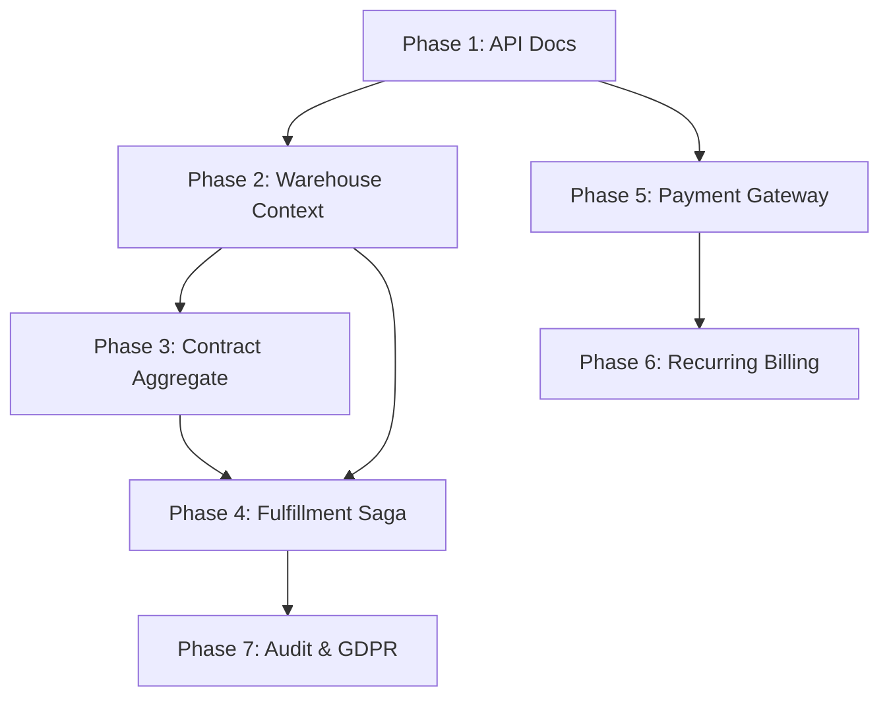

# Promenade Platform Roadmap Q1-Q2 2026

**Статус**:  Active Development  
**Період**: January - June 2026  
**Остання оновлення**: January 5, 2026

---

##  Поточний статус (Baseline)

###  Завершені контексти (Production-ready)
- **Shared Context** - Reference data (Country, Currency, Language, Timezone)
- **Identity Context** - User, Contact, Profile, Role, Permission (RBAC)
- **Customer Management** - Customer, Company, Deal, Interaction, Analytics
- **Order Management** - Order, OrderLine (базовий lifecycle)
- **Billing Context** - Invoice, Payment, Subscription

**Total**: 5 контекстів, 420+ тестів, 0 lint issues

---

##  Стратегічні цілі Q1-Q2 2026

### 1⃣ **Developer Experience** (Q1)
- API Documentation & Tooling
- Developer Portal з прикладами

### 2⃣ **E-commerce Foundation** (Q1-Q2)
- Warehouse Context (Inventory Management)
- Contract aggregate (Order Management)
- Fulfillment Saga (повна автоматизація)

### 3⃣ **Payment Integration** (Q1)
- Stripe/PayPal Gateway
- Recurring Billing Automation

### 4⃣ **Enterprise Features** (Q2)
- Audit Logging
- GDPR Compliance
- Advanced Security

---

##  Execution Plan (з залежностями)



---

##  Phase 1: API Documentation & Developer Experience
**Timeline**: Week 1-2 (Jan 6 - Jan 17, 2026)  
**Status**: COMPLETE (5/5 tasks - 100%)  
**Completed**: January 5, 2026 (Day 5 - ahead of schedule!)  
**Dependencies**: None (Quick win!)

### Objectives
- Автоматична генерація Swagger/OpenAPI 3.0 spec
- Postman collection для всіх endpoints (120+)
- API versioning strategy (v1 → v2)
- Interactive API documentation (Swagger UI)

### Progress
**Completed**: 5/5 tasks (100%)  
**Duration**: 5 days (Jan 1-5, 2026)  
**Status**: PHASE COMPLETE - ahead of schedule!

### Tasks
- [x] **Task 1.1**: Setup Swagger generation (swaggo/swag) COMPLETE
  - Duration: 1 day (completed January 5, 2026)
  - Installed swaggo/swag
  - Configured swagger comments in all handlers (120+ endpoints)
  - Generated swagger.json/swagger.yaml
  - Integrated: `make swagger-all` working
  - Swagger UI available at `/api/docs/index.html`
  - Status: Production-ready

- [x] **Task 1.2**: Swagger UI integration COMPLETE
  - Duration: 0.5 day (completed January 5, 2026)
  - Swagger UI served at `/api/docs/index.html`
  - JWT authentication integrated in UI
  - Deployed to dev environment
  - Status: Production-ready

- [x] **Task 1.3**: Postman collection generation COMPLETE
  - Duration: 1 day (completed January 5, 2026)
  - Generated OpenAPI → Postman collection (33K lines, 120+ endpoints)
  - Added 3 environments (Development, Staging, Production)
  - Authentication flow: Auto-save tokens, auto-refresh expired tokens
  - Pre-request scripts + test automation
  - Newman CLI integration for CI/CD
  - Status: Production-ready, documented in postman/README.md

- [x] **Task 1.4**: API versioning strategy COMPLETE
  - Duration: 1 day (completed January 5, 2026)
  - URL-based versioning strategy (/api/v1/, /api/v2/)
  - RFC 8594 compliant deprecation headers
  - 12-month deprecation lifecycle policy
  - Deprecation middleware implemented (pkg/middleware/versioning.go)
  - Sunset middleware (410 Gone response)
  - Version logging for analytics
  - Breaking vs non-breaking changes definitions (7 + 6 categories)
  - Migration guide template (v1→v2 example)
  - Comprehensive documentation (2 guides: strategy + practical examples)
  - 37 middleware tests (12 versioning + 25 existing), 95% coverage
  - Status: Production-ready, integrated with Swagger

- [x] **Task 1.5**: Developer Portal guides COMPLETE
  - Duration: 1 day (completed January 5, 2026)
  - Created Quick Start Guide (1100 lines) - practical 5-minute tutorial
  - Created Authentication Flow Guide (1200 lines) - JWT, RBAC, security
  - Created Common Use Cases Guide (1400 lines) - 7 business scenarios
  - Created Troubleshooting Guide (900 lines) - common issues and solutions
  - All guides include: curl examples, JSON responses, flow diagrams, cross-references
  - Status: Production-ready, integrated with INDEX.md

**Acceptance Criteria**: ALL MET
- Swagger UI accessible at `/api/docs/index.html`
- 120+ endpoints documented in OpenAPI spec
- Postman collection with 120+ requests
- All 5 contexts documented (Identity, Customer, Order, Billing, Shared)
- Developer Portal with 4 comprehensive guides (4600+ lines)

**Deliverables**: ALL DELIVERED
- `docs/swagger.yaml` (OpenAPI 3.0 spec)
- Postman collection JSON (33K lines)
- Swagger UI at `/api/docs/index.html`
- `make swagger-all` command working
- Quick Start Guide (1100 lines)
- Authentication Flow Guide (1200 lines)
- Common Use Cases Guide (1400 lines)
- Troubleshooting Guide (900 lines)

**Phase Status**: COMPLETE (100%)

---

##  Phase 2: Warehouse Context (Inventory Management)
**Timeline**: Week 3-4 (Jan 20 - Jan 31, 2026)  
**Status**:  Planned  
**Dependencies**: None 

### Objectives
- Inventory tracking (stock levels, locations)
- Stock movements (receipts, transfers, adjustments)
- Low stock alerts
- Integration with Order Management

### Architecture
```
internal/contexts/warehouse/
  inventory/                 # Inventory Aggregate
    entity.go               # SKU, quantity, location, reorder_point
    repository.go           # IInventoryRepository
    usecase.go             # Stock queries, low stock alerts
  stock-movement/            # StockMovement Aggregate
    entity.go               # Type (receipt, transfer, adjustment), quantity
    repository.go           # IStockMovementRepository
    usecase.go             # Record movements, audit trail
  integration/               # Integration with Order Management
    reservation_service.go  # Reserve stock for orders
```

### Tasks
- [ ] **Task 2.1**: Inventory Aggregate
  - Duration: 2 days
  - Entity: SKU, ProductID, Quantity, Location, ReorderPoint, Status
  - Repository: CRUD + GetByProduct, GetLowStock, BulkUpdate
  - UseCase: CheckStock, UpdateStock, GetLowStockAlerts
  - Tests: 40+ tests (entity + usecase + repository)

- [ ] **Task 2.2**: StockMovement Aggregate
  - Duration: 2 days
  - Entity: Type (receipt/transfer/adjustment), Quantity, Reason, UserID
  - Repository: CRUD + GetByInventory, GetByDateRange
  - UseCase: RecordReceipt, RecordTransfer, RecordAdjustment
  - Audit trail: Who changed what when
  - Tests: 40+ tests

- [ ] **Task 2.3**: HTTP API handlers
  - Duration: 1 day
  - 14 endpoints for Inventory
  - 10 endpoints for StockMovement
  - DTOs with validation
  - Swagger annotations

- [ ] **Task 2.4**: Integration with Order Management
  - Duration: 1 day
  - ReservationService: Reserve stock when order confirmed
  - Release stock when order cancelled
  - Commit stock when order fulfilled
  - Domain events: stock.reserved, stock.released, stock.committed

- [ ] **Task 2.5**: Low Stock Alerts
  - Duration: 1 day
  - Daily job to check reorder points
  - Event: inventory.low_stock
  - Integration with Notification system (future)

- [ ] **Task 2.6**: Database migrations
  - Duration: 0.5 day
  - warehouse_inventory table
  - warehouse_stock_movements table
  - Indexes on (product_id, location), (created_at)

**Acceptance Criteria**:
-  24 endpoints working (Inventory + StockMovement)
-  80+ tests passing
-  Integration with Order Management (reservation flow)
-  Migrations applied successfully
-  Low stock alert system working

**Deliverables**:
- Warehouse Context code (2 aggregates)
- Database migrations
- API documentation
- Integration tests

---

##  Phase 3: Contract Aggregate (Order Management)
**Timeline**: Week 5 (Feb 3 - Feb 7, 2026)  
**Status**:  Planned  
**Dependencies**: None 

### Objectives
- Legal agreements for orders
- Terms & conditions management
- Customer signatures
- Contract lifecycle (draft → active → completed → terminated)

### Architecture
```
internal/contexts/order-mgmt/contract/
  entity.go                 # Contract Aggregate
  repository.go             # IContractRepository
  usecase.go               # Create, Sign, Terminate
  adapter/
    http/handler/
      contract_handler.go   # 12 endpoints
```

### Tasks
- [ ] **Task 3.1**: Contract Entity
  - Duration: 1 day
  - Fields: OrderID, CustomerID, Terms, SignedAt, Status
  - Lifecycle: draft → pending_signature → active → completed/terminated
  - Methods: Sign(), Terminate(), Renew()
  - Tests: 30+ entity tests

- [ ] **Task 3.2**: Contract Repository
  - Duration: 1 day
  - CRUD + GetByOrder, GetByCustomer, GetActive
  - PostgreSQL implementation
  - Tests: 10+ integration tests

- [ ] **Task 3.3**: Contract UseCase
  - Duration: 1 day
  - CreateContract, SignContract, TerminateContract
  - RenewContract (for recurring orders)
  - Business rules: Can't terminate active contract with pending payments
  - Tests: 30+ usecase tests

- [ ] **Task 3.4**: HTTP API
  - Duration: 1 day
  - 12 endpoints (CRUD + Sign, Terminate, Renew, GetByOrder)
  - DTOs with validation
  - Swagger annotations
  - Tests: 12+ handler tests

- [ ] **Task 3.5**: Database migration
  - Duration: 0.5 day
  - order_contracts table
  - Indexes on (order_id, customer_id, status)

**Acceptance Criteria**:
-  12 endpoints working
-  70+ tests passing
-  Contract lifecycle enforced
-  Integration with Order aggregate

**Deliverables**:
- Contract aggregate code
- Database migration
- API documentation
- Tests

---

##  Phase 4: Fulfillment Saga (Distributed Transaction)
**Timeline**: Week 6-7 (Feb 10 - Feb 21, 2026)  
**Status**:  Planned  
**Dependencies**:  Phase 2 (Warehouse), Phase 3 (Contract)

### Objectives
- Координація distributed transaction: Order → Payment → Inventory → Shipping
- Saga pattern implementation з compensation logic
- Retry mechanism для failure scenarios
- Complete order lifecycle automation

### Architecture
```
internal/contexts/order-mgmt/fulfillment/
  saga.go                   # FulfillmentSaga
  steps/
    validate_order.go       # Step 1: Validate order
    process_payment.go      # Step 2: Process payment (call Billing)
    reserve_inventory.go    # Step 3: Reserve stock (call Warehouse)
    create_shipment.go      # Step 4: Create shipment
  compensation/
    refund_payment.go       # Compensate: Refund payment
    release_inventory.go    # Compensate: Release reserved stock
```

### Saga Flow
```
1. ValidateOrder
   ↓ success
2. ProcessPayment (→ Billing Context)
   ↓ success        ↓ failure: END (order stays pending)
3. ReserveInventory (→ Warehouse Context)
   ↓ success        ↓ failure: COMPENSATE (refund payment)
4. CreateShipment
   ↓ success        ↓ failure: COMPENSATE (release inventory, refund payment)
5. MarkOrderFulfilled
```

### Tasks
- [ ] **Task 4.1**: Saga framework setup
  - Duration: 1 day
  - Use pkg/saga/ (вже є!)
  - SagaOrchestrator configuration
  - Event-driven coordination via Event Bus

- [ ] **Task 4.2**: Saga steps implementation
  - Duration: 2 days
  - ValidateOrderStep
  - ProcessPaymentStep (integration з Payment aggregate)
  - ReserveInventoryStep (integration з Warehouse)
  - CreateShipmentStep (placeholder для Shipping)
  - Tests: 20+ per step

- [ ] **Task 4.3**: Compensation logic
  - Duration: 2 days
  - RefundPaymentCompensation
  - ReleaseInventoryCompensation
  - CancelShipmentCompensation
  - Tests: идемпотентність, retry logic

- [ ] **Task 4.4**: Integration testing
  - Duration: 1 day
  - Happy path: order → payment → inventory → shipment → fulfilled
  - Failure scenarios: payment fails, inventory unavailable
  - Compensation scenarios: rollback successful
  - Tests: 30+ integration tests

- [ ] **Task 4.5**: Monitoring & alerting
  - Duration: 1 day
  - Saga execution logs
  - Failure notifications
  - Retry metrics
  - Dashboard (future)

**Acceptance Criteria**:
-  Complete fulfillment flow working end-to-end
-  All compensation scenarios tested
-  70+ tests passing (steps + compensations + integration)
-  Saga completes in <5 seconds (happy path)
-  100% compensation success rate

**Deliverables**:
- FulfillmentSaga implementation
- Integration with Billing and Warehouse
- Comprehensive tests
- Monitoring instrumentation

---

##  Phase 5: Payment Gateway Integration
**Timeline**: Week 8-9 (Feb 24 - Mar 7, 2026)  
**Status**:  Planned  
**Dependencies**:  Потребує API keys (Stripe/PayPal)

### Objectives
- Stripe integration для card payments
- PayPal integration (alternative)
- Webhook handling для async notifications
- Refund/chargeback handling
- PCI compliance (no card storage)

### Architecture
```
pkg/payment/
  gateway/
    interface.go            # PaymentGateway interface
    stripe/
      stripe_gateway.go     # Stripe implementation
      webhook_handler.go    # Stripe webhooks
    paypal/
      paypal_gateway.go     # PayPal implementation
      webhook_handler.go    # PayPal webhooks
  
internal/contexts/billing/payment/
  usecase.go               # Updated з gateway integration
  adapter/http/webhook/
    stripe_webhook_handler.go
    paypal_webhook_handler.go
```

### Tasks
- [ ] **Task 5.1**: PaymentGateway interface
  - Duration: 0.5 day
  - Methods: CreatePaymentIntent, CapturePayment, RefundPayment
  - Error handling strategy
  - Idempotency keys

- [ ] **Task 5.2**: Stripe integration
  - Duration: 2 days
  - stripe-go SDK setup
  - CreatePaymentIntent implementation
  - CapturePayment implementation
  - RefundPayment implementation
  - Tests: 30+ (with Stripe test mode)

- [ ] **Task 5.3**: Stripe webhook handling
  - Duration: 1 day
  - Webhook endpoint `/webhooks/stripe`
  - Verify signature
  - Handle events: payment_intent.succeeded, payment_intent.failed
  - Idempotency (avoid duplicate processing)
  - Tests: 20+

- [ ] **Task 5.4**: PayPal integration
  - Duration: 2 days
  - PayPal REST API setup
  - CreateOrder implementation
  - CaptureOrder implementation
  - RefundOrder implementation
  - Tests: 30+

- [ ] **Task 5.5**: Update Payment UseCase
  - Duration: 1 day
  - Inject PaymentGateway into UseCase
  - ProcessPaymentWithGateway method
  - Store gateway transaction ID
  - Migration: add gateway_transaction_id column

- [ ] **Task 5.6**: Error handling & retry
  - Duration: 1 day
  - Retry transient errors (network failures)
  - Handle non-retryable errors (insufficient funds)
  - Dead letter queue для failed payments

**Acceptance Criteria**:
-  Stripe payments working end-to-end
-  PayPal payments working end-to-end
-  Webhooks handling async notifications
-  80+ tests passing
-  No card data stored (PCI compliance)

**Deliverables**:
- Payment gateway abstraction
- Stripe + PayPal implementations
- Webhook handlers
- Updated Payment UseCase
- Tests

**Security Considerations**:
-  NEVER store card numbers
-  Use Stripe Payment Intents (not legacy Charges API)
-  Verify webhook signatures
-  Use idempotency keys for retries

---

##  Phase 6: Recurring Billing Automation
**Timeline**: Week 10-11 (Mar 10 - Mar 21, 2026)  
**Status**:  Planned  
**Dependencies**:  Phase 5 (Payment Gateway)

### Objectives
- Автоматична генерація інвойсів для subscriptions
- Автоматична оплата через gateway
- Обробка failed payments (retry logic)
- Dunning management (нагадування про unpaid invoices)

### Architecture
```
internal/contexts/billing/recurring/
  scheduler.go              # Cron job для генерації invoices
  billing_engine.go         # Логіка генерації invoices
  payment_processor.go      # Автоматична оплата
  dunning_manager.go        # Обробка failed payments
```

### Tasks
- [ ] **Task 6.1**: Billing Scheduler
  - Duration: 1 day
  - Cron job: щоденно о 00:00 UTC
  - Query subscriptions з next_billing_date = today
  - Generate invoices для кожної subscription
  - Tests: 20+

- [ ] **Task 6.2**: Invoice Generation Engine
  - Duration: 2 days
  - Calculate amount based на subscription plan
  - Prorated charges для mid-cycle changes
  - Apply discounts/coupons
  - Store invoice in database
  - Update subscription.next_billing_date
  - Tests: 40+

- [ ] **Task 6.3**: Automatic Payment Processing
  - Duration: 2 days
  - Try to charge payment method on file
  - Use PaymentGateway від Phase 5
  - Handle success: mark invoice paid
  - Handle failure: trigger dunning process
  - Idempotency для retries
  - Tests: 30+

- [ ] **Task 6.4**: Dunning Management
  - Duration: 2 days
  - Retry failed payments: Day 1, Day 3, Day 7
  - Send email notifications (integration з future Notification system)
  - Suspend subscription після 3 failed attempts
  - Grace period configuration
  - Tests: 30+

- [ ] **Task 6.5**: Subscription lifecycle automation
  - Duration: 1 day
  - Auto-activate після successful payment
  - Auto-suspend після failed payments
  - Auto-cancel після grace period
  - Domain events: subscription.renewed, subscription.suspended

- [ ] **Task 6.6**: Monitoring & reporting
  - Duration: 1 day
  - MRR (Monthly Recurring Revenue) calculation
  - Churn rate tracking
  - Failed payment dashboard
  - Logs для debugging

**Acceptance Criteria**:
-  Invoices автоматично генеруються щодня
-  Payments автоматично обробляються
-  Failed payments retry 3 times
-  Subscriptions auto-suspend після failures
-  120+ tests passing

**Deliverables**:
- Recurring billing engine
- Dunning management system
- Monitoring dashboard data
- Comprehensive tests

---

##  Phase 7: Audit Logging & GDPR Compliance
**Timeline**: Week 12-13 (Mar 24 - Apr 4, 2026)  
**Status**:  Planned  
**Dependencies**: None 

### Objectives
- Audit trail для всіх critical operations
- GDPR compliance tools (data export, deletion, consent)
- Data encryption at rest
- Compliance reporting

### Architecture
```
internal/contexts/audit/
  log/                      # AuditLog Aggregate
    entity.go               # Who, What, When, IP, UserAgent
    repository.go           # Append-only log
    usecase.go             # Search, filter, export
  
internal/contexts/identity/gdpr/
  export_service.go         # Export all user data
  deletion_service.go       # GDPR right to be forgotten
  consent_manager.go        # Track consent for data processing
```

### Tasks
- [ ] **Task 7.1**: AuditLog Aggregate
  - Duration: 2 days
  - Entity: UserID, Action, ResourceType, ResourceID, IPAddress, Timestamp
  - Repository: Append-only (no updates/deletes)
  - UseCase: LogAction, SearchLogs, ExportLogs
  - Tests: 40+

- [ ] **Task 7.2**: Audit middleware
  - Duration: 1 day
  - HTTP middleware для logging всіх requests
  - Extract user від JWT
  - Log: method, path, status, duration
  - Async logging (не блокувати requests)

- [ ] **Task 7.3**: Critical operations instrumentation
  - Duration: 2 days
  - Додати audit logging до UseCase methods:
    - User: Login, Register, PasswordChange, Suspend, Ban
    - Customer: Create, Update, Delete
    - Order: Create, Confirm, Cancel
    - Payment: Process, Refund
    - Subscription: Create, Cancel, Suspend

- [ ] **Task 7.4**: GDPR Data Export
  - Duration: 2 days
  - ExportUserData(userID) → JSON з всіх contexts
  - Include: User, Contacts, Profile, Customers, Orders, Payments
  - Async job (може бути багато даних)
  - Download link expires після 7 днів
  - Tests: 20+

- [ ] **Task 7.5**: GDPR Data Deletion (Right to be Forgotten)
  - Duration: 2 days
  - DeleteUserData(userID) → cascade delete або anonymize
  - Strategy: Soft delete + anonymization (замість hard delete)
  - Keep financial records (legal requirement)
  - Audit log deletion request
  - Tests: 30+

- [ ] **Task 7.6**: Consent Management
  - Duration: 1 day
  - Track consent для: marketing emails, analytics, cookies
  - ConsentEntity: UserID, Type, Granted, GrantedAt
  - API endpoints для managing consent
  - Tests: 20+

**Acceptance Criteria**:
-  All critical operations logged
-  GDPR export working (JSON download)
-  GDPR deletion working (anonymization)
-  Consent management API working
-  130+ tests passing

**Deliverables**:
- Audit Log system
- GDPR compliance tools
- Consent management
- Comprehensive tests

---

##  Success Metrics

### Developer Experience
- [ ] Swagger UI доступний
- [ ] 80+ endpoints documented
- [ ] Postman collection з прикладами
- [ ] <5 minutes для першого API call

### E-commerce
- [ ] Order fulfillment повністю автоматизований
- [ ] Inventory tracking working
- [ ] Contract lifecycle enforced
- [ ] <10 seconds для fulfillment saga

### Payment Integration
- [ ] Stripe/PayPal payments working
- [ ] 99%+ payment success rate
- [ ] <3 seconds для payment processing
- [ ] Webhooks handling async events

### Recurring Billing
- [ ] Invoices автоматично генеруються
- [ ] Failed payments retry automatically
- [ ] 95%+ successful payment rate
- [ ] Dunning process working

### Compliance
- [ ] Audit logs для всіх операцій
- [ ] GDPR export/deletion working
- [ ] Consent management implemented
- [ ] Ready для enterprise customers

---

##  Q1-Q2 2026 Milestones

### Q1 2026 (Jan-Mar)
-  **Week 1-2**: API Documentation complete
-  **Week 3-4**: Warehouse Context complete
-  **Week 5**: Contract Aggregate complete
-  **Week 6-7**: Fulfillment Saga complete
-  **Week 8-9**: Payment Gateway Integration complete
-  **Week 10-11**: Recurring Billing complete

### Q2 2026 (Apr-Jun)
-  **Week 12-13**: Audit & GDPR complete
-  **Week 14+**: Production deployment & monitoring
-  **Week 16+**: Performance optimization
-  **Week 18+**: Advanced features based на feedback

---

##  Risks & Mitigation

### Technical Risks
| Risk | Impact | Probability | Mitigation |
|------|--------|-------------|------------|
| Stripe API changes | High | Low | Pin SDK version, monitor changelog |
| Saga compensation failures | High | Medium | Extensive testing, idempotency |
| Database migrations fail | Medium | Low | Rollback scripts, testing |
| Performance degradation | Medium | Medium | Load testing, indexing |

### Business Risks
| Risk | Impact | Probability | Mitigation |
|------|--------|-------------|------------|
| Scope creep | High | High | Strict phase boundaries |
| API breaking changes | Medium | Medium | Versioning strategy |
| GDPR non-compliance | High | Low | Legal review, documentation |

---

##  Notes

### Configuration Required
- [ ] Stripe API keys (test + production)
- [ ] PayPal API credentials
- [ ] SMTP server для dunning emails
- [ ] Monitoring setup (Prometheus/Grafana)

### Documentation Updates
- [ ] Update README.md після кожної phase
- [ ] API documentation в Swagger
- [ ] Developer guides для integration
- [ ] Deployment runbooks

### Testing Strategy
- Unit tests: 70%+ coverage per aggregate
- Integration tests: All repository methods
- E2E tests: Critical user flows
- Load tests: 1000 req/sec target

---

**Last Updated**: January 5, 2026  
**Owner**: Promenade Team  
**Review Cadence**: Weekly (кожен понеділок)

---

##  Success Definition

**Q1-Q2 2026 вважається успішним якщо:**
-  All 7 phases completed
-  800+ tests passing (420 base + 380 new)
-  0 critical bugs in production
-  API documentation 100% complete
-  Payment gateway integration working
-  GDPR compliance achieved
-  Performance targets met (latency <100ms p99)

**Готові до production SaaS платформи!** 
