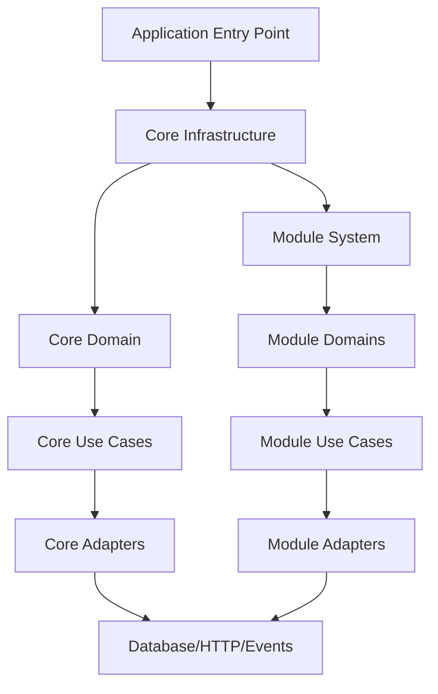
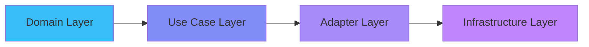
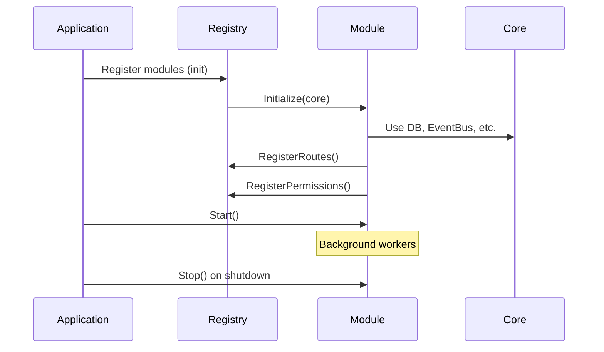
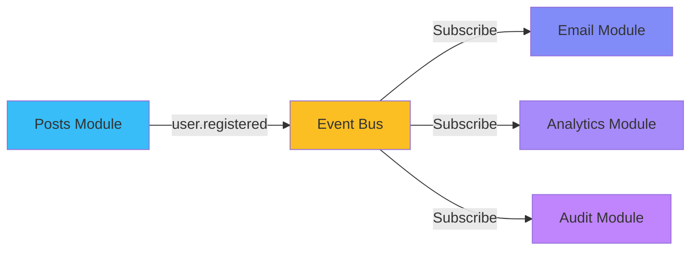
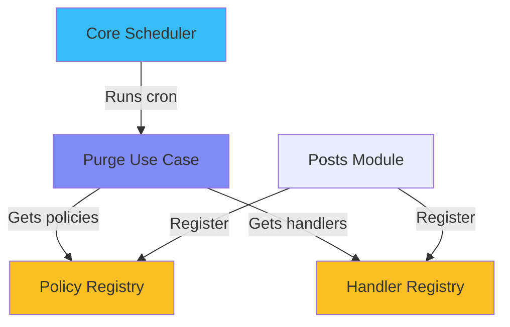
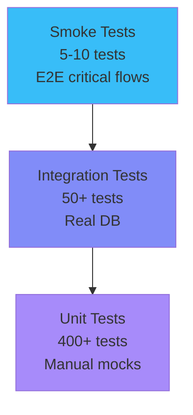
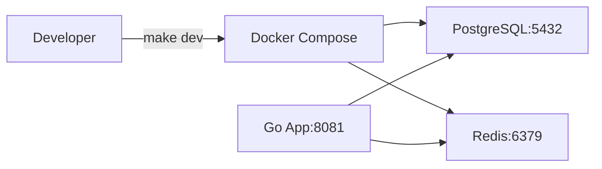
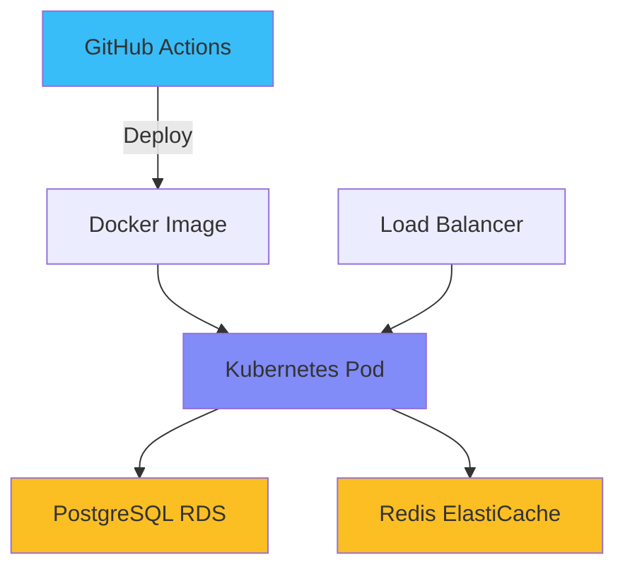

## Architekturüberblick

Promenade folgt den Prinzipien der **Clean Architecture** mit einem **modularen Plugin-System**.

### Systemschichten



### Core vs. Module

**Core = Infrastruktur + Sicherheit + Referenzdaten**

- Immer aktiviert
- Authentifizierung (JWT)
- RBAC (Rollen, Berechtigungen)
- Referenzdaten (Länder, Währungen, Regionen, Städte, Zahlungsmethoden, Zeitzonen, Sprachen)
- Event Bus, Datenbank, Logger, Scheduler

**Module = Geschäftslogik**

- Optional, aktivierbar/deaktivierbar
- Vollständige vertikale Schichten (Entity → UseCase → Adapter)
- Eigene Migrationen, Konfigurationen, Berechtigungen
- Separat lizenzierbar (kostenlos oder kommerziell)

---

## Clean Architecture Schichten

### Abhängigkeitsfluss



**Kernregel:** Innere Schichten hängen niemals von äußeren ab!

### Schichtenverantwortlichkeiten

**1. Domain Layer** (`internal/domain/entity/`)

- Reine Geschäftsentitäten
- Validierungsmethoden
- Keine Framework-Abhängigkeiten
- Beispiel: `User`, `Post`, `Comment`

**2. Use Case Layer** (`internal/usecase/`)

- Nur Geschäftslogik
- Abhängig von Domain-Interfaces
- Beispiel: `RegisterUser`, `CreatePost`

**3. Adapter Layer** (`internal/adapter/`)

- HTTP-Handler
- Repository-Implementierungen
- Framework-Integration
- Beispiel: `UserHandler`, `PostgresUserRepo`

**4. Infrastructure Layer** (`internal/infrastructure/`)

- Datenbankverbindungen
- Event Bus
- Externe Dienste
- Beispiel: `PostgreSQL`, `Redis`, `SMTP`

---

## Modularchitektur

### Modulstruktur

```
internal/modules/posts/
├── module.go              # Modul-Interface-Implementierung
├── register.go            # Auto-Registrierung
├── config/                # Eigene Umgebungskonfigurationen
├── entity/                # Domain-Entitäten
├── usecase/               # Geschäftslogik
└── adapter/
    ├── http/              # Handler, DTO, Routen
    └── repository/        # Datenzugriff
```

### Modul-Lebenszyklus



### Modulunabhängigkeit

**Module importieren NIEMALS:**

- `internal/domain` (Core-Domain)
- `internal/usecase` (Core Use Cases)
- `internal/adapter` (Core-Adapter)
- Andere Module

**Module KÖNNEN verwenden:**

- `pkg/*` (gemeinsame Pakete)
- Core-Infrastruktur über `module.Core`
- Events für Modul-zu-Modul-Kommunikation

---

## Kommunikationsmuster

### Event-Driven Communication



**Vorteile:**

- Lose Kopplung zwischen Modulen
- Asynchrone Verarbeitung
- Einfaches Hinzufügen neuer Abonnenten
- Keine direkten Modulabhängigkeiten

---

## Datenbankarchitektur

### UUID v7 Primärschlüssel

```sql
CREATE TABLE users (
    id UUID PRIMARY KEY DEFAULT uuid_v7(),
    email TEXT NOT NULL,
    created_at TIMESTAMP DEFAULT NOW()
);
```

**Vorteile:**

- ⚡ 2x schnellere Einfügungen (B-Tree-Lokalität)
- 📉 Reduzierte Index-Fragmentierung
- 🔍 Zeitbasierte Sortierung
- 🆔 Global eindeutig

### Namespace-basierte Migrationen

```
migrations/
├── core/                    # Core wird immer zuerst ausgeführt
│   ├── 000001_init.sql
│   ├── 000002_auth.sql
│   └── 000003_rbac.sql
├── posts/                   # Posts-Modul
│   ├── 000001_posts.sql
│   └── 000002_comments.sql
└── billing/                 # Billing-Modul
    └── 000001_tables.sql
```

**Jeder Namespace hat eine unabhängige Versionshistorie!**

---

## Purge-System

### Registry-basiertes Design



**Kernpunkte:**

- Core weiß WANN bereinigt wird (Schedule, Batch-Größe)
- Module definieren WAS bereinigt wird (Entitäten, Aufbewahrungstage)
- Echte Modulunabhängigkeit durch Registries

---

## Testen

### Test-Pyramide



**Abdeckung:** Core: 275 Tests | Posts: 33 | Profiles: 21 | Billing: 375 | Analytics: 11

**Gesamt: 400+ Tests laufen in ~20 Sekunden**

---

## Deployment

### Entwicklung



### Produktion



---

## Nächste Schritte

- [Modul-Entwicklungshandbuch](/promenade/docs/module-development)
- [Datenbankschema](/promenade/docs/database-schema)
- [Schnellstart](/promenade/docs/getting-started)
- [Features](/promenade/features)
