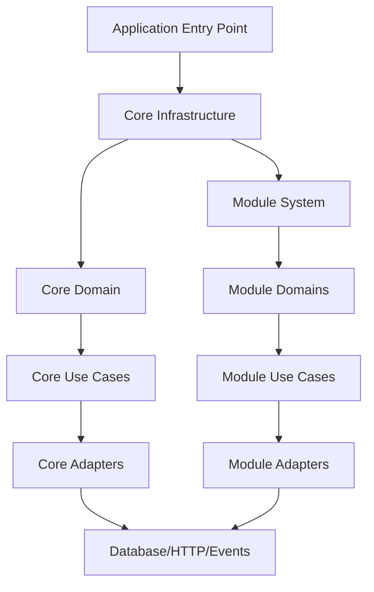
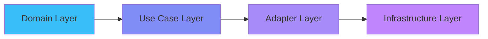
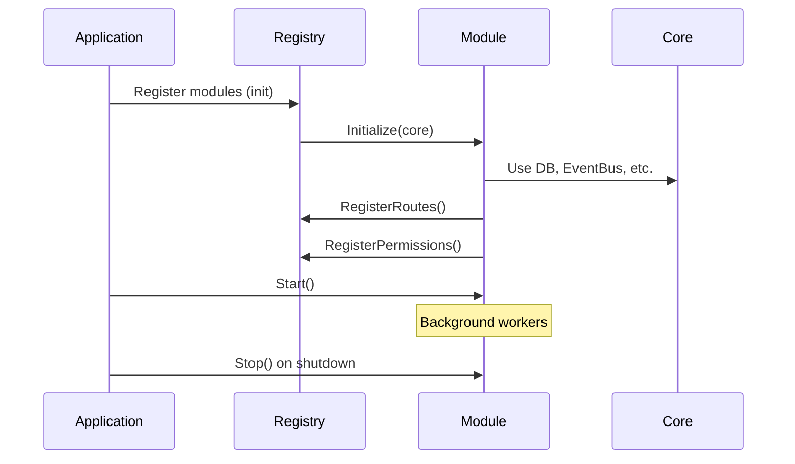
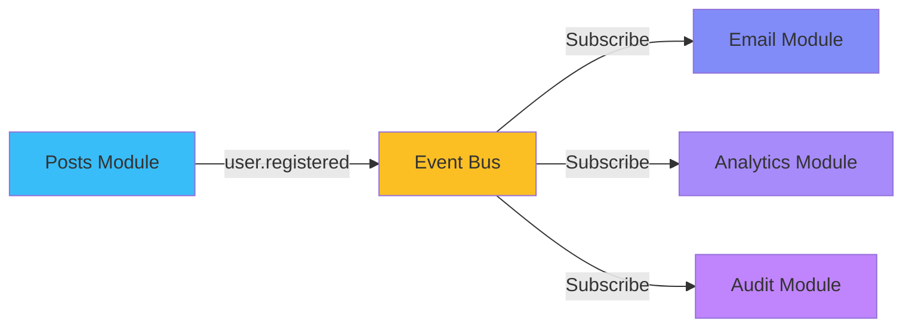
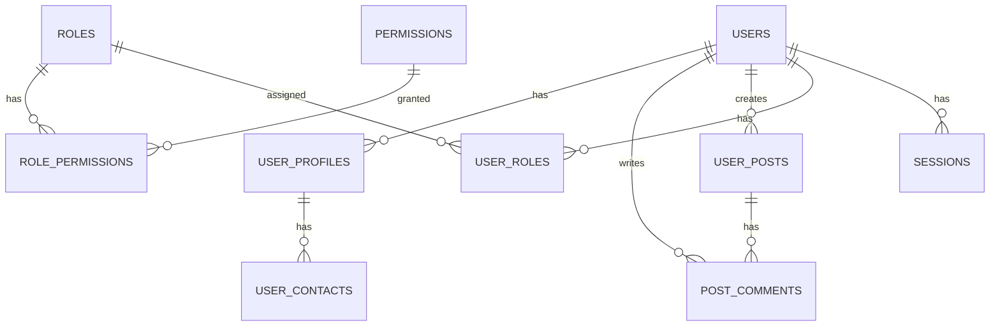
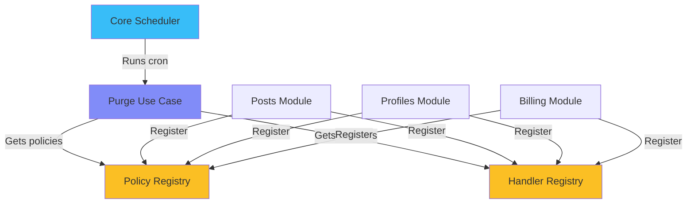
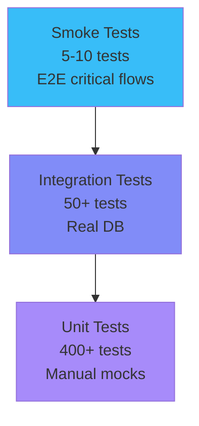
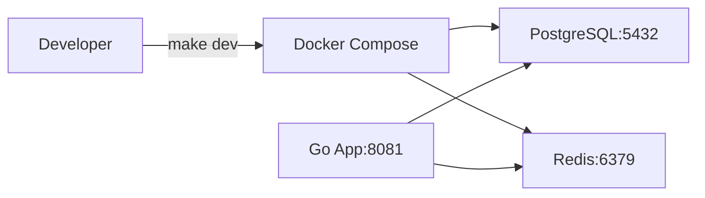
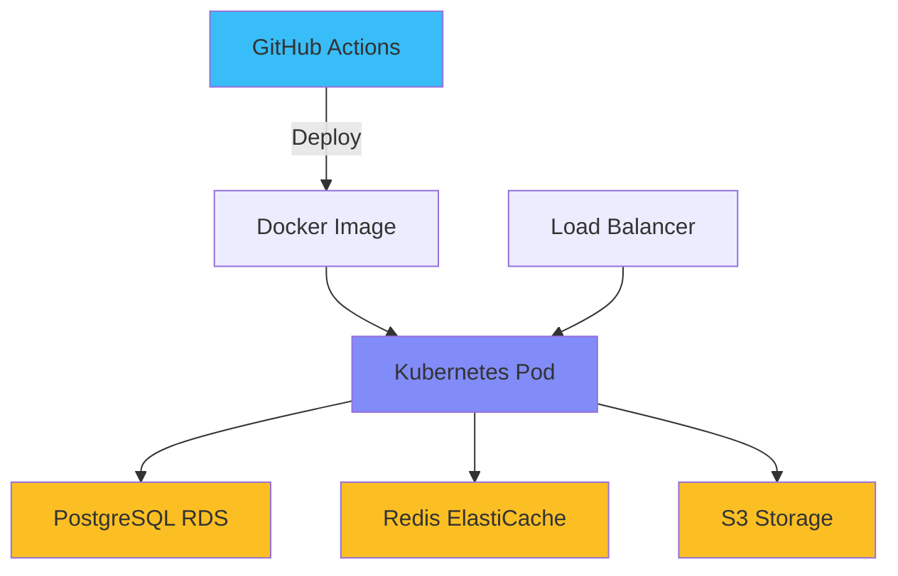

## Architecture Overview

Promenade follows **Clean Architecture** principles with a **modular plugin system**.

### System Layers



### Core vs Modules

**Core = Infrastructure + Security + Reference Data**

- Always enabled
- Authentication (JWT)
- RBAC (roles, permissions)
- Reference data (countries, currencies, regions, cities, payment methods, timezones, languages)
- Event bus, Database, Logger, Scheduler

**Modules = Business Logic**

- Optional, can be enabled/disabled
- Complete vertical slices (entity → usecase → adapter)
- Own migrations, configs, permissions
- Licensed separately (free or commercial)

---

## Clean Architecture Layers

### Dependency Flow



**Key Rule:** Inner layers never depend on outer layers!

### Layer Responsibilities

**1. Domain Layer** (`internal/domain/entity/`)

- Pure business entities
- Validation methods
- No dependencies on frameworks
- Example: `User`, `Post`, `Comment`

**2. Use Case Layer** (`internal/usecase/`)

- Business logic only
- Depends on domain interfaces
- Example: `RegisterUser`, `CreatePost`

**3. Adapter Layer** (`internal/adapter/`)

- HTTP handlers
- Repository implementations
- Framework integration
- Example: `UserHandler`, `PostgresUserRepo`

**4. Infrastructure Layer** (`internal/infrastructure/`)

- Database connections
- Event bus
- External services
- Example: `PostgreSQL`, `Redis`, `SMTP`

---

## Module Architecture

### Module Structure

Each module is a complete vertical slice:

```
internal/modules/posts/
├── module.go              # Module interface implementation
├── register.go            # Auto-registration
├── config/                # Own configs per environment
│   ├── config.dev.yaml
│   ├── config.test.yaml
│   └── config.prod.yaml
├── entity/                # Domain entities
│   ├── post.go
│   └── comment.go
├── usecase/               # Business logic
│   ├── post_usecase.go
│   └── comment_usecase.go
└── adapter/
    ├── http/              # Handlers, DTOs, routes
    │   ├── handler/
    │   └── dto/
    └── repository/        # Data access
        └── postgres/
```

### Module Lifecycle



### Module Independence

**Modules NEVER import:**

- `internal/domain` (core domain)
- `internal/usecase` (core use cases)
- `internal/adapter` (core adapters)
- Other modules

**Modules CAN use:**

- `pkg/*` (shared packages)
- Core infrastructure via `module.Core`
- Events for inter-module communication

---

## Communication Patterns

### Event-Driven Communication



**Benefits:**

- Loose coupling between modules
- Async processing
- Easy to add new subscribers
- No direct module dependencies

### Example Event Flow

```go
// Posts module publishes
event := &PostCreatedEvent{
    PostID: "123",
    UserID: "456",
    Title:  "My Post",
}
eventBus.Publish(ctx, "post.created", event)

// Email module subscribes
eventBus.Subscribe("post.created", func(e Event) {
    SendNotification(e.PostID)
})
```

---

## Database Architecture

### UUID v7 Primary Keys

Time-ordered UUIDs for better performance:

```sql
CREATE TABLE users (
    id UUID PRIMARY KEY DEFAULT uuid_v7(),
    email TEXT NOT NULL,
    created_at TIMESTAMP DEFAULT NOW()
);
```

**Benefits:**

- ⚡ 2x faster inserts (B-tree locality)
- 📉 Reduced index fragmentation
- 🔍 Sortable by creation time
- 🆔 Globally unique

### Namespace-Based Migrations

```
migrations/
├── core/                    # Core always runs first
│   ├── 000001_init.sql
│   ├── 000002_auth.sql
│   └── 000003_rbac.sql
├── posts/                   # Posts module
│   ├── 000001_posts.sql
│   └── 000002_comments.sql
└── billing/                 # Billing module
    └── 000001_tables.sql
```

**Each namespace has independent version history!**

### Schema Overview



---

## Purge System Architecture

### Registry-Based Design



**Key Points:**

- Core knows WHEN to purge (schedule, batch size)
- Modules define WHAT to purge (entities, retention days)
- True module independence via registries

---

## Testing Architecture

### Test Pyramid



**Coverage:**

- Core: 275 tests
- Posts: 33 tests (83.3%)
- Profiles: 21 tests (80.4%)
- Billing: 375 tests (100%)
- Analytics: 11 tests

**Total: 400+ tests running in ~20 seconds**

---

## Deployment Architecture

### Development



### Production



---

## Next Steps

- [Module Development Guide](/docs/MODULE_DEVELOPMENT)
- [Testing Strategy](/docs/TESTING_GUIDE)
- [Database Patterns](/features/database)
- [API Documentation](/api/v1/docs/swagger/index.html)
