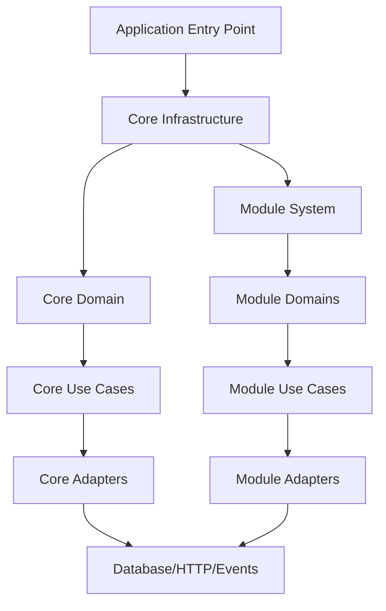
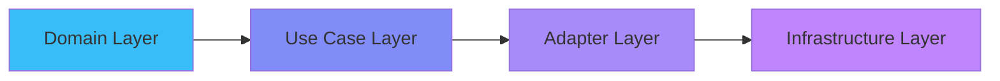
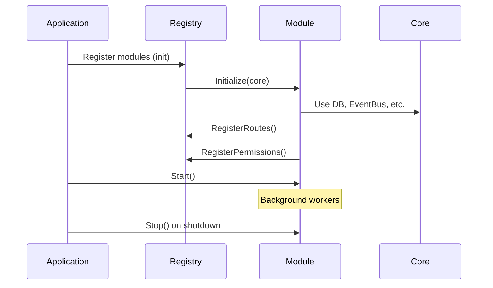
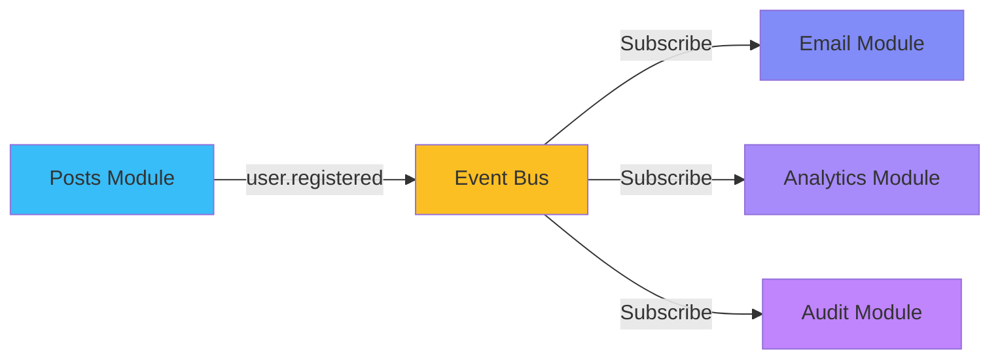
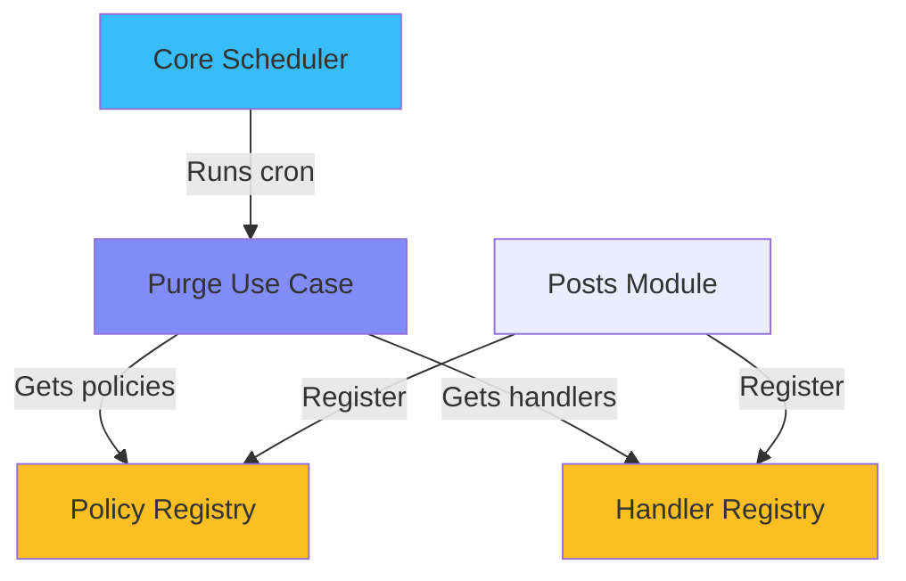
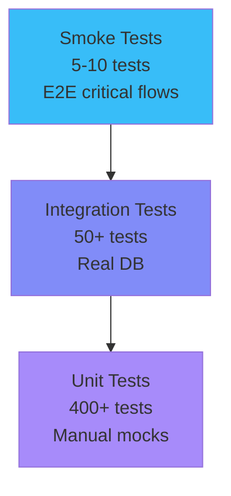
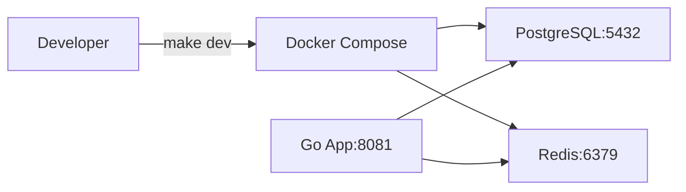
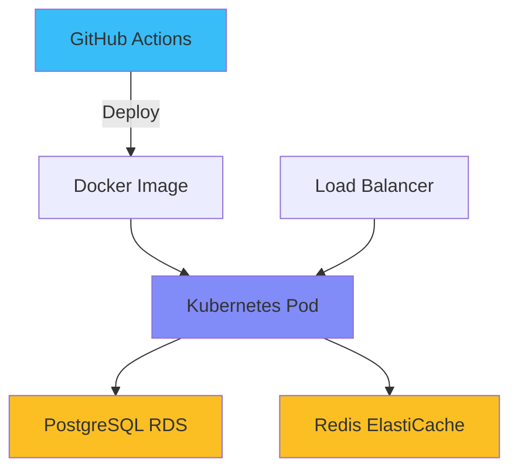

## Огляд Архітектури

Promenade дотримується принципів **Clean Architecture** з **модульною плагін-системою**.

### Системні Шари



### Core vs Модулі

**Core = Інфраструктура + Безпека + Референсні Дані**

- Завжди увімкнений
- Автентифікація (JWT)
- RBAC (ролі, дозволи)
- Референсні дані (країни, валюти, регіони, міста, способи оплати, часові пояси, мови)
- Event bus, База даних, Logger, Scheduler

**Модулі = Бізнес-Логіка**

- Опціональні, можна вмикати/вимикати
- Повні вертикальні зрізи (entity → usecase → adapter)
- Власні міграції, конфіги, дозволи
- Ліцензуються окремо (безкоштовні або комерційні)

---

## Шари Clean Architecture

### Потік Залежностей



**Ключове Правило:** Внутрішні шари ніколи не залежать від зовнішніх!

### Відповідальність Шарів

**1. Domain Layer** (`internal/domain/entity/`)

- Чисті бізнес-сутності
- Методи валідації
- Без залежностей від фреймворків
- Приклад: `User`, `Post`, `Comment`

**2. Use Case Layer** (`internal/usecase/`)

- Тільки бізнес-логіка
- Залежить від domain інтерфейсів
- Приклад: `RegisterUser`, `CreatePost`

**3. Adapter Layer** (`internal/adapter/`)

- HTTP обробники
- Реалізації репозиторіїв
- Інтеграція з фреймворком
- Приклад: `UserHandler`, `PostgresUserRepo`

**4. Infrastructure Layer** (`internal/infrastructure/`)

- З'єднання з базою даних
- Event bus
- Зовнішні сервіси
- Приклад: `PostgreSQL`, `Redis`, `SMTP`

---

## Архітектура Модулів

### Структура Модуля

```
internal/modules/posts/
├── module.go              # Реалізація інтерфейсу модуля
├── register.go            # Авто-реєстрація
├── config/                # Власні конфіги на середовище
├── entity/                # Доменні сутності
├── usecase/               # Бізнес-логіка
└── adapter/
    ├── http/              # Обробники, DTO, маршрути
    └── repository/        # Доступ до даних
```

### Життєвий Цикл Модуля



### Незалежність Модулів

**Модулі НІКОЛИ не імпортують:**

- `internal/domain` (core domain)
- `internal/usecase` (core use cases)
- `internal/adapter` (core adapters)
- Інші модулі

**Модулі МОЖУТЬ використовувати:**

- `pkg/*` (спільні пакети)
- Core інфраструктуру через `module.Core`
- Події для міжмодульної комунікації

---

## Паттерни Комунікації

### Подієво-Орієнтована Комунікація



**Переваги:**

- Слабка зв'язаність між модулями
- Асинхронна обробка
- Легко додавати нових підписників
- Без прямих залежностей модулів

---

## Архітектура Бази Даних

### UUID v7 Первинні Ключі

```sql
CREATE TABLE users (
    id UUID PRIMARY KEY DEFAULT uuid_v7(),
    email TEXT NOT NULL,
    created_at TIMESTAMP DEFAULT NOW()
);
```

**Переваги:**

- ⚡ У 2 рази швидші вставки (локальність B-дерева)
- 📉 Зменшена фрагментація індексів
- 🔍 Сортування за часом створення
- 🆔 Глобально унікальні

### Міграції на Основі Просторів Імен

```
migrations/
├── core/                    # Core завжди виконується першим
│   ├── 000001_init.sql
│   ├── 000002_auth.sql
│   └── 000003_rbac.sql
├── posts/                   # Модуль Posts
│   ├── 000001_posts.sql
│   └── 000002_comments.sql
└── billing/                 # Модуль Billing
    └── 000001_tables.sql
```

**Кожен простір імен має незалежну історію версій!**

---

## Система Очищення

### Дизайн на Основі Реєстрів



**Ключові Моменти:**

- Core знає КОЛИ очищати (розклад, розмір пакета)
- Модулі визначають ЩО очищати (сутності, дні зберігання)
- Справжня незалежність модулів через реєстри

---

## Тестування

### Піраміда Тестів



**Покриття:** Core: 275 тестів | Posts: 33 | Profiles: 21 | Billing: 375 | Analytics: 11

**Всього: 400+ тестів виконуються за ~20 секунд**

---

## Розгортання

### Розробка



### Продакшн



---

## Наступні Кроки

- [Посібник з Розробки Модулів](/promenade/docs/module-development)
- [Схема Бази Даних](/promenade/docs/database-schema)
- [Швидкий Старт](/promenade/docs/getting-started)
- [Функції](/promenade/features)
