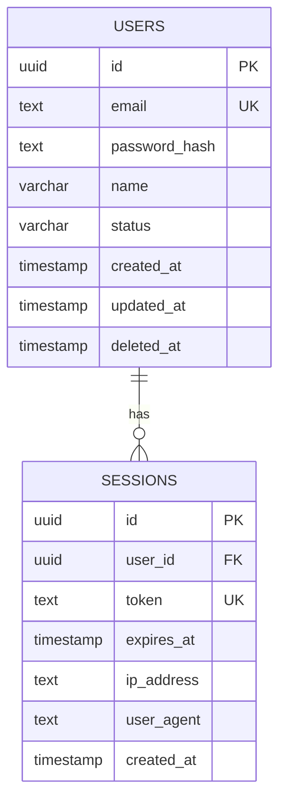
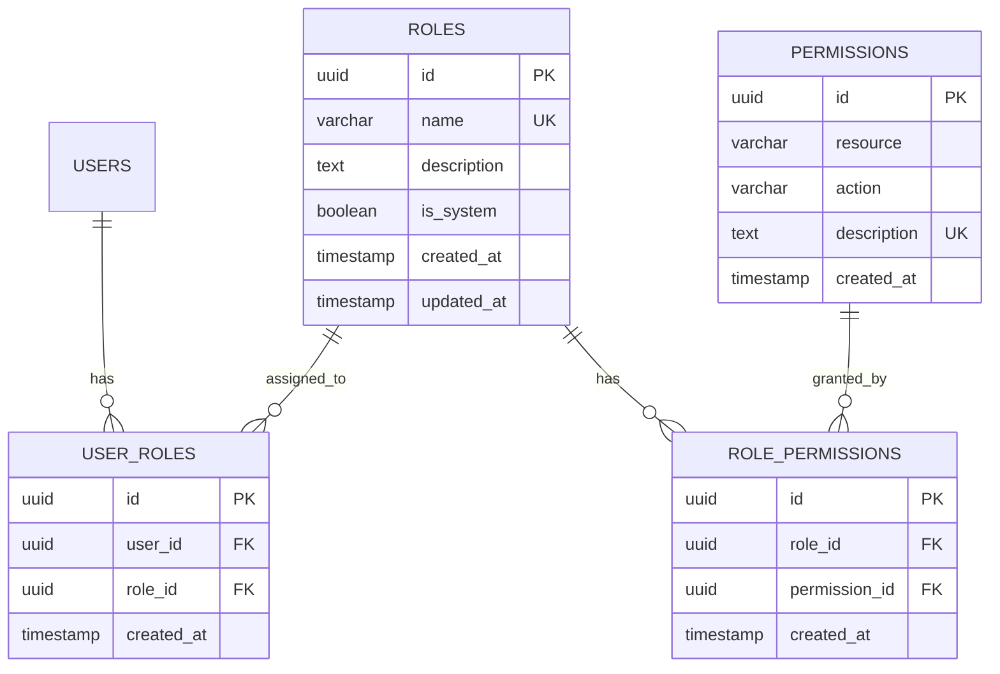
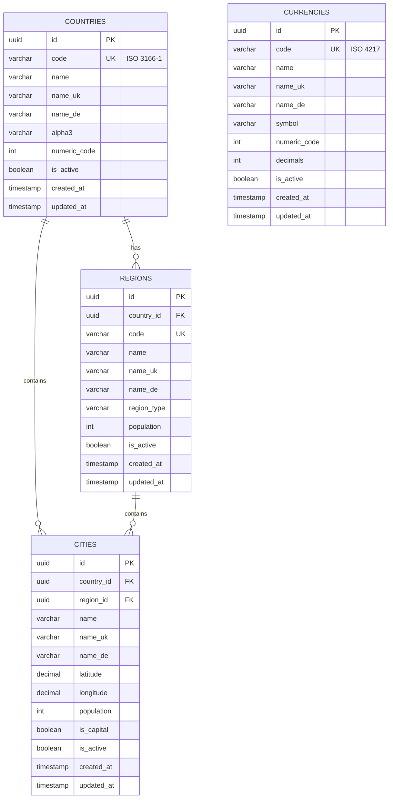
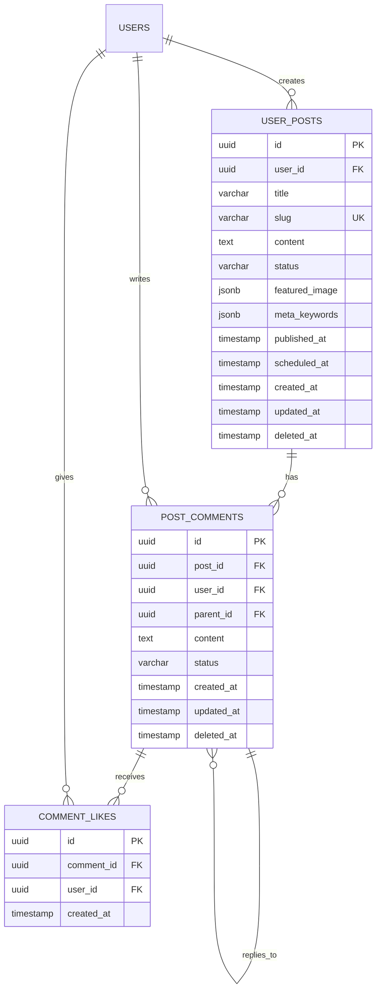
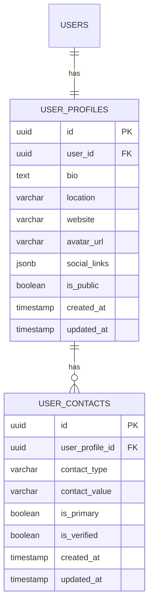
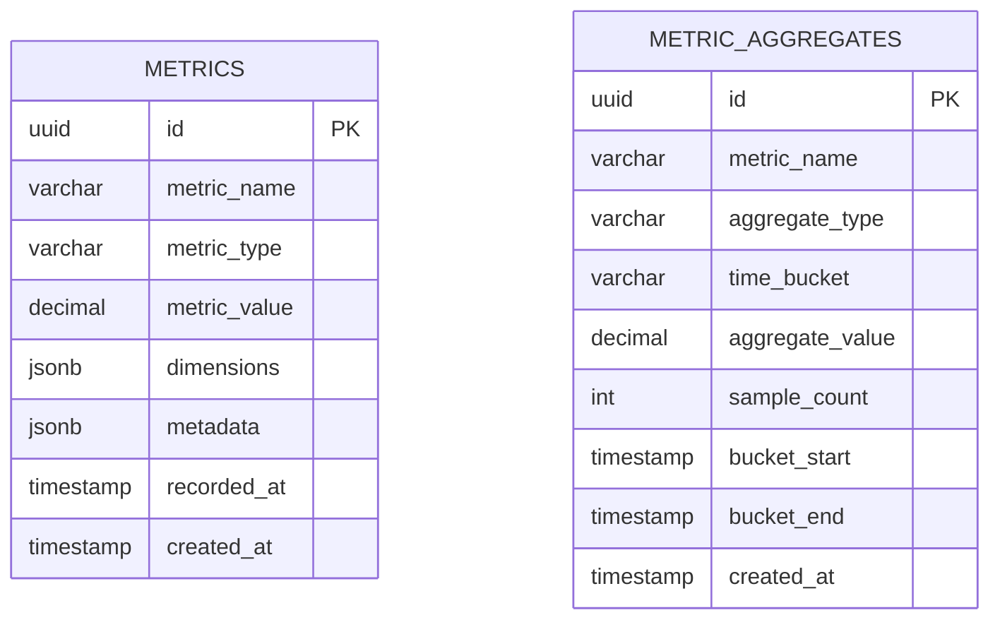
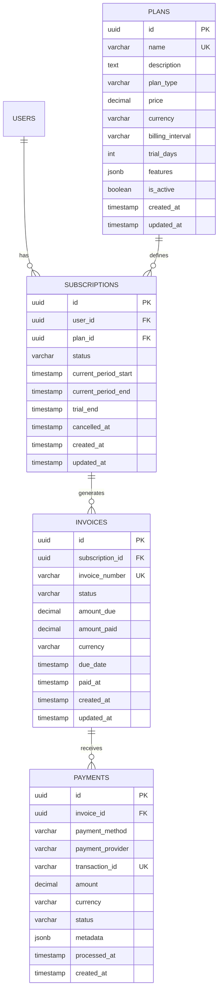

## Database Schema Overview

Promenade uses **PostgreSQL 16** with **UUID v7** primary keys and **soft delete** pattern for user content.

---

## Core Tables

### Authentication & Users



**User Statuses:**

- `active` - Normal user
- `suspended` - Temporarily blocked
- `deleted` - Soft deleted (can be purged)

---

### RBAC (Role-Based Access Control)



**System Roles:**

1. **Admin** - Full access (`*` permission)
2. **Moderator** - Content moderation
3. **User** - Basic operations
4. **Guest** - Read-only

**Permission Format:** `resource:action`

Examples: `posts:create`, `users:delete`, `*` (wildcard)

---

### Reference Data



**Data Coverage:**

- 145 countries with ISO codes
- 124 currencies (ISO 4217)
- 30 admin regions (states, oblasts, provinces)
- 17 major cities with coordinates
- All names in 3 languages (EN/UK/DE)

---

## Module Tables

### Posts Module



**Post Statuses:**

- `draft` - Work in progress
- `published` - Live post
- `archived` - Removed from public view
- `scheduled` - Publish at specific time

**Soft Delete:** `deleted_at IS NULL` in all queries

---

### Profiles Module



**Contact Types:**

- `email`, `phone`, `telegram`, `whatsapp`, `linkedin`, etc.

---

### Analytics Module (Commercial)



**Metric Types:**

- `counter` - Incremental count
- `gauge` - Point-in-time value
- `histogram` - Distribution

**Aggregate Types:**

- `sum`, `avg`, `min`, `max`, `count`

**Time Buckets:**

- `hourly`, `daily`, `weekly`, `monthly`

---

### Billing Module (Commercial)



**Subscription Statuses:**

- `active` - Currently active
- `trialing` - In trial period
- `past_due` - Payment failed
- `cancelled` - User cancelled
- `paused` - Temporarily suspended

**Payment Methods:**

40+ supported methods including credit cards, digital wallets, crypto, BNPL

---

## Schema Migrations

### Namespace Structure

```
migrations/
├── core/
│   ├── 000001_core_init_uuid_v7.up.sql
│   ├── 000002_core_auth_full.up.sql
│   ├── 000003_core_rbac_full.up.sql
│   ├── 000004_core_ref_timezones.up.sql
│   ├── 000005_core_ref_languages.up.sql
│   ├── 000006_core_ref_countries_currencies.up.sql
│   ├── 000007_core_ref_regions_cities.up.sql
│   └── 000008_core_ref_payment_methods.up.sql
├── posts/
│   ├── 000001_posts_posts.up.sql
│   ├── 000002_posts_comments.up.sql
│   └── 000003_posts_comment_likes.up.sql
├── profiles/
│   ├── 000001_profiles_contacts.up.sql
│   └── 000002_profiles_profiles.up.sql
├── analytics/
│   └── 000001_analytics_tables.up.sql
└── billing/
    ├── 000001_billing_plans.up.sql
    ├── 000002_billing_subscriptions.up.sql
    ├── 000003_billing_invoices.up.sql
    └── 000004_billing_payments.up.sql
```

### Migration Commands

```bash
# Run all migrations
make migrate

# Run specific module
make migrate-module MODULE=posts

# Create new migration
make migrate-create MODULE=posts NAME=add_views_count

# Rollback
make migrate-rollback MODULE=posts STEPS=1
```

---

## Indexes & Performance

### Core Indexes

```sql
-- Users
CREATE INDEX idx_users_email ON users(email);
CREATE INDEX idx_users_status ON users(status) WHERE deleted_at IS NULL;

-- Sessions
CREATE INDEX idx_sessions_user_id ON sessions(user_id);
CREATE INDEX idx_sessions_token ON sessions(token);
CREATE INDEX idx_sessions_expires_at ON sessions(expires_at);

-- RBAC
CREATE INDEX idx_user_roles_user_id ON user_roles(user_id);
CREATE INDEX idx_user_roles_role_id ON user_roles(role_id);
CREATE INDEX idx_role_permissions_role_id ON role_permissions(role_id);
```

### Module Indexes

```sql
-- Posts
CREATE INDEX idx_user_posts_user_id ON user_posts(user_id);
CREATE INDEX idx_user_posts_slug ON user_posts(slug);
CREATE INDEX idx_user_posts_status ON user_posts(status) WHERE deleted_at IS NULL;
CREATE INDEX idx_user_posts_published_at ON user_posts(published_at DESC) WHERE status = 'published';

-- Comments
CREATE INDEX idx_post_comments_post_id ON post_comments(post_id);
CREATE INDEX idx_post_comments_parent_id ON post_comments(parent_id);
```

### UUID v7 Benefits

```sql
-- Traditional UUID v4 (random)
INSERT INTO users VALUES (uuid_generate_v4(), ...);
-- Result: Random insertions, B-tree page splits, fragmentation

-- UUID v7 (time-ordered)
INSERT INTO users VALUES (uuid_v7(), ...);
-- Result: Sequential insertions, better locality, 2x faster
```

---

## Soft Delete Pattern

```sql
-- All SELECT queries MUST include:
WHERE deleted_at IS NULL

-- Soft delete (user action)
UPDATE user_posts
SET deleted_at = NOW()
WHERE id = $1;

-- Hard delete (purge job, after retention period)
DELETE FROM user_posts
WHERE deleted_at < NOW() - INTERVAL '90 days';
```

**Why Soft Delete:**

- Users can restore accidentally deleted content
- Audit trail preserved
- Purge jobs clean up old data automatically

---

## Connection Pooling

```yaml
database:
  max_open_conns: 25
  max_idle_conns: 5
  conn_max_lifetime: 5m
  conn_max_idle_time: 2m
```

**Recommendations:**

- Development: 10 max connections
- Production: 25-50 per instance
- Monitor with `pg_stat_activity`

---

## Backup Strategy

**Automated Backups:**

- Daily full backup at 2 AM
- Point-in-time recovery (PITR)
- 30-day retention
- Encrypted at rest

**Manual Backup:**

```bash
# Export schema only
pg_dump -s -d promenade > schema.sql

# Export data only
pg_dump -a -d promenade > data.sql

# Full backup
pg_dump -d promenade > full_backup.sql
```

---

## Next Steps

- [UUID v7 Guide](/docs/UUID_V7_GUIDE)
- [Migration Architecture](/docs/MIGRATION_ARCHITECTURE)
- [Soft Delete Pattern](/docs/SOFT_DELETE)
- [Database Feature Page](/features/database)
