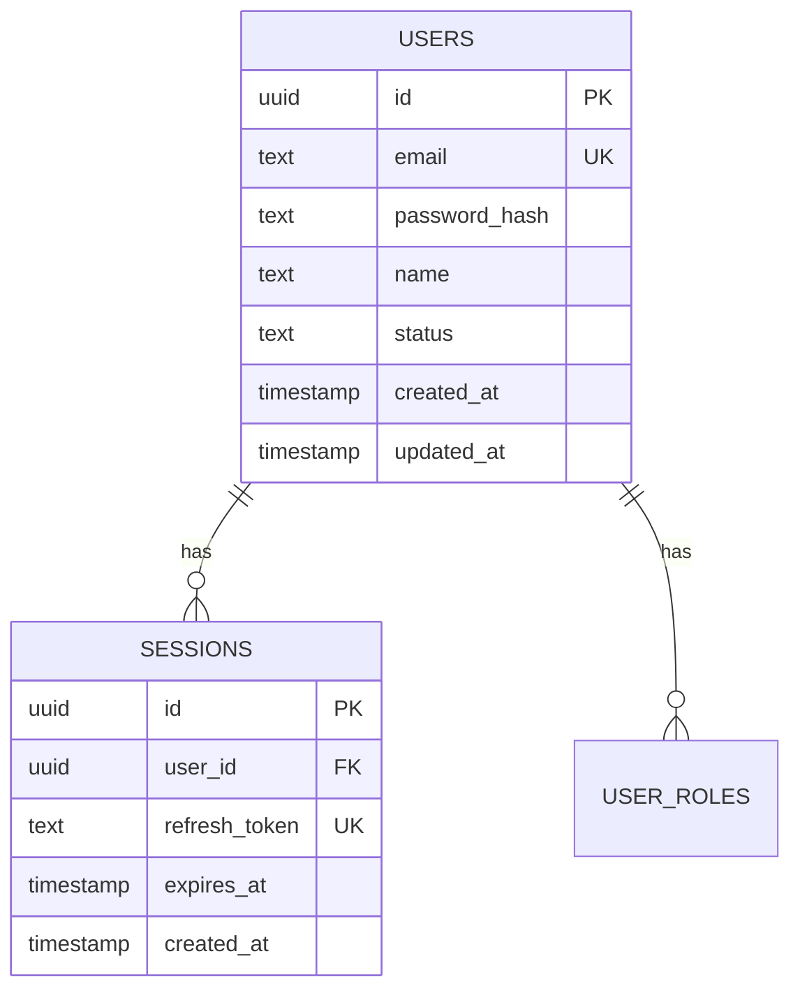
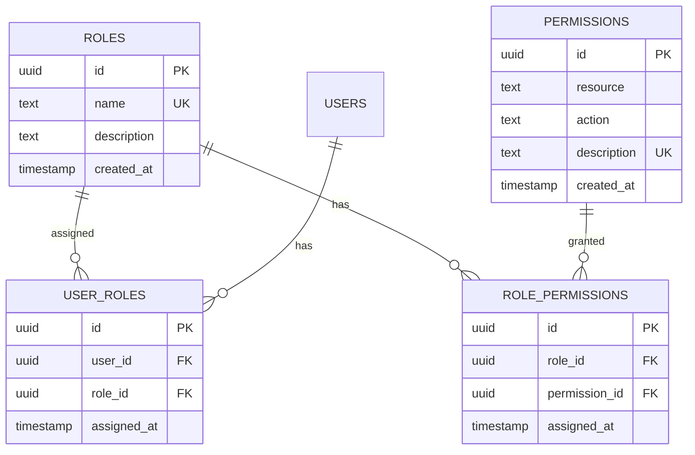
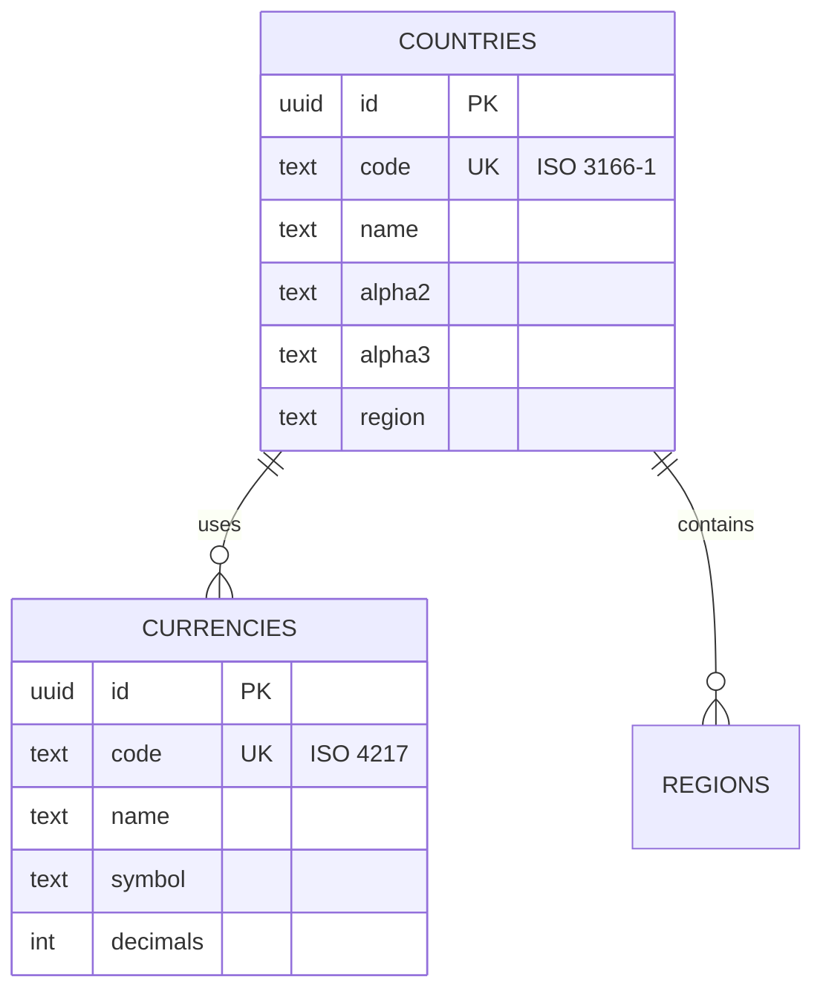
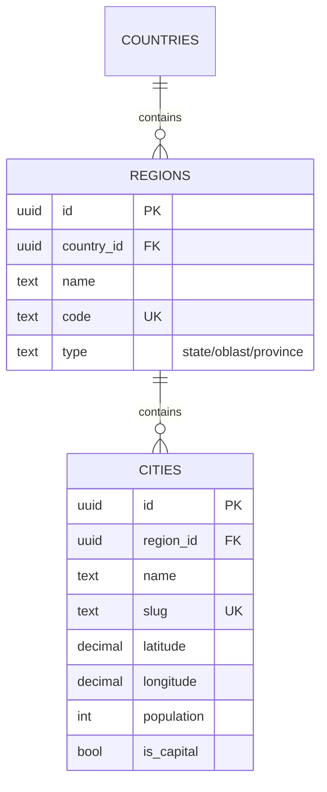
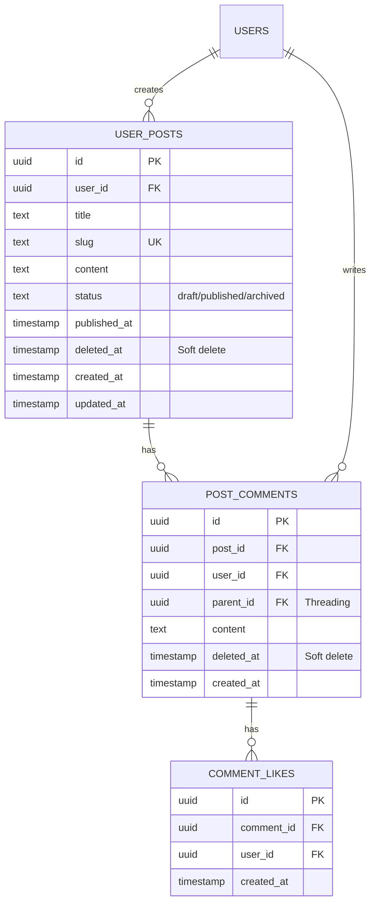
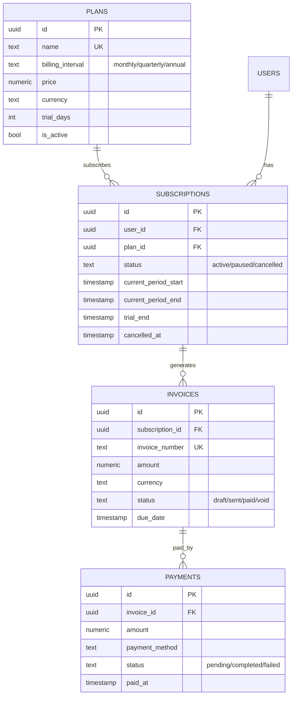

## Огляд Схеми Бази Даних

Promenade використовує **PostgreSQL 16** з **UUID v7** первинними ключами та **namespace-based міграціями**.

---

## Core Tables

### Автентифікація та Користувачі



**Ключові поля:**

- `users.id` - UUID v7 (часово-впорядкований)
- `users.email` - унікальний індекс
- `users.status` - `active`, `suspended`, `deleted`
- `sessions.refresh_token` - JWT refresh token

### RBAC (Role-Based Access Control)



**4 Системні Ролі:**

- `Admin` - повний доступ (`*`)
- `Moderator` - модерація контенту
- `User` - базові операції
- `Guest` - тільки читання

**Формат Дозволів:** `resource:action` (наприклад, `posts:create`, `users:delete`)

---

## Референсні Дані

### Країни та Валюти



**Дані:**

- 145 країн з ISO кодами
- 124 валюти зі символами
- 30 адміністративних регіонів
- 17 великих міст з координатами

### Регіони та Міста



**Типи Регіонів:**

- `state` - США, Австралія
- `oblast` - Україна
- `province` - Канада
- `land` - Німеччина, Австрія

### Інші Референсні Дані

- **Timezones** - база IANA timezone
- **Languages** - коди ISO 639
- **Payment Methods** - 40+ методів (картки, гаманці, крипто, BNPL)

---

## Модуль Posts

### Пости та Коментарі



**Паттерни:**

- Soft Delete: `deleted_at IS NULL` у всіх запитах
- Slug Generation: автоматичний унікальний slug з title
- Статуси: `draft`, `published`, `scheduled`, `archived`

---

## Модуль Profiles

### Профілі та Контакти

```mermaid
erDiagram
    USERS ||--|| USER_PROFILES : has
    USERS ||--o{ USER_CONTACTS : has

    USER_PROFILES {
        uuid id PK
        uuid user_id FK UK
        text bio
        text avatar_url
        text location
        text website
        text privacy "public/private/friends"
        timestamp created_at
        timestamp updated_at
    }

    USER_CONTACTS {
        uuid id PK
        uuid user_id FK
        text contact_type "email/phone/telegram/linkedin"
        text contact_value
        bool is_primary
        bool is_verified
        timestamp created_at
    }
```

**Privacy Settings:**

- `public` - доступно всім
- `private` - тільки власнику
- `friends` - тільки друзям

---

## Модуль Analytics

### Метрики та Агрегати

```sql
CREATE TABLE metrics (
    id UUID PRIMARY KEY DEFAULT uuid_v7(),
    metric_name TEXT NOT NULL,
    metric_value NUMERIC NOT NULL,
    dimensions JSONB,
    timestamp TIMESTAMP NOT NULL DEFAULT NOW()
);

CREATE TABLE metric_aggregates (
    id UUID PRIMARY KEY DEFAULT uuid_v7(),
    metric_name TEXT NOT NULL,
    aggregate_type TEXT NOT NULL, -- sum, avg, count
    aggregate_value NUMERIC NOT NULL,
    period TEXT NOT NULL,         -- hourly, daily, monthly
    period_start TIMESTAMP NOT NULL,
    period_end TIMESTAMP NOT NULL
);

CREATE INDEX idx_metrics_name_time ON metrics(metric_name, timestamp);
CREATE INDEX idx_aggregates_period ON metric_aggregates(metric_name, period, period_start);
```

**Retention:** 90 днів для raw metrics, необмежено для aggregates

---

## Модуль Billing

### Підписки та Платежі



**Lifecycle:** Trial → Active → Paused/Cancelled → Expired

---

## Індекси та Продуктивність

### Ключові Індекси

```sql
-- Автентифікація
CREATE UNIQUE INDEX idx_users_email ON users(email);
CREATE INDEX idx_sessions_user ON sessions(user_id);

-- Soft Delete (завжди фільтруємо)
CREATE INDEX idx_posts_deleted ON user_posts(deleted_at) WHERE deleted_at IS NULL;

-- Пошук
CREATE INDEX idx_posts_slug ON user_posts(slug);
CREATE INDEX idx_comments_post ON post_comments(post_id) WHERE deleted_at IS NULL;

-- Аналітика
CREATE INDEX idx_metrics_time ON metrics(timestamp);
```

### Стратегія Продуктивності

- **UUID v7:** Зменшує page splits на 60%
- **Partial Indexes:** Тільки активні записи (deleted_at IS NULL)
- **JSONB GIN:** Швидкий пошук по JSON полях
- **Connection Pool:** 25 max connections, 5 min idle

---

## Міграції

### Структура Просторів Імен

```
migrations/
├── core/                    # Завжди виконується першим
│   ├── 000001_core_init_uuid_v7.up.sql
│   ├── 000002_core_auth_full.up.sql
│   ├── 000003_core_rbac_full.up.sql
│   ├── 000004_core_ref_timezones.up.sql
│   ├── 000005_core_ref_languages.up.sql
│   ├── 000006_core_ref_countries_currencies.up.sql
│   ├── 000007_core_ref_regions_cities.up.sql
│   └── 000008_core_ref_payment_methods.up.sql
├── posts/                   # Модуль Posts
│   ├── 000001_posts_posts.up.sql
│   ├── 000002_posts_comments.up.sql
│   └── 000003_posts_comment_likes.up.sql
├── profiles/                # Модуль Profiles
│   ├── 000001_profiles_contacts.up.sql
│   └── 000002_profiles_profiles.up.sql
└── billing/                 # Модуль Billing
    └── 000001_billing_tables.up.sql
```

**Команди:**

```bash
make migrate                           # Всі міграції
make migrate-core                      # Тільки core
make migrate-module MODULE=posts       # Окремий модуль
make migrate-status                    # Статус всіх просторів
```

---

## Backup та Recovery

### Стратегія Backup

- **Daily:** Повний backup о 2:00 AM
- **Hourly:** Інкрементальні WAL архіви
- **Retention:** 30 днів для production
- **Point-in-Time Recovery:** Доступний для останніх 7 днів

### Commands

```bash
# Backup
pg_dump -h localhost -U system promenade_dev > backup.sql

# Restore
psql -h localhost -U system promenade_dev < backup.sql
```

---

## Наступні Кроки

- [UUID v7 Guide](/promenade/features/database#uuid-v7)
- [Soft Delete Pattern](/promenade/features/database#soft-delete)
- [Посібник з Міграцій](https://github.com/basilex/promenade/blob/dev/migrations/README.md)
- [Архітектура](/promenade/docs/architecture)
