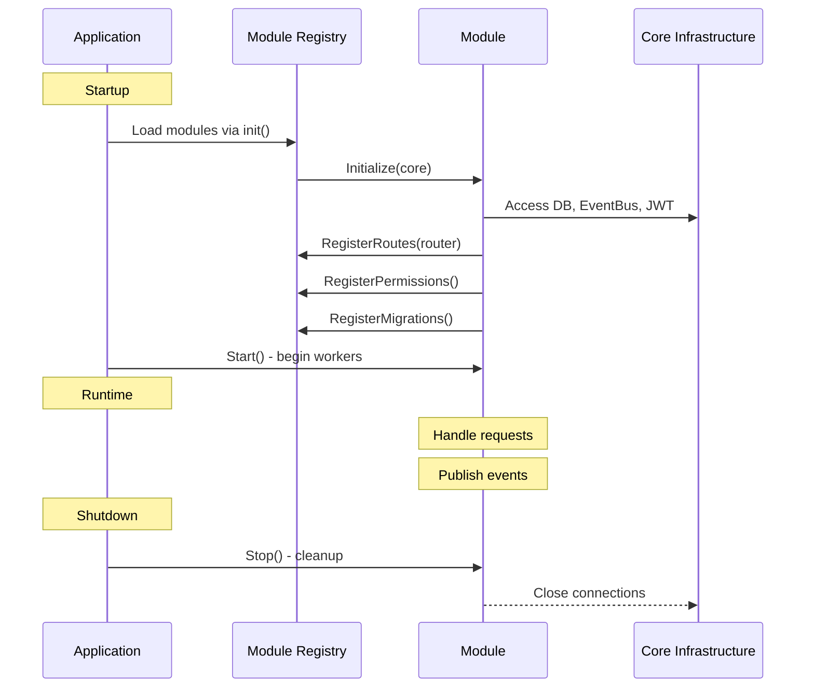

## Was ist ein Modul?

**Modul** = Unabhängige vertikale Business-Logik-Schicht mit eigenem:

- Domain-Modell (Entities)
- Geschäftslogik (Use Cases)
- Datenzugriff (Repositories)
- HTTP API (Handlers, Routen)
- Konfiguration
- Datenbank-Migrationen
- RBAC-Berechtigungen

---

## Modulstruktur

```
internal/modules/mymodule/
├── module.go              # IModule Interface-Implementierung
├── register.go            # Auto-Registrierung via init()
├── config/                # Eigene Umgebungskonfigurationen
│   ├── config.dev.yaml
│   ├── config.test.yaml
│   └── config.prod.yaml
├── entity/                # Domain-Entitäten
│   ├── item.go
│   └── item_test.go
├── usecase/               # Geschäftslogik
│   ├── item_usecase.go
│   └── item_usecase_test.go
└── adapter/
    ├── http/
    │   ├── handler/       # HTTP-Handler
    │   │   └── item_handler.go
    │   └── dto/           # Data Transfer Objects
    │       └── item_dto.go
    └── repository/
        └── postgres/
            └── item_repository.go
```

---

## Modul-Lebenszyklus



---

## Schritt 1: IModule Interface Implementieren

```go
// internal/modules/mymodule/module.go
package mymodule

import (
    "context"
    "github.com/basilex/promenade/pkg/module"
    "github.com/gin-gonic/gin"
)

type MyModule struct {
    *module.BaseModule
    // Eigene Felder
    db       *sqlx.DB
    usecase  *ItemUseCase
    handler  *ItemHandler
    config   *Config
}

func New() module.IModule {
    return &MyModule{
        BaseModule: module.NewBaseModule(module.Metadata{
            Name:        "mymodule",
            DisplayName: "My Module",
            Version:     "1.0.0",
            Author:      "Your Name",
            Description: "Does something useful",
            License:     "MIT",
            Tags:        []string{"business", "feature"},
        }),
    }
}

func (m *MyModule) Initialize(ctx context.Context, core *module.Core) error {
    // 1. Core-Infrastruktur speichern
    m.db = core.DB

    // 2. Modulkonfiguration laden
    cfg, err := LoadConfig()
    if err != nil {
        return fmt.Errorf("failed to load config: %w", err)
    }
    m.config = cfg

    // 3. Repositories erstellen
    repo := NewItemRepository(m.db)

    // 4. Use Cases erstellen
    m.usecase = NewItemUseCase(repo, core.EventBus)

    // 5. Handler erstellen
    m.handler = NewItemHandler(m.usecase)

    return nil
}

func (m *MyModule) RegisterRoutes(router *gin.RouterGroup) {
    items := router.Group("/mymodule")
    {
        items.GET("", m.handler.List)
        items.GET("/:id", m.handler.Get)
        items.POST("", m.handler.Create)
        items.PUT("/:id", m.handler.Update)
        items.DELETE("/:id", m.handler.Delete)
    }
}

func (m *MyModule) RegisterPermissions() []module.Permission {
    return []module.Permission{
        {Resource: "mymodule", Action: "read", Description: "View items"},
        {Resource: "mymodule", Action: "create", Description: "Create items"},
        {Resource: "mymodule", Action: "update", Description: "Update items"},
        {Resource: "mymodule", Action: "delete", Description: "Delete items"},
    }
}

func (m *MyModule) Start(ctx context.Context) error {
    // Hintergrund-Worker starten
    return nil
}

func (m *MyModule) Stop(ctx context.Context) error {
    // Verbindungen schließen, Worker stoppen
    return nil
}

func (m *MyModule) HealthCheck(ctx context.Context) error {
    // Modulstatus prüfen
    return nil
}
```

---

## Schritt 2: Auto-Registrierung

```go
// internal/modules/mymodule/register.go
package mymodule

import (
    "log/slog"
    "github.com/basilex/promenade/pkg/module"
)

func init() {
    if err := module.DefaultRegistry.Register(New()); err != nil {
        slog.Error("Failed to register mymodule", "error", err)
    }
}
```

---

## Schritt 3: Modulkonfiguration

```yaml
# internal/modules/mymodule/config/config.dev.yaml
module:
  name: "mymodule"
  enabled: true
  version: "1.0.0"

mymodule:
  max_items: 100
  allow_public: true
  cache_ttl: 300 # seconds

purge:
  items:
    retention_days: 60
    enabled: true
```

```go
// internal/modules/mymodule/config/config.go
package config

import (
    "github.com/basilex/promenade/pkg/module/config"
)

type Config struct {
    Module struct {
        Name    string `yaml:"name"`
        Enabled bool   `yaml:"enabled"`
        Version string `yaml:"version"`
    } `yaml:"module"`

    MyModule struct {
        MaxItems    int  `yaml:"max_items"`
        AllowPublic bool `yaml:"allow_public"`
        CacheTTL    int  `yaml:"cache_ttl"`
    } `yaml:"mymodule"`
}

func LoadConfig() (*Config, error) {
    var cfg Config
    if err := config.Load("internal/modules/mymodule/config", &cfg); err != nil {
        return nil, err
    }
    return &cfg, nil
}
```

---

## Kommunikationsmuster

### Event-Driven (Empfohlen)

```go
// Event veröffentlichen
event := &ItemCreatedEvent{
    BaseEvent: bus.BaseEvent{ID: uuid.New().String()},
    ItemID:    item.ID,
    UserID:    userID,
}
core.EventBus.Publish(ctx, "mymodule.item.created", event)

// Events abonnieren
func (m *MyModule) RegisterEventHandlers(bus bus.IBus) error {
    return bus.Subscribe(ctx, "user.registered", m.onUserRegistered)
}

func (m *MyModule) onUserRegistered(ctx context.Context, e bus.Event) error {
    evt := e.(*UserRegisteredEvent)
    // Standard-Items für neuen Benutzer erstellen
    return m.usecase.CreateDefaultItems(ctx, evt.UserID)
}
```

### Direct Registry (Vorsichtig verwenden)

```go
// Anderes Modul abrufen
postsModule := core.Registry.Get("posts")
if api, ok := postsModule.(PostsAPI); ok {
    stats := api.GetStats(userID)
}
```

---

## Best Practices

### ✅ DO

- UUID v7 für alle IDs verwenden
- Eigene Konfigurationen aus `config/` laden
- Purge-Handler für Soft-Delete-Entitäten registrieren
- Events für wichtige Operationen veröffentlichen
- Unit Tests für Use Cases schreiben
- Alle öffentlichen APIs dokumentieren

### ❌ DON'T

- Nicht `internal/domain` oder `internal/usecase` importieren
- Andere Module nicht direkt importieren
- Keinen Status in Handlern speichern (stateless)
- Keine globalen Variablen verwenden
- `deleted_at IS NULL` Filter nicht vergessen

---

## Module Testen

### Unit Tests

```go
// internal/modules/mymodule/usecase/item_usecase_test.go
func TestItemUseCase_Create(t *testing.T) {
    // Arrange
    mockRepo := &MockItemRepository{}
    mockBus := &MockEventBus{}
    usecase := NewItemUseCase(mockRepo, mockBus)

    mockRepo.On("Create", mock.Anything, mock.Anything).Return(nil)
    mockBus.On("Publish", mock.Anything, mock.Anything, mock.Anything).Return(nil)

    // Act
    item, err := usecase.Create(context.Background(), "Test Item")

    // Assert
    assert.NoError(t, err)
    assert.NotEmpty(t, item.ID)
    mockRepo.AssertExpectations(t)
    mockBus.AssertExpectations(t)
}
```

### Integration Tests

```go
func TestItemRepository_Create(t *testing.T) {
    // Test-DB einrichten
    db := setupTestDB(t)
    defer db.Close()

    repo := NewItemRepository(db)

    // Testen
    item := &entity.Item{ID: uuidv7.New(), Name: "Test"}
    err := repo.Create(context.Background(), item)

    assert.NoError(t, err)
}
```

---

## Modul Aktivieren

### 1. In main.go importieren

```go
// cmd/api/main.go
import (
    _ "github.com/basilex/promenade/internal/modules/posts"
    _ "github.com/basilex/promenade/internal/modules/profiles"
    _ "github.com/basilex/promenade/internal/modules/mymodule"  // Hier hinzufügen
)
```

### 2. Zu config/modules.yaml hinzufügen

```yaml
modules:
  enabled:
    - posts
    - profiles
    - mymodule # Hier hinzufügen
```

### 3. Migrationen erstellen

```bash
make migrate-create MODULE=mymodule NAME=init_tables
```

---

## Troubleshooting

**Problem:** Modul lädt nicht

- ✅ Import in `cmd/api/main.go` prüfen
- ✅ `config/modules.yaml` prüfen - ist Modul in `enabled`?
- ✅ Logs auf Registrierungsfehler prüfen

**Problem:** Migrationen laufen nicht

- ✅ Namespace prüfen: `migrations/mymodule/`
- ✅ `make migrate-status` ausführen
- ✅ Dateinamenformat prüfen: `000001_description.up.sql`

**Problem:** Routen funktionieren nicht

- ✅ `RegisterRoutes()` wird aufgerufen prüfen
- ✅ Pfad prüfen: `/api/v1/mymodule`
- ✅ Middleware prüfen (auth, permissions)

---

## Modul-Beispiele

### 1. Simple CRUD Module

```go
type SimpleModule struct {
    *module.BaseModule
    crud *CRUDUseCase
}

func (m *SimpleModule) RegisterRoutes(r *gin.RouterGroup) {
    r.GET("/items", m.handler.List)
    r.POST("/items", m.handler.Create)
}
```

### 2. Background Worker Module

```go
func (m *WorkerModule) Start(ctx context.Context) error {
    go m.processQueue(ctx)
    return nil
}

func (m *WorkerModule) processQueue(ctx context.Context) {
    ticker := time.NewTicker(1 * time.Minute)
    for {
        select {
        case <-ticker.C:
            m.usecase.ProcessPendingJobs(ctx)
        case <-ctx.Done():
            return
        }
    }
}
```

### 3. Event-Driven Module

```go
func (m *EventModule) RegisterEventHandlers(bus bus.IBus) error {
    bus.Subscribe(ctx, "user.registered", m.onUserRegistered)
    bus.Subscribe(ctx, "post.created", m.onPostCreated)
    return nil
}
```

---

## Nächste Schritte

- [Modulunabhängigkeit](/promenade/docs/MODULE_INDEPENDENCE)
- [Architektur](/promenade/docs/architecture)
- [Datenbankmuster](/promenade/docs/database-schema)
- [Modul-Beispiele](https://github.com/basilex/promenade/tree/dev/internal/modules)
