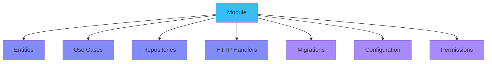
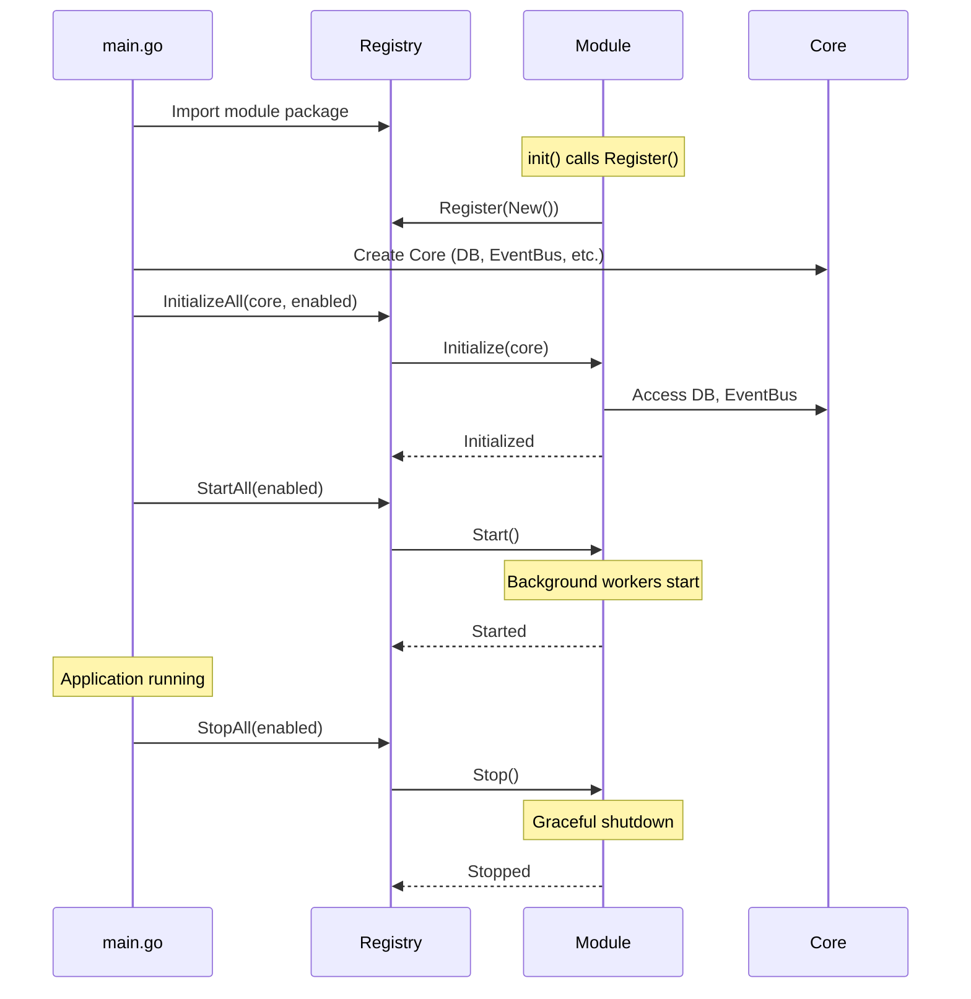

## Module Development Guide

Learn how to create independent, reusable modules for Promenade.

---

## What is a Module?

A **module** is a complete vertical slice of business functionality:



**Key Principles:**

✅ Self-contained - Own entities, logic, routes  
✅ Independent - No imports from core or other modules  
✅ Configurable - Own YAML configs per environment  
✅ Licensable - Can be free or commercial  
✅ Optional - Enable/disable without code changes

---

## Module Structure

### Complete Example: `posts` Module

```
internal/modules/posts/
├── module.go                    # Module interface implementation
├── register.go                  # Auto-registration via init()
├── config/
│   ├── config.dev.yaml         # Dev environment config
│   ├── config.test.yaml        # Test environment config
│   └── config.prod.yaml        # Production config
├── entity/
│   ├── post.go                 # Post entity
│   ├── comment.go              # Comment entity
│   └── like.go                 # Like entity
├── usecase/
│   ├── post_usecase.go         # Post business logic
│   └── comment_usecase.go      # Comment business logic
├── adapter/
│   ├── http/
│   │   ├── handler/
│   │   │   ├── post_handler.go     # HTTP handlers
│   │   │   └── comment_handler.go
│   │   └── dto/
│   │       ├── post_dto.go         # Request/response DTOs
│   │       └── comment_dto.go
│   └── repository/
│       └── postgres/
│           ├── post_repository.go   # Data access
│           └── comment_repository.go
└── README.md                    # Module documentation
```

---

## Creating a New Module

### Step 1: Create Directory Structure

```bash
mkdir -p internal/modules/mymodule/{config,entity,usecase,adapter/http/handler,adapter/repository/postgres}
```

### Step 2: Implement Module Interface

```go
// internal/modules/mymodule/module.go
package mymodule

import (
    "context"
    "github.com/basilex/promenade/pkg/module"
    "github.com/gin-gonic/gin"
)

type MyModule struct {
    *module.BaseModule
    db       *sqlx.DB
    eventBus bus.IBus
    handler  *Handler
}

func New() module.IModule {
    return &MyModule{
        BaseModule: module.NewBaseModule(module.Metadata{
            Name:        "mymodule",
            DisplayName: "My Module",
            Version:     "1.0.0",
            Author:      "Your Name",
            Description: "Does something useful",
            License:     "MIT",
            Tags:        []string{"business", "example"},
        }),
    }
}

func (m *MyModule) Dependencies() []string {
    return []string{} // No dependencies
}

func (m *MyModule) Initialize(ctx context.Context, core *module.Core) error {
    // 1. Store core references
    m.db = core.DB
    m.eventBus = core.EventBus

    // 2. Load module config
    cfg := moduleconfig.Load("internal/modules/mymodule/config",
        os.Getenv("ENVIRONMENT"))

    // 3. Initialize repository
    repo := postgres.NewMyRepository(m.db)

    // 4. Initialize use case
    usecase := usecase.NewMyUseCase(repo, m.eventBus)

    // 5. Initialize handler
    m.handler = NewHandler(usecase)

    // 6. Register purge handlers (if soft-delete entities)
    purgeHandler := NewMyPurgeHandler(m.db)
    purge.DefaultRegistry.Register(purgeHandler)

    // 7. Register retention policies
    purge.DefaultPolicyRegistry.RegisterPolicy(purge.RetentionPolicy{
        EntityName:    "my_entities",
        RetentionDays: cfg.Purge.RetentionDays,
        Enabled:       cfg.Purge.Enabled,
    })

    return nil
}

func (m *MyModule) RegisterRoutes(router *gin.RouterGroup) {
    group := router.Group("/mymodule")
    {
        group.GET("", m.handler.List)
        group.GET("/:id", m.handler.GetByID)
        group.POST("", m.handler.Create)
        group.PUT("/:id", m.handler.Update)
        group.DELETE("/:id", m.handler.Delete)
    }
}

func (m *MyModule) RegisterMigrations() []module.Migration {
    return []module.Migration{
        {
            Version:     1,
            Description: "Create my_entities table",
            Up:          `CREATE TABLE my_entities (...)`,
            Down:        `DROP TABLE my_entities`,
        },
    }
}

func (m *MyModule) RegisterPermissions() []module.Permission {
    return []module.Permission{
        {
            Resource:    "mymodule",
            Action:      "read",
            Description: "View my entities",
        },
        {
            Resource:    "mymodule",
            Action:      "create",
            Description: "Create my entities",
        },
        {
            Resource:    "mymodule",
            Action:      "update",
            Description: "Update my entities",
        },
        {
            Resource:    "mymodule",
            Action:      "delete",
            Description: "Delete my entities",
        },
    }
}

func (m *MyModule) RegisterEventHandlers(bus bus.IBus) error {
    // Subscribe to events from other modules
    return bus.Subscribe(context.Background(), "user.registered",
        func(ctx context.Context, e bus.Event) error {
            // Handle event
            return nil
        },
    )
}

func (m *MyModule) Start(ctx context.Context) error {
    // Start background workers, cron jobs, etc.
    return nil
}

func (m *MyModule) Stop(ctx context.Context) error {
    // Graceful shutdown
    return nil
}

func (m *MyModule) HealthCheck(ctx context.Context) error {
    // Health check logic
    return nil
}
```

### Step 3: Auto-Registration

```go
// internal/modules/mymodule/register.go
package mymodule

import (
    "log/slog"
    "github.com/basilex/promenade/pkg/module"
)

func init() {
    if err := module.DefaultRegistry.Register(New()); err != nil {
        slog.Error("Failed to register mymodule", "error", err)
    }
}
```

### Step 4: Module Configuration

```yaml
# internal/modules/mymodule/config/config.dev.yaml
module:
  name: "mymodule"
  version: "1.0.0"
  enabled: true

mymodule:
  max_items: 100
  allow_public: true
  notification_enabled: true

purge:
  my_entities:
    retention_days: 60
    enabled: true
```

### Step 5: Enable Module

```yaml
# config/modules.yaml
modules:
  enabled:
    - posts
    - profiles
    - mymodule # Add here
```

### Step 6: Import in main.go

```go
// cmd/api/main.go
import (
    _ "github.com/basilex/promenade/internal/modules/posts"
    _ "github.com/basilex/promenade/internal/modules/profiles"
    _ "github.com/basilex/promenade/internal/modules/mymodule"  // Add here
)
```

---

## Module Lifecycle



---

## Module Communication

### Event-Based (Recommended)

```go
// Module A publishes event
type OrderCreatedEvent struct {
    bus.BaseEvent
    OrderID   string
    UserID    string
    TotalAmount decimal.Decimal
}

eventBus.Publish(ctx, "order.created", &OrderCreatedEvent{
    BaseEvent: bus.BaseEvent{ID: uuid.New().String()},
    OrderID:   order.ID,
    UserID:    order.UserID,
    TotalAmount: order.Total,
})

// Module B subscribes
func (m *InvoiceModule) RegisterEventHandlers(bus bus.IBus) error {
    return bus.Subscribe(ctx, "order.created",
        func(ctx context.Context, e bus.Event) error {
            evt := e.(*OrderCreatedEvent)
            // Generate invoice
            return m.invoiceUseCase.CreateFromOrder(ctx, evt.OrderID)
        },
    )
}
```

### Registry-Based (Use Sparingly)

```go
// Get another module
postsModule := core.Registry.Get("posts")

// Type assert to public interface
if api, ok := postsModule.(PostsAPI); ok {
    stats := api.GetStats(userID)
}
```

**Use events for 95% of inter-module communication!**

---

## Best Practices

### ✅ DO

- Keep modules independent (no imports from `internal/domain`)
- Use events for async communication
- Load own configs from `config/` directory
- Register purge handlers if using soft delete
- Write tests alongside code (`*_test.go`)
- Document in module README

### ❌ DON'T

- Import other modules directly
- Hard-code configuration in code
- Depend on execution order of modules
- Share database connections (use core DB)
- Create global state

---

## Testing Modules

```go
func TestMyUseCase_Create(t *testing.T) {
    // Manual mock
    mockRepo := &mockMyRepository{
        items: make(map[string]*MyEntity),
    }

    usecase := NewMyUseCase(mockRepo, nil)

    item, err := usecase.Create(context.Background(), "test", "value")

    assert.NoError(t, err)
    assert.NotEmpty(t, item.ID)
    assert.Equal(t, "test", item.Name)
}

// Run module tests
// make test-module-mymodule
```

---

## Examples

### Simple CRUD Module

```go
// Minimal module with CRUD operations
type SimpleModule struct {
    *module.BaseModule
    handler *SimpleHandler
}

func (m *SimpleModule) Initialize(ctx context.Context, core *module.Core) error {
    repo := NewSimpleRepo(core.DB)
    usecase := NewSimpleUseCase(repo)
    m.handler = NewSimpleHandler(usecase)
    return nil
}

func (m *SimpleModule) RegisterRoutes(router *gin.RouterGroup) {
    router.GET("/simple", m.handler.List)
    router.POST("/simple", m.handler.Create)
}
```

### Background Worker Module

```go
// Module with background processing
type WorkerModule struct {
    *module.BaseModule
    worker *Worker
}

func (m *WorkerModule) Start(ctx context.Context) error {
    m.worker = NewWorker(m.db)
    go m.worker.Run(ctx) // Background goroutine
    return nil
}

func (m *WorkerModule) Stop(ctx context.Context) error {
    return m.worker.Stop(ctx) // Graceful shutdown
}
```

### Event-Driven Module

```go
// Module that reacts to events
type ReactiveModule struct {
    *module.BaseModule
}

func (m *ReactiveModule) RegisterEventHandlers(bus bus.IBus) error {
    bus.Subscribe(ctx, "user.registered", m.handleUserRegistered)
    bus.Subscribe(ctx, "order.created", m.handleOrderCreated)
    return nil
}

func (m *ReactiveModule) handleUserRegistered(ctx context.Context, e bus.Event) error {
    evt := e.(*UserRegisteredEvent)
    // Process new user
    return nil
}
```

---

## Troubleshooting

### Module Not Loading

```bash
# Check if registered
grep "register mymodule" internal/modules/mymodule/register.go

# Check if imported
grep "mymodule" cmd/api/main.go

# Check if enabled
grep "mymodule" config/modules.yaml
```

### Migration Issues

```bash
# Check migration status
make migrate-status

# Run specific module migration
make migrate-module MODULE=mymodule
```

### Event Bus Issues

```bash
# Check event subscriptions
# Look for "Subscribe" calls in module initialization

# Test event publishing
eventBus.Publish(ctx, "test.event", testEvent)
```

---

## Next Steps

- [Architecture Overview](/promenade/docs/architecture)
- [Database Schema](/promenade/docs/database-schema)
- [Testing Guide](/promenade/docs/TESTING_GUIDE)
- [Module Examples in codebase](https://github.com/basilex/promenade/tree/dev/internal/modules)
